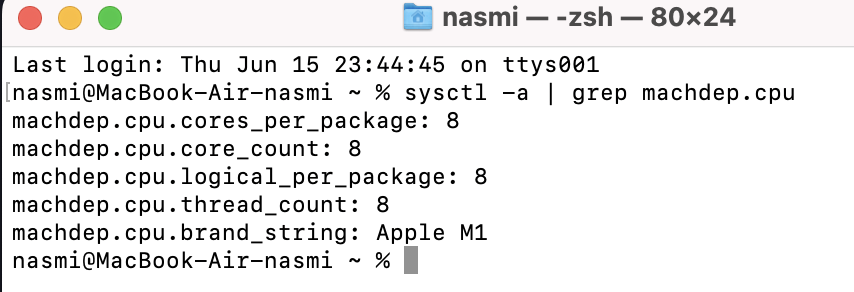

---
## Front matter
lang: ru-RU
title: Лабораторная работа №1
subtitle: Основы информационной безопасности
author:
  - Мишина А. А.
date: 17 февраля 2024

## i18n babel
babel-lang: russian
babel-otherlangs: english

## Formatting pdf
toc: false
toc-title: Содержание
slide_level: 2
aspectratio: 169
section-titles: true
theme: metropolis
header-includes:
 - \metroset{progressbar=frametitle,sectionpage=progressbar,numbering=fraction}
 - '\makeatletter'
 - '\beamer@ignorenonframefalse'
 - '\makeatother'
---

## Цели и задачи

- Целью данной работы является приобретение практических навыков установки операционной системы на виртуальную машину, настройки минимально необходимых для дальнейшей работы сервисов.

# Выполнение лабораторной работы

## Скачивание образа Rocky 9.3

{width=60% }

## Подключение образа Rocky 9.3

{width=60% }

## Настройки виртуальной машины

{width=60% }

## Настройки виртуальной машины

{ width=60% }

## Настройки виртуальной машины

{ width=60% }

## Установка Rocky на жесткий диск

{ width=60% }

## Некоторые настройки операционной системы

- В разделе выбора программ указываем в качестве базового окружения Server with GUI, а в качестве дополнения — Development Tools.

{width=60% }

## Некоторые настройки операционной системы

- Включаем сетевое соединение, в качестве имени узла указываем aamishina.localdomain.

{ width=60% }

## Настройка пользователя root

- Переходим к установке пароля для root, также разрешаем ввод пароля для root при использовании SSH.

{ width=60% }

## Настройка локального пользователя

- Далее создаем локального пользователя с правами администратора и вводим пароль для него.

{ width=60% }

## Перезапуск виртуальной машины

{ width=60% }

## Образ диска дополнений гостевой ОС

- это необходимо для общего буфера обмена, передачи файлов перетаскиванием, интеграции экранов, автоматической настройки разрешения экрана и другие возможности, упрощающие работу.

{ width=60% }

# Выполнение заданий самостоятельной работы (Информация о системе)

## Версия Линукса 

{ width=60% }

## Частота процессора

{ width=60% }

## Модель процессора

{ width=60% }

## Модель процессора

{ width=60% }

## Объем доступной оперативной памяти

{ width=60% }

## Гипервизор

{ width=60% }

## Тип файловой системы корневого раздела

{ width=60% }

## Последовательность монтирования файловых систем

{ width=60% }

## Вывод

- В ходе выполнения данной лабораторной работы я приобрела практические навыки установки операционной системы на виртуальную машину, настроила минимально необходимые сервисы для дальнейшей работы. Разобралась с настройками UTM, что позволило виртуальной машине Rocky работать с лучшей производительностью. Также мне удалось составить отчет, прикрепив скриншоты, которые я делала во время выполнения задания.
