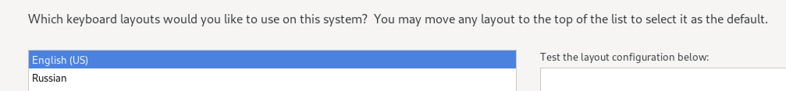
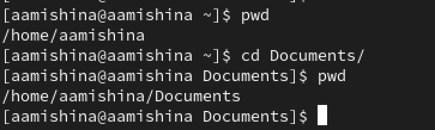

---
## Front matter
title: "Отчёт по лабораторной работе №1"
subtitle: "Дисциплина: Основы информационной безопасности"
author: "Мишина Анастасия Алексеевна"

## Generic options
lang: ru-RU
toc-title: "Содержание"

## Bibliography
bibliography: bib/cite.bib
csl: pandoc/csl/gost-r-7-0-5-2008-numeric.csl

## Pdf output format
toc: true # Table of contents
toc-depth: 2
lof: true # List of figures
lot: true # List of tables
fontsize: 14pt
linestretch: 1.5
papersize: a4
documentclass: scrreprt
## I18n polyglossia
polyglossia-lang:
  name: russian
  options:
	- spelling=modern
	- babelshorthands=true
polyglossia-otherlangs:
  name: english
## I18n babel
babel-lang: russian
babel-otherlangs: english
## Fonts
mainfont: PT Serif
romanfont: PT Serif
sansfont: PT Sans
monofont: PT Mono
mainfontoptions: Ligatures=TeX
romanfontoptions: Ligatures=TeX
sansfontoptions: Ligatures=TeX,Scale=MatchLowercase
monofontoptions: Scale=MatchLowercase,Scale=0.9
## Biblatex
biblatex: true
biblio-style: "gost-numeric"
biblatexoptions:
  - parentracker=true
  - backend=biber
  - hyperref=auto
  - language=auto
  - autolang=other*
  - citestyle=gost-numeric
## Pandoc-crossref LaTeX customization
figureTitle: "Рис."
tableTitle: "Таблица"
listingTitle: "Листинг"
lofTitle: "Список иллюстраций"
lotTitle: "Список таблиц"
lolTitle: "Листинги"
## Misc options
indent: true
header-includes:
  - \usepackage{indentfirst}
  - \usepackage{float} # keep figures where there are in the text
  - \floatplacement{figure}{H} # keep figures where there are in the text
---

# Цель работы

Целью данной работы является приобретение практических навыков установки операционной системы на виртуальную машину, настройки минимально необходимых для дальнейшей работы сервисов.

# Выполнение лабораторной работы

Так как я выполняла задание на макбуке и устанавливала соответственно не Virtual Box, а UTM, многие шаги либо отсутствуют в моей работе, либо отличаются.

В данной работе выполняется установка дистрибутива Rocky 9.3 на виртуальную машину UTM, которую я ставила в предыдущем семестре.

Для начала скачиваем образ ОС по ссылке, указанной на ТУИСе (рис. [-@fig:001]).

{ #fig:001 width=80% }

Переходим к созданию виртуальной машины. Открываем UTM и добавляем наш образ (рис. [-@fig:002]). Указываем размер основной памяти виртуальной машины - 8192 Мб и выделяем четыре ядра (рис. [-@fig:003]). Выделяем машине 64 Гб (рис. [-@fig:004]). Указываем имя виртуальной машины (Rocky-9.3), проверяю выставленные значения (рис. [-@fig:005]).

{ #fig:002 width=80% }

{ #fig:003 width=80% }

{ #fig:004 width=80% }

{ #fig:005 width=80% }

В следующем окне запускаем виртуальную машину (рис. [-@fig:006]).

{ #fig:006 width=80% }

Во время загрузки системы на экран должны были вывестись несколько вариантов работы с образом, но в моем случае этого не произошло. Благодаря Интернету, я выяснила, что мне было необходимо поменять параметры дисплея в настройках виртуальной машины (рис. [-@fig:007]).

{ #fig:007 width=80% }

Заходим в систему и выбираем установку на жесткий диск (рис. [-@fig:008]).

{ #fig:008 width=80% }

Выбираем язык установки (рис. [-@fig:009]), переходим в окно настроек образа ОС и настраиваем раскладку клавиатуры (рис. [-@fig:010]) и ставим комбинацию на переключение языка alt+shift (рис. [-@fig:011]). Также устанавливаем часовой пояс (рис. [-@fig:012]).

{ #fig:009 width=80% }

{ #fig:010 width=80% }

{ #fig:011 width=80% }

{ #fig:012 width=80% }

В разделе выбора программ указываем в качестве базового окружения Server with GUI, а в качестве дополнения — Development Tools (рис. [-@fig:013]).

{ #fig:013 width=80% }

Отключаем KDUMP (рис. [-@fig:014]).

{ #fig:014 width=80% }

Место установки ОС оставляем без изменения (рис. [-@fig:015]).

{ #fig:015 width=80% }

Включаем сетевое соединение, в качестве имени узла указываем aamishina.localdomain (рис. [-@fig:016]).

{ #fig:016 width=80% }

Теперь переходим к установке пароля для root, также разрешаем ввод пароля для root при использовании SSH (рис. [-@fig:017]).

{ #fig:017 width=80% }

Далее создаем локального пользователя с правами администратора и вводим пароль для него (рис. [-@fig:018]).

{ #fig:018 width=80% }

Начинаем установку образа системы (рис. [-@fig:019]). После завершения установки ОС корректно перезапускаем виртуальную машину (рис. [-@fig:020]) и отключаем образ диска (рис. [-@fig:021]).

{ #fig:019 width=80% }

{ #fig:020 width=80% }

{ #fig:021 width=80% }

При включении появляется возможность войти в аккаунт (рис. [-@fig:022]), вводим пароль (рис. [-@fig:023]).

{ #fig:022 width=80% }

{ #fig:023 width=80% }

Финальное задание в этой части лабораторной работы - установка образа диска дополнений гостевой ОС. В UTM я нашла аналогичное - Windows guest tools, устанавливаем простым нажатием кнопки install (рис. [-@fig:024]). Я поняла, что это необходимо для общего буфера обмена, передачи файлов перетаскиванием, интеграции экранов, автоматической настройки разрешения экрана и другие возможности, упрощающие работу.

{ #fig:024 width=80% }

При попытке установить вручную, получаем информацию, что дополнения гостевой ОС уже установлены (рис. [-@fig:033]).

{ #fig:033 width=80% }

# Выполнение заданий самостоятельной работы

В заданиях самостоятельной работы было необходимо посмотреть некоторую информацию о системе. Получить удалось не все данные, так как в моем ноутбуке установлен чип Apple M1.

Версия Линукса (рис. [-@fig:025]):

{ #fig:025 width=80% }

Частоту и модель процессора выяснить не удалось из-за наличия чипа M1 (рис. [-@fig:026]), (рис. [-@fig:027]). Модель процессора я смогла увидеть из своей ОС (рис. [-@fig:028]), но частоту не удалось узнать даже там. Я почитала и узнала, что доступ к этой информации получить невозможно и компания Apple скрывает ее намеренно.

{ #fig:026 width=80% }

{ #fig:027 width=80% }

{ #fig:028 width=80% }

Объем доступной оперативной памяти (рис. [-@fig:029]):

{ #fig:029 width=80% }

Тип обнаруженного гипервизора определить так же не удалось, причина все та же (рис. [-@fig:030]):

{ #fig:030 width=80% }

Тип файловой системы корневого раздела (рис. [-@fig:031]):

{ #fig:031 width=80% }

Последовательность монтирования файловых систем (рис. [-@fig:032]):

{ #fig:032 width=80% }

Контрольные вопросы:

1. Какую информацию содержит учётная запись пользователя?

* Имя пользователя (username) - имя, которое вводит пользователь в ответ на приглашение login.
* Идентификационный номер пользователя (UID) - это положительное целое число, по которому система и отслеживает пользователей. Обычно это число выбирается автоматически при регистрации учётной записи, однако оно не может быть совершенно произвольным.
* Идентификационный номер группы (GID) - группы пользователей применяются для организации доступа нескольких пользователей к некоторым ресурсам. У группы, так же, как и у пользователя, есть имя и идентификационный номер — GID (Group ID). В Linux каждый пользователь должен принадлежать как минимум к одной группе.
* Пароль (password)
* Полное имя (ful name) - корме системного имени учётной записи содержится и полное имя использующего данную учётную запись человека. Конечно, пользователь может указать что угодно в качестве своего имени и фамилии.
* Домашний каталог (home directory) - файлы всех пользователей в Linux хранятся раздельно, у каждого пользователя есть собственный домашний каталог, в котором он может хранить свои данные.
* Начальная оболочка (login shell) - начальная оболочка запускается при входе пользователя в систему в текстовом режиме (например, на виртуальной консоли). В Linux несколько разных командных оболочек, в учётной записи указано, какую нужно запустить для пользователя. Если специально не указывать начальную оболочку при создании учётной записи, она будет назначена по умолчанию, вероятнее всего это будет bash.

2. Укажите команды терминала и приведите примеры:

 * для получения справки по команде: <команда> --help (cd -- help) (рис. [-@fig:036]):

{ #fig:036 width=80% }
 
 * для перемещения по файловой системе: cd (cd Documents) (рис. [-@fig:037]):

{ #fig:037 width=80% }

 * для просмотра содержимого каталога: ls (ls study) (рис. [-@fig:038]):

{ #fig:038 width=80% }

 * для определения объёма каталога: du <каталог> (du study). Так как новая система была только что установлена, в каталогах пусто (рис. [-@fig:039]):

{ #fig:039 width=80% }

 * для создания / удаления каталогов / файлов: touch / rm (touch something.txt) (рис. [-@fig:040]):

{ #fig:040 width=80% }

 * для задания определённых прав на файл / каталог: chmod <файл> (chmod 644 text.txt) (рис. [-@fig:041]):

{ #fig:041 width=80% }

 * для просмотра истории команд: history (рис. [-@fig:042]):

{ #fig:042 width=80% }

3. Что такое файловая система? Приведите примеры с краткой характеристикой.

Файловая система - порядок, определяющий способ организации, хранения и именования данных на носителях информации в компьютерах, а также в другом электронном оборудовании: цифровых фотоаппаратах, мобильных телефонах и т. п.

Файловая система определяет формат содержимого и способ физического хранения информации, которую принято группировать в виде файлов.

Конкретная файловая система определяет размер имен файлов (и каталогов), максимальный возможный размер файла и раздела, набор атрибутов файла. Некоторые файловые системы предоставляют сервисные возможности, например, разграничение доступа или шифрование файлов.

Примеры файловых систем:

* FAT – одна из старейших файловых систем, которая была разработана еще в 1977 году программистами компании Microsoft для гибких дисков. FAT – одна из старейших файловых систем, которая была разработана еще в 1977 году программистами компании Microsoft для гибких дисков.

* NTFS, или новая технология файловой системы была создана, чтоб устранить недостатки FAT32. Структура системы хранения данных имеет вид бинарного дерева. В отличие от иерархической, как у FAT32, доступ к информации осуществляется по запросу, а поиск ведется по названию файла. При этом система имеет каталог, отсортированный по названиям. Массив делится на 2 части и отсекается та, в которой данного файла не будет, оставшаяся часть также делиться на 2, и так далее до тех пор, пока не будет найден нужный файл.

4. Как посмотреть, какие файловые системы подмонтированы в ОС?

Команда findmnt — это простая утилита командной строки, используемая для отображения списка смонтированных файловых систем или поиска файловой системы в /etc/fstab, /etc/mtab и /proc/self/mountinfo (рис. [-@fig:034]).

{ #fig:034 width=80% }

5. Как удалить зависший процесс?

Удалить зависший процесс можно с помощью команды kill -9 (kill -9 <айди процесса>). Чтобы узнать айди можем воспользоваться командой: ps -e | grep 'ИМЯ', затем убиваем процесс: kill -9 ИДЕНТИФИКАТОР-ПРОЦЕССА (рис. [-@fig:035]).

{ #fig:035 width=80% }

# Выводы

В ходе выполнения данной лабораторной работы я приобрела практические навыки установки операционной системы на виртуальную машину, настроила минимально необходимые сервисы для дальнейшей работы. Разобралась с настройками UTM, что позволило виртуальной машине Rocky работать с лучшей производительностью. Также мне удалось составить отчет, прикрепив скриншоты, которые я делала во время выполнения задания.
