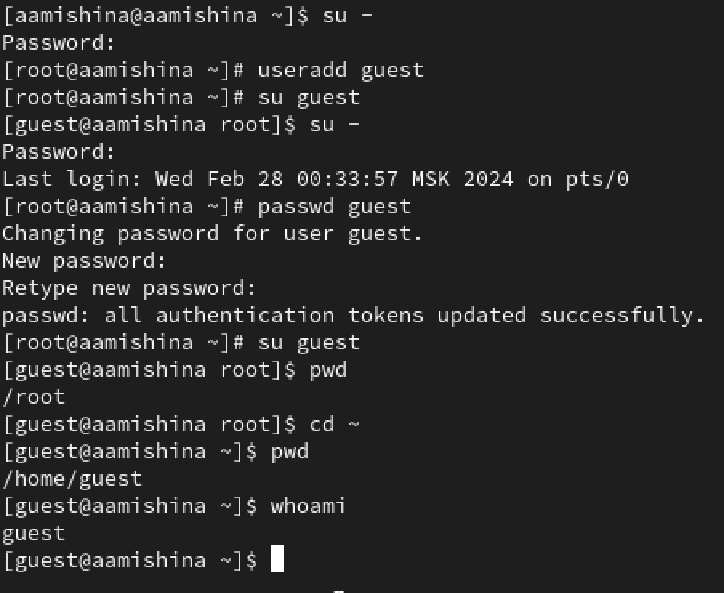
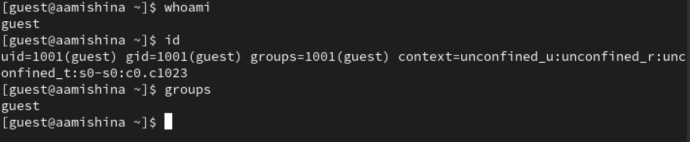
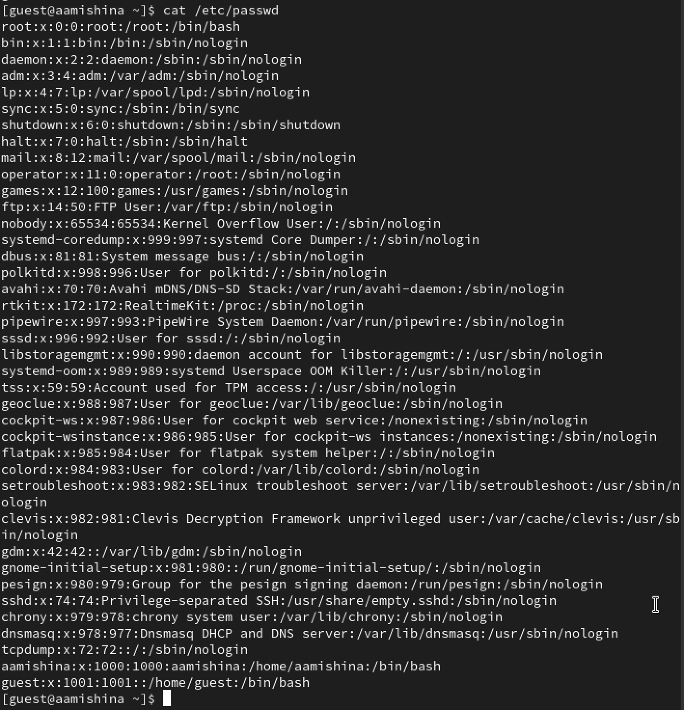
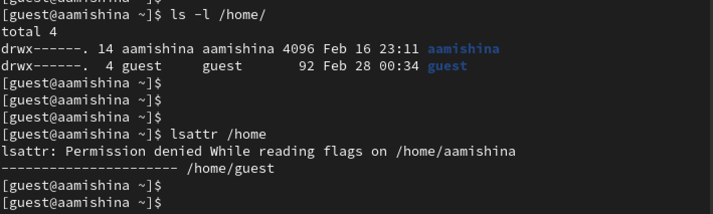
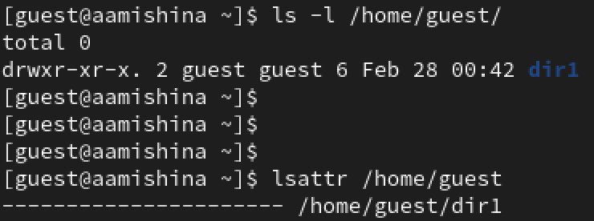
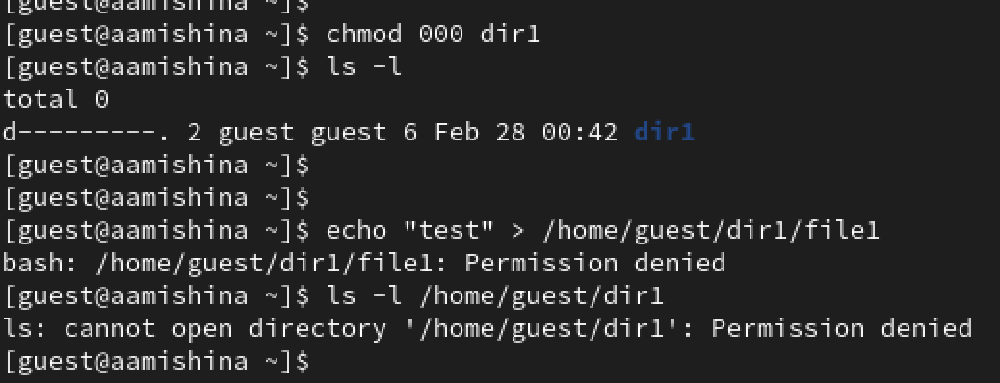
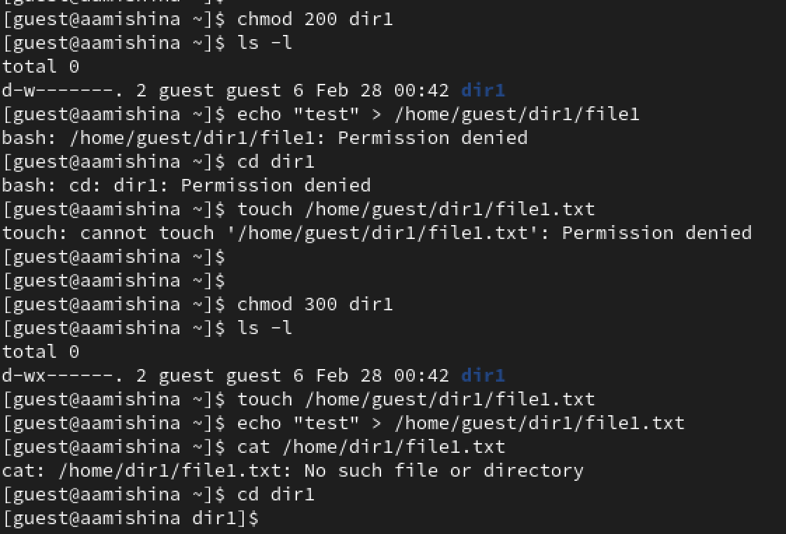
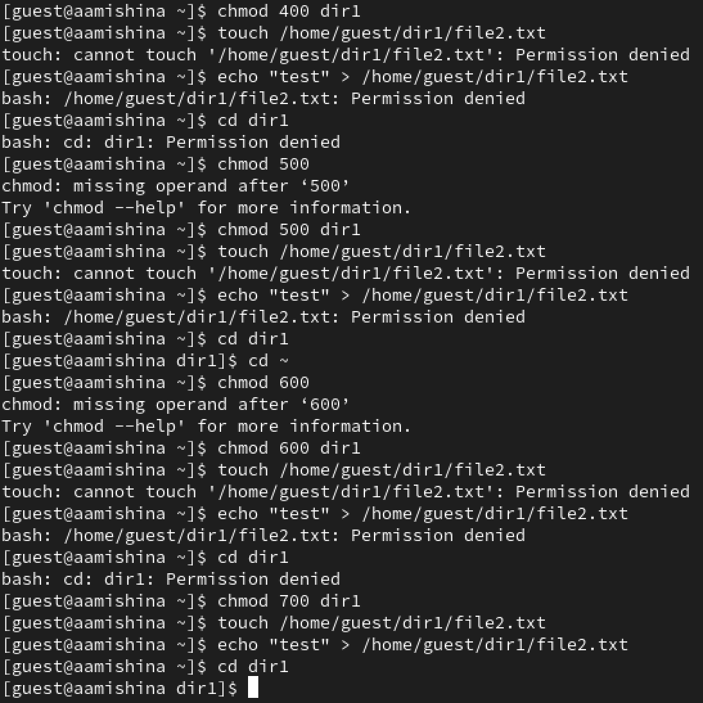

---
## Front matter
lang: ru-RU
title: Лабораторная работа №2
subtitle: Основы информационной безопасности
author:
  - Мишина А. А.
date: 28 февраля 2024

## i18n babel
babel-lang: russian
babel-otherlangs: english

## Fonts
mainfont: PT Serif
romanfont: PT Serif
sansfont: PT Sans
monofont: PT Mono
mainfontoptions: Ligatures=TeX
romanfontoptions: Ligatures=TeX
sansfontoptions: Ligatures=TeX,Scale=MatchLowercase
monofontoptions: Scale=MatchLowercase,Scale=0.9

## Formatting pdf
toc: false
toc-title: Содержание
slide_level: 2
aspectratio: 169
section-titles: true
theme: metropolis
header-includes:
 - \metroset{progressbar=frametitle,sectionpage=progressbar,numbering=fraction}
 - '\makeatletter'
 - '\beamer@ignorenonframefalse'
 - '\makeatother'
---

## Докладчик

- Мишина Анастасия Алексеевна
- НПИбд-02-22

# Выполнение лабораторной работы

## Цель работы

- Получение практических навыков работы в консоли с атрибутами файлов, закрепление теоретических основ дискреционного разграничения доступа в современных системах с открытым кодом на базе ОС Linux.

## Создание пользователя guest

{#fig:001 width=50%}

## Информация о пользователе guest

{#fig:002 width=70%}

## Файл /etc/passwd

{#fig:003 width=35%}

## Директории и поддиректории

{#fig:004 width=70%}

## Создание директории dir1

{#fig:005 width=70%}

## Изменение прав доступа dir1

{#fig:006 width=70%}

## Операции для заполнения таблиц

{#fig:007 width=70%}

## Операции для заполнения таблиц

{#fig:008 width=50%}

## Установленные права и разрешенные действия

: Установленные права и разрешенные действия

| Права директории | Права файла | Создание файла | Удаление файла | Запись в файл | Чтение файла | Смена директории | Просмотр файлов и директории | Переименование файла | Смена атрибутов файла |
|------------------|-------------|----------------|----------------|---------------|--------------|------------------|------------------------------|----------------------|----------------------|
| 000 | 000 | - | - | - | - | - | - | - | - |
| 100 | 100 | - | - | - | - | + | - | - | + |
| 200 | 200 | - | - | - | - | - | - | - | - |
| 300 | 300 | + | + | + | - | + | - | + | + |

## Установленные права и разрешенные действия

: Установленные права и разрешенные действия

| Права директории | Права файла | Создание файла | Удаление файла | Запись в файл | Чтение файла | Смена директории | Просмотр файлов и директории | Переименование файла | Смена атрибутов файла |
|------------------|-------------|----------------|----------------|---------------|--------------|------------------|------------------------------|----------------------|----------------------|
| 400 | 400 | - | - | - | - | - | + | - | - |
| 500 | 500 | - | - | - | + | + | + | - | + |
| 600 | 600 | - | - | - | - | - | + | - | - |
| 700 | 700 | + | + | + | + | + | + | + | + |

## Установленные права и разрешенные действия

: Минимальные права для совершения операций

| Операция | Минимальные права   на директорию | Минимальные права   на файл |
|----------|--------------------------------------|-----------------------------------|
| Создание файла | 300 | 200 |
| Удаление файла | 300 | 200 |
| Чтение файла | 500 | 400 |
| Запись в файл | 300 | 200 |
| Переименование файла | 300 | 200 |
| Создание поддиректории | 300 | 300 |
| Удаление поддиректории | 300 | 300 |

## Вывод

В ходе выполнения данной лабораторной работы, я получила практические навыки работы в консоли с атрибутами файлов, закрепила теоретические основы дискреционного разграничения доступа в современных системах с открытым кодом на базе ОС Linux.

