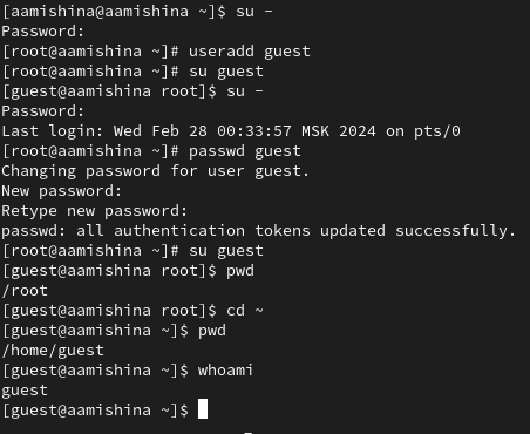
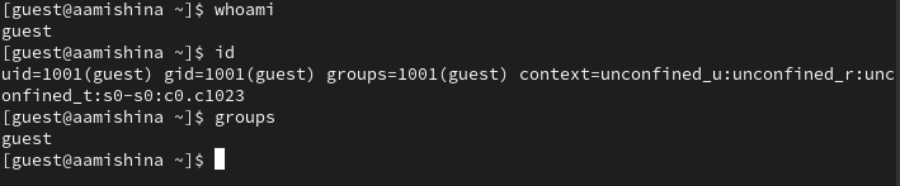
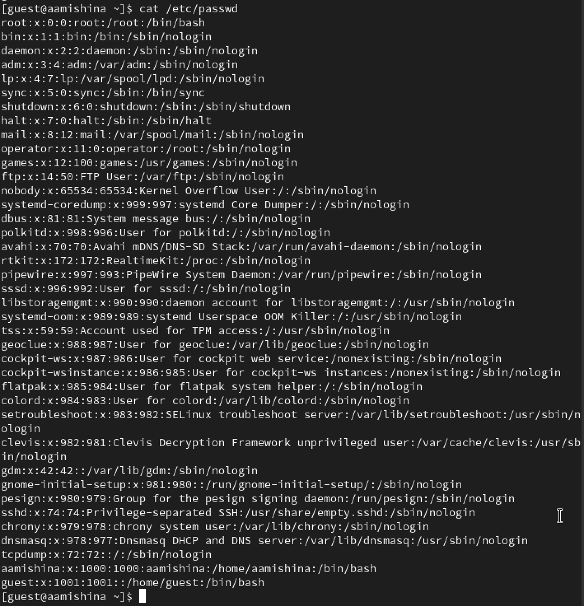
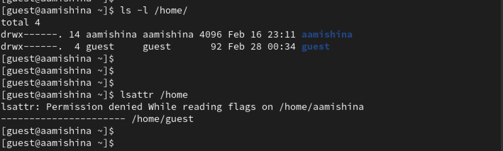
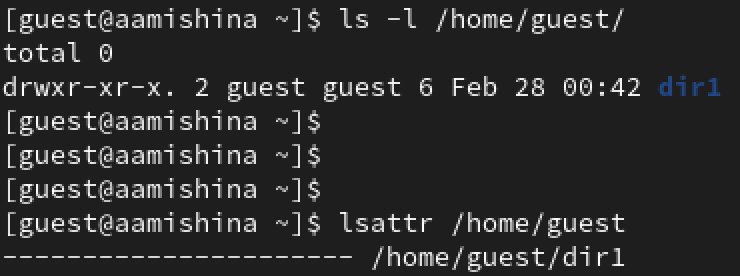
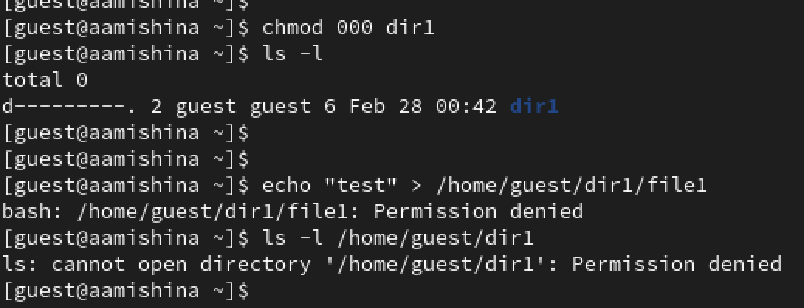
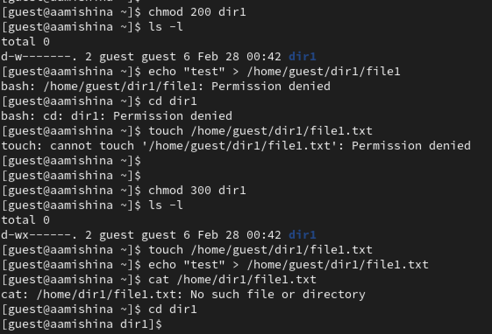
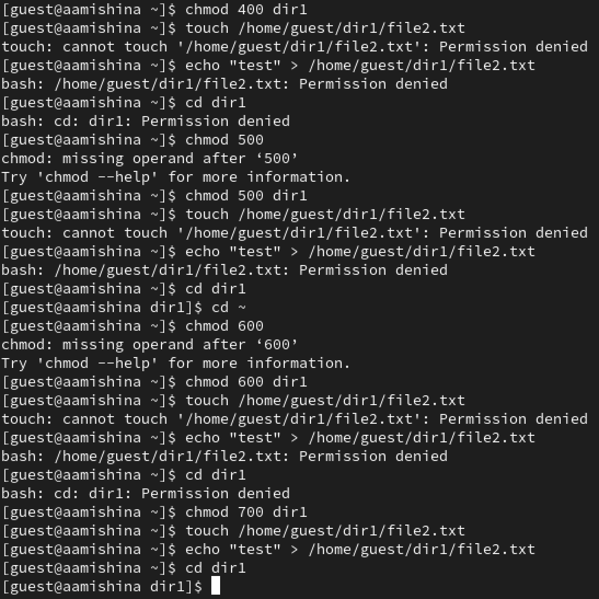

---
## Front matter
title: "Отчёт по лабораторной работе №2"
subtitle: "Дисциплина: Основы информационной безопасности"
author: "Мишина Анастасия Алексеевна"

## Generic otions
lang: ru-RU
toc-title: "Содержание"

## Bibliography
bibliography: bib/cite.bib
csl: pandoc/csl/gost-r-7-0-5-2008-numeric.csl

## Pdf output format
toc: true # Table of contents
toc-depth: 2
lof: true # List of figures
lot: true # List of tables
fontsize: 12pt
linestretch: 1.5
papersize: a4
documentclass: scrreprt
## I18n polyglossia
polyglossia-lang:
  name: russian
  options:
	- spelling=modern
	- babelshorthands=true
polyglossia-otherlangs:
  name: english
## I18n babel
babel-lang: russian
babel-otherlangs: english
## Fonts
mainfont: PT Serif
romanfont: PT Serif
sansfont: PT Sans
monofont: PT Mono
mainfontoptions: Ligatures=TeX
romanfontoptions: Ligatures=TeX
sansfontoptions: Ligatures=TeX,Scale=MatchLowercase
monofontoptions: Scale=MatchLowercase,Scale=0.9
## Biblatex
biblatex: true
biblio-style: "gost-numeric"
biblatexoptions:
  - parentracker=true
  - backend=biber
  - hyperref=auto
  - language=auto
  - autolang=other*
  - citestyle=gost-numeric
## Pandoc-crossref LaTeX customization
figureTitle: "Рис."
tableTitle: "Таблица"
listingTitle: "Листинг"
lofTitle: "Список иллюстраций"
lotTitle: "Список таблиц"
lolTitle: "Листинги"
## Misc options
indent: true
header-includes:
  - \usepackage{indentfirst}
  - \usepackage{float} # keep figures where there are in the text
  - \floatplacement{figure}{H} # keep figures where there are in the text
---

# Цель работы

Получение практических навыков работы в консоли с атрибутами файлов, закрепление теоретических основ дискреционного разграничения доступа в современных системах с открытым кодом на базе ОС Linux [@infosec].

# Выполнение лабораторной работы

Переходим в режим суперпользователя и создаем учётную запись пользователя guest: useradd guest. Зададим пароль для пользователя guest (использую учётную запись ад-
министратора): passwd guest. Далее войдем в систему от имени пользователя guest и определим директорию, в которой находимся, командой pwd. Директория не оказалась домашней, поэтому переходим в нее сами. Уточняем имя пользователя командой whoami - guest (рис. [-@fig:001]).

{#fig:001 width=70%}

Уточним имя пользователя - guest, его группу, а также группы, куда входит пользователь, командой id. Выведенные значения uid - 1001, gid - 1001, group: guest. Вывод команды groups совпадает с выводом команды id. Полученная информация об имени пользователя с данными совпадает с данными, выводимыми в приглашении командной строки (рис. [-@fig:002]).

{#fig:002 width=70%}

Просмотрим файл /etc/passwd командой cat /etc/passwd. В самом низу видим свою учетную запись, uid - 1001, gid - 1001. Значение совпадают с теми, что были получены в предыдущих пунктах (рис. [-@fig:003]).

{#fig:003 width=70%}

Определим существующие в системе директории командой ls -l /home/. На директориях установлены все права (чтение, запись, выполнение) для владельца. Проверим, какие расширенные атрибуты установлены на поддиректориях, находящихся в директории /home, командой: lsattr /home. Удалось увидеть лишь расширенные атрибуты своей директории, потому что мы не являемся владельцем остальных (рис. [-@fig:004]).

{#fig:004 width=70%}

Создаем в домашней директории поддиректорию dir1 командой mkdir dir1. Определим командами ls -l и lsattr, какие права доступа и расширенные атрибуты были выставлены на директорию dir1 - drwxr-xr-x (рис. [-@fig:005]).

{#fig:005 width=70%}

Снимаем с директории dir1 все атрибуты командой: chmod 000 dir1. Проверим с помощью команды ls -l правильность выполнения (рис. [-@fig:006]). Попытаемся создать в директории dir1 файл file1 командой echo "test" > /home/guest/dir1/file1, но получаем отказ, так как все права были отозваны. Файл не был создан (команда ls -l /home/guest/dir1 также не выполняется).

{#fig:006 width=70%}

Для заполнения таблиц 1 и 2 меняем права доступа на директорию и пытаемся производить операции (рис. [-@fig:007]), (рис. [-@fig:008]). Если операция разрешена, то заносим знак "+", иначе - "-".

{#fig:007 width=70%}

{#fig:008 width=70%}

Заполним таблицу "Установленные права и разрешенные действия" [-@tbl:1].

: Установленные права и разрешенные действия {#tbl:1}

| Права директории | Права файла | Создание файла | Удаление файла | Запись в файл | Чтение файла | Смена директории | Просмотр файлов и директории | Переименование файла | Смена атрибутов файла |
|------------------|-------------|----------------|----------------|---------------|--------------|------------------|------------------------------|----------------------|----------------------|
| 000 | 000 | - | - | - | - | - | - | - | - |
| 100 | 100 | - | - | - | - | + | - | - | + |
| 200 | 200 | - | - | - | - | - | - | - | - |
| 300 | 300 | + | + | + | - | + | - | + | + |
| 400 | 400 | - | - | - | - | - | + | - | - |
| 500 | 500 | - | - | - | + | + | + | - | + |
| 600 | 600 | - | - | - | - | - | + | - | - |
| 700 | 700 | + | + | + | + | + | + | + | + |

Заполним таблицу "Минимальные права для совершения операций" [-@tbl:2].

: Минимальные права для совершения операций {#tbl:2}

| Операция | Минимальные права   на директорию | Минимальные права   на файл |
|----------|--------------------------------------|-----------------------------------|
| Создание файла | 300 | 200 |
| Удаление файла | 300 | 200 |
| Чтение файла | 500 | 400 |
| Запись в файл | 300 | 200 |
| Переименование файла | 300 | 200 |
| Создание поддиректории | 300 | 300 |
| Удаление поддиректории | 300 | 300 |

# Выводы

В ходе выполнения данной лабораторной работы, я получила практические навыки работы в консоли с атрибутами файлов, закрепила теоретические основы дискреционного разграничения доступа в современных системах с открытым кодом на базе ОС Linux.

# Список литературы{.unnumbered}

::: {#refs}
:::
