---
## Front matter
title: "Отчёт по лабораторной работе №3"
subtitle: "Дисциплина: Основы информационной безопасности"
author: "Мишина Анастасия Алексеевна"

## Generic otions
lang: ru-RU
toc-title: "Содержание"

## Bibliography
bibliography: bib/cite.bib
csl: pandoc/csl/gost-r-7-0-5-2008-numeric.csl

## Pdf output format
toc: true # Table of contents
toc-depth: 2
lof: true # List of figures
lot: true # List of tables
fontsize: 12pt
linestretch: 1.5
papersize: a4
documentclass: scrreprt
## I18n polyglossia
polyglossia-lang:
  name: russian
  options:
	- spelling=modern
	- babelshorthands=true
polyglossia-otherlangs:
  name: english
## I18n babel
babel-lang: russian
babel-otherlangs: english
## Fonts
mainfont: PT Serif
romanfont: PT Serif
sansfont: PT Sans
monofont: PT Mono
mainfontoptions: Ligatures=TeX
romanfontoptions: Ligatures=TeX
sansfontoptions: Ligatures=TeX,Scale=MatchLowercase
monofontoptions: Scale=MatchLowercase,Scale=0.9
## Biblatex
biblatex: true
biblio-style: "gost-numeric"
biblatexoptions:
  - parentracker=true
  - backend=biber
  - hyperref=auto
  - language=auto
  - autolang=other*
  - citestyle=gost-numeric
## Pandoc-crossref LaTeX customization
figureTitle: "Рис."
tableTitle: "Таблица"
listingTitle: "Листинг"
lofTitle: "Список иллюстраций"
lotTitle: "Список таблиц"
lolTitle: "Листинги"
## Misc options
indent: true
header-includes:
  - \usepackage{indentfirst}
  - \usepackage{float} # keep figures where there are in the text
  - \floatplacement{figure}{H} # keep figures where there are in the text
---

# Цель работы

Получение практических навыков работы в консоли с атрибутами файлов для групп пользователей [@infosec].

# Выполнение лабораторной работы

Переходим в режим суперпользователя и создаем учётную запись пользователя guest2: useradd guest2 (пользователь guest был уже создан). Зададим пароль для пользователя guest2 (использую учётную запись администратора): passwd guest2. Добавляем пользователя guest2 в группу guest: gpasswd -a guest2 guest (рис. [-@fig:001]).

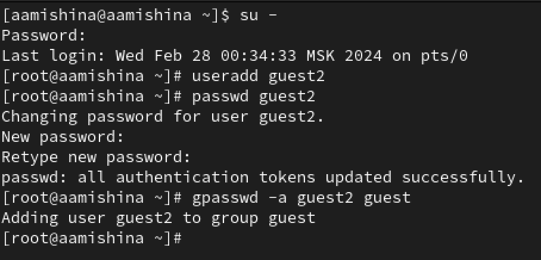{#fig:001 width=70%}

Осуществляем вход в систему от двух пользователей на двух разных консолях: guest на первой консоли (рис. [-@fig:002]) и guest2 на второй консоли (рис. [-@fig:003]). Для обоих пользователей командой pwd определяем директорию, в которой находимся - /home/aamishina. Уточним имена пользователей - команда whoami (guest и guest2), их группы - команда groups (guest для 1ого и guest, guest2 для 2ого). С помощью команды id также смотрим, к каким группам принадлежат пользователи, запоминаем gid. Выводы команд groups и id -Gn совпадают, а команда id -G выводит не имена групп, а их gid. Команды groups guest и groups guest 2 также дают верные результаты (рис. [-@fig:004]).

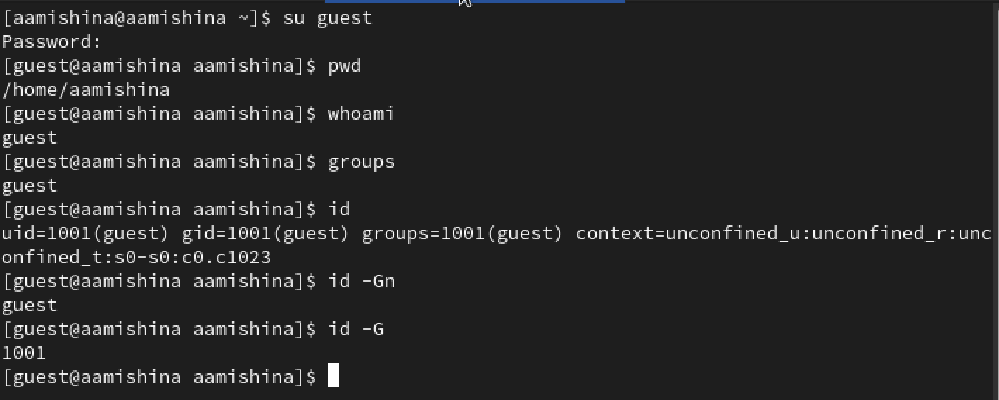{#fig:002 width=70%}

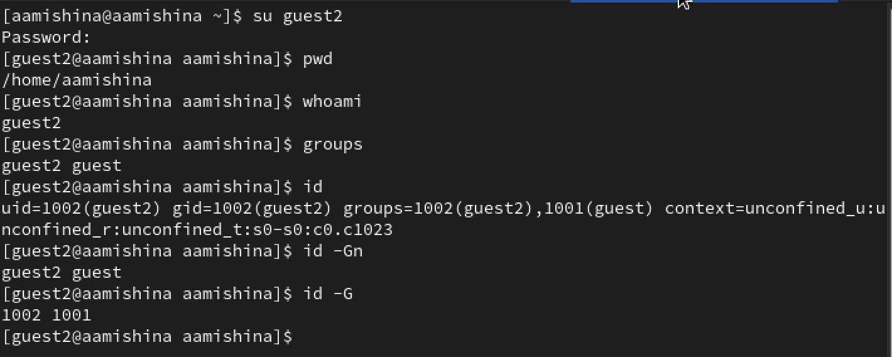{#fig:003 width=70%}

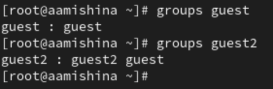{#fig:004 width=70%}

Затем сравним полученную информацию с содержимым файла /etc/group. Просмотрим его командой cat /etc/group (рис. [-@fig:005]), (рис. [-@fig:006]). Видим, что в группе пользователя guest он сам и пользователь guest2, а в группе пользователя guest2 только он сам.

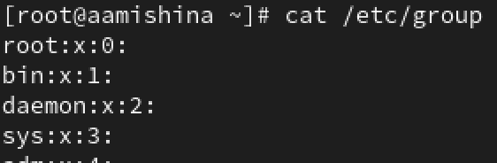{#fig:005 width=70%}

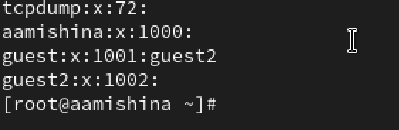{#fig:006 width=70%}

От имени пользователя guest2 выполним регистрацию пользователя guest2 в группе guest командой newgrp guest (рис. [-@fig:007]).

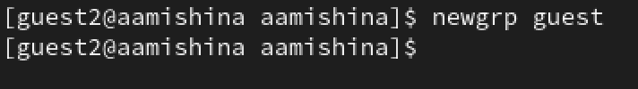{#fig:007 width=70%}

От имени пользователя guest изменяем права директории /home/guest, разрешив все действия для пользователей группы: chmod g+rwx /home/guest (рис. [-@fig:008]).

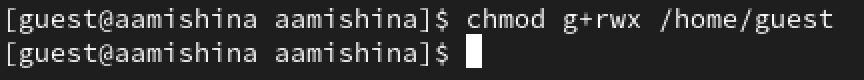{#fig:008 width=70%}

От имени пользователя guest снимем с директории /home/guest/dir1 все атрибуты командой chmod 000 dir1 и проверим правильность снятия атрибутов. Ни одно из действий не разрешено.

Для заполнения таблиц 1 и 2 меняем права доступа на директорию dir1 (рис. [-@fig:009]) и пытаемся производить операции от пользователя guest2 (рис. [-@fig:010]), (рис. [-@fig:011]), (рис. [-@fig:012]), (рис. [-@fig:013]), (рис. [-@fig:014]), (рис. [-@fig:015]). Если операция разрешена, то заносим знак "+", иначе - "-".

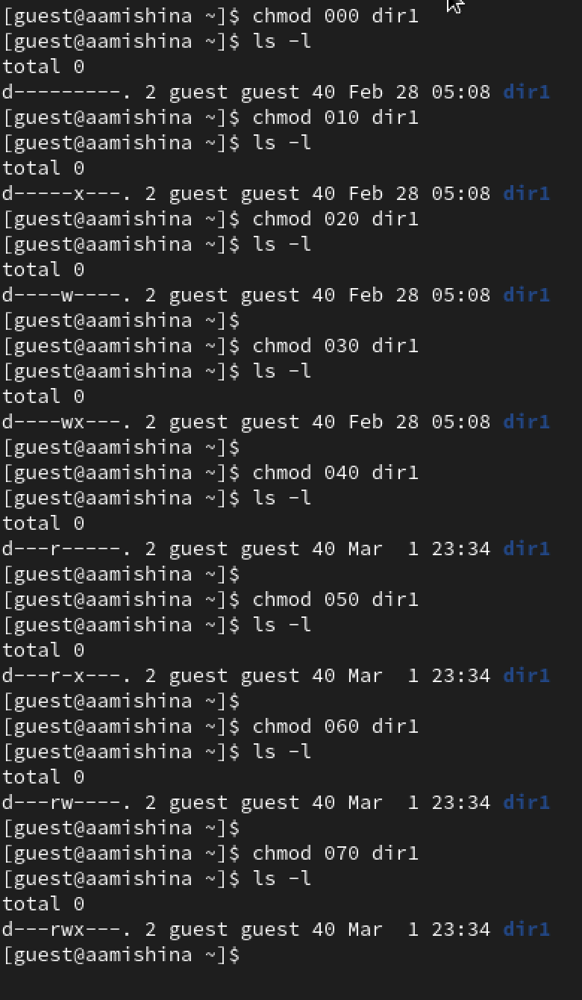{#fig:009 width=70%}

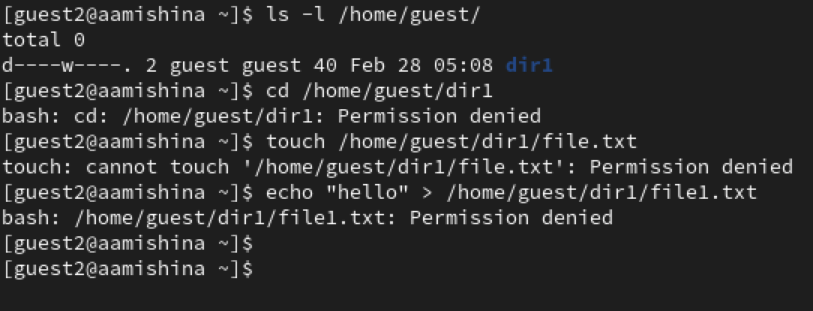{#fig:010 width=70%}

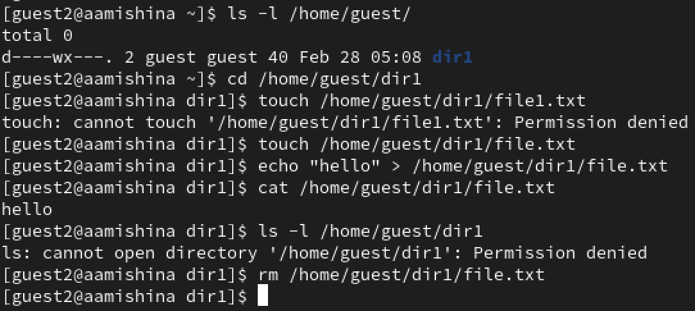{#fig:011 width=70%}

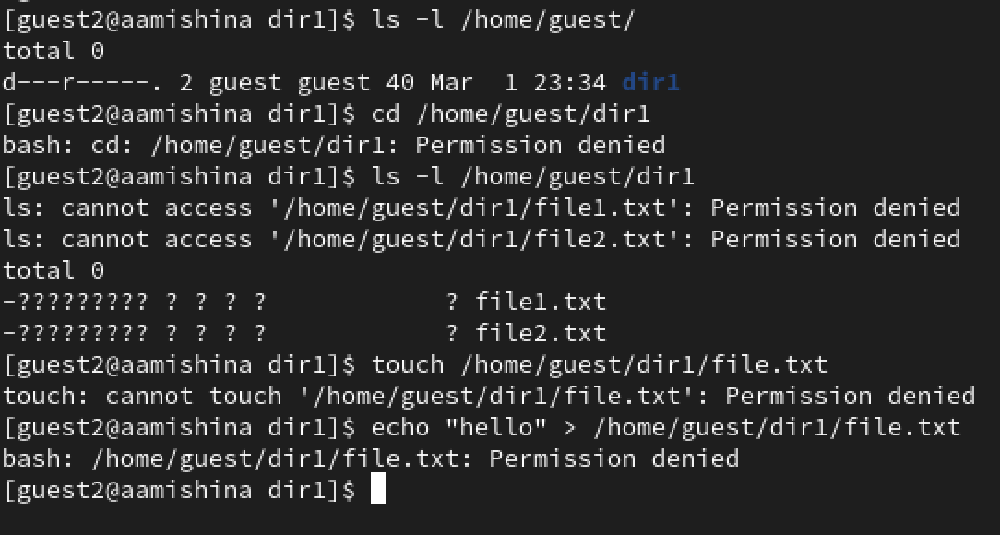{#fig:012 width=70%}

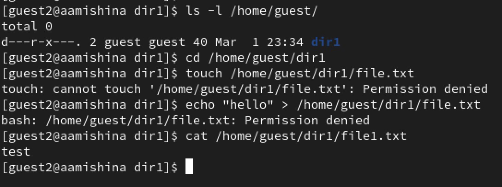{#fig:013 width=70%}

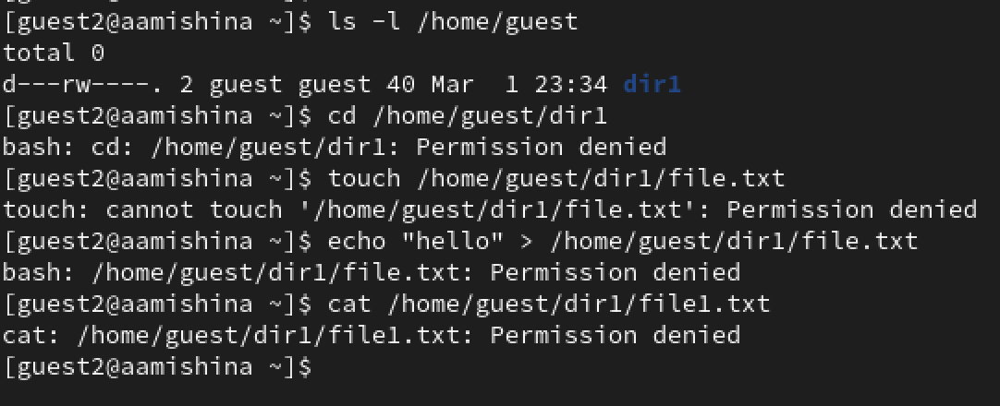{#fig:014 width=70%}

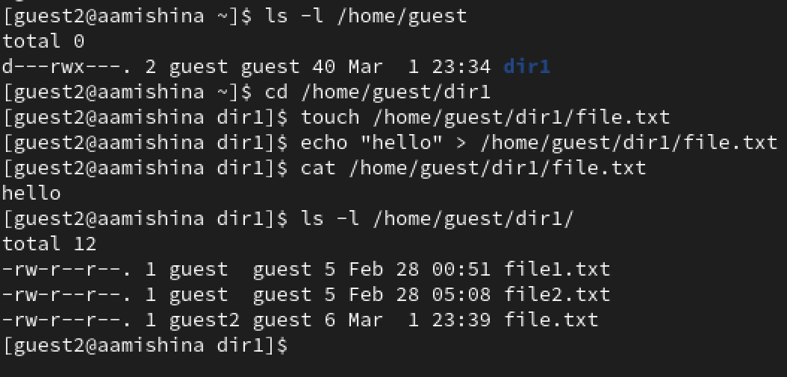{#fig:015 width=70%}

Заполним таблицу "Установленные права и разрешенные действия для групп" [-@tbl:1].

: Установленные права и разрешенные действия для групп {#tbl:1}

| Права директории | Права файла | Создание файла | Удаление файла | Запись в файл | Чтение файла | Смена директории | Просмотр файлов и директории | Переименование файла | Смена атрибутов файла |
|------------------|-------------|----------------|----------------|---------------|--------------|------------------|------------------------------|----------------------|----------------------|
| 000 | 000 | - | - | - | - | - | - | - | - |
| 100 | 100 | - | - | - | - | + | - | - | + |
| 200 | 200 | - | - | - | - | - | - | - | - |
| 300 | 300 | + | + | + | - | + | - | + | + |
| 400 | 400 | - | - | - | - | - | + | - | - |
| 500 | 500 | - | - | - | + | + | + | - | + |
| 600 | 600 | - | - | - | - | - | + | - | - |
| 700 | 700 | + | + | + | + | + | + | + | + |

Заполним таблицу "Минимальные права для совершения операций от имени пользователей входящих в группу" [-@tbl:2].

: Минимальные права для совершения операций от имени пользователей входящих в группу {#tbl:2}

| Операция | Минимальные права   на директорию | Минимальные права   на файл |
|----------|--------------------------------------|-----------------------------------|
| Создание файла | 300 | 200 |
| Удаление файла | 300 | 200 |
| Чтение файла | 500 | 400 |
| Запись в файл | 300 | 200 |
| Переименование файла | 300 | 200 |
| Создание поддиректории | 300 | 300 |
| Удаление поддиректории | 300 | 300 |

# Выводы

В ходе выполнения данной лабораторной работы, я получила практические навыки работы в консоли с атрибутами файлов для групп пользователей.

# Список литературы{.unnumbered}

::: {#refs}
:::
