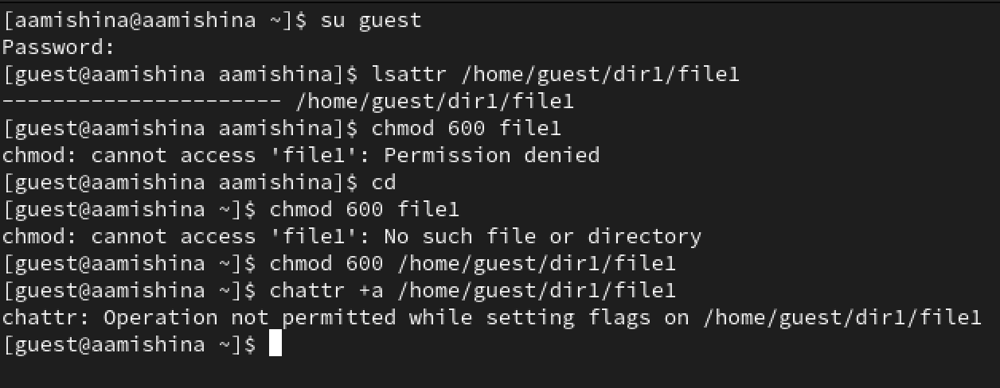
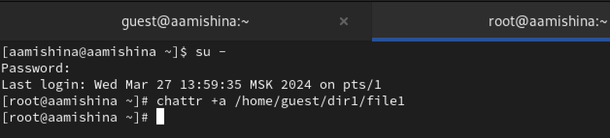
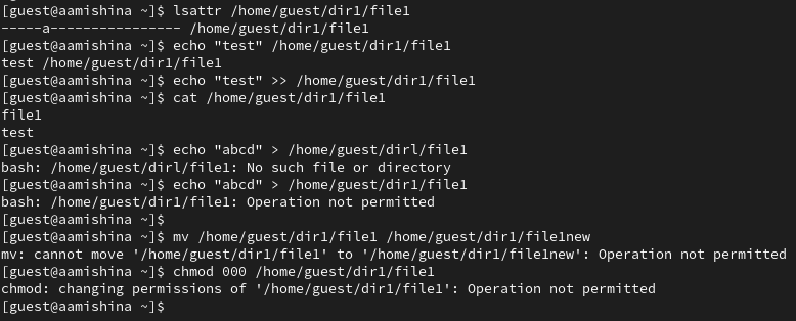
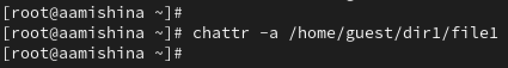
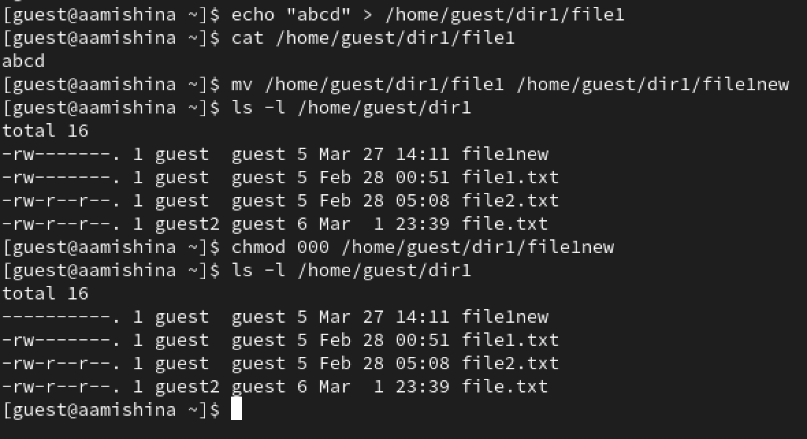
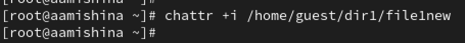
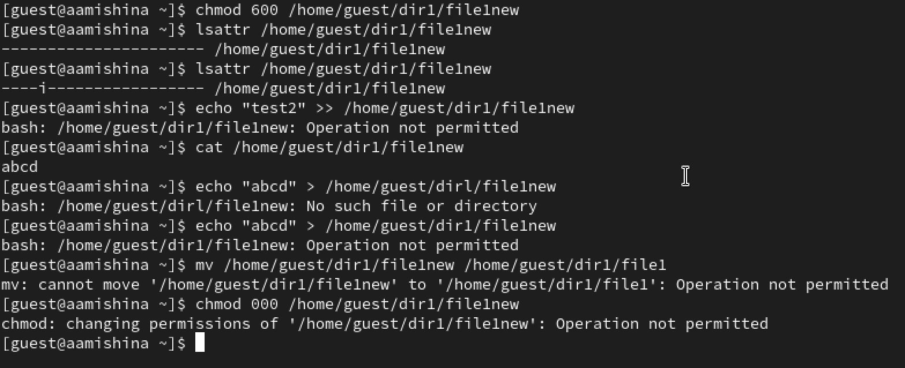

---
## Front matter
title: "Отчёт по лабораторной работе №4"
subtitle: "Дисциплина: Основы информационной безопасности"
author: "Мишина Анастасия Алексеевна"

## Generic otions
lang: ru-RU
toc-title: "Содержание"

## Bibliography
bibliography: bib/cite.bib
csl: pandoc/csl/gost-r-7-0-5-2008-numeric.csl

## Pdf output format
toc: true # Table of contents
toc-depth: 2
lof: true # List of figures
lot: true # List of tables
fontsize: 12pt
linestretch: 1.5
papersize: a4
documentclass: scrreprt
## I18n polyglossia
polyglossia-lang:
  name: russian
  options:
	- spelling=modern
	- babelshorthands=true
polyglossia-otherlangs:
  name: english
## I18n babel
babel-lang: russian
babel-otherlangs: english
## Fonts
mainfont: PT Serif
romanfont: PT Serif
sansfont: PT Sans
monofont: PT Mono
mainfontoptions: Ligatures=TeX
romanfontoptions: Ligatures=TeX
sansfontoptions: Ligatures=TeX,Scale=MatchLowercase
monofontoptions: Scale=MatchLowercase,Scale=0.9
## Biblatex
biblatex: true
biblio-style: "gost-numeric"
biblatexoptions:
  - parentracker=true
  - backend=biber
  - hyperref=auto
  - language=auto
  - autolang=other*
  - citestyle=gost-numeric
## Pandoc-crossref LaTeX customization
figureTitle: "Рис."
tableTitle: "Таблица"
listingTitle: "Листинг"
lofTitle: "Список иллюстраций"
lotTitle: "Список таблиц"
lolTitle: "Листинги"
## Misc options
indent: true
header-includes:
  - \usepackage{indentfirst}
  - \usepackage{float} # keep figures where there are in the text
  - \floatplacement{figure}{H} # keep figures where there are in the text
---

# Цель работы

Получение практических навыков работы в консоли с расширенными атрибутами файлов [@infosec].

# Выполнение лабораторной работы

Переходим в режим пользователя guest. Определяем расширенные атрибуты файла /home/guest/dir1/file1 командой lsattr /home/guest/dir1/file1. Устанавливаем командой
chmod 600 file1 на файл file1 права, разрешающие чтение и запись для владельца файла. Пробуем установить на файл /home/guest/dir1/file1 расширенный атрибут a от имени пользователя guest: chattr +a /home/guest/dir1/file1. В ответ получаем отказ от выполнения операции (рис. [-@fig:001]).

{#fig:001 width=70%}
 
Открываем второе окно терминала, переходим в режим суперпользователя. Пробуем установить расширенный атрибут a на файл /home/guest/dir1/file1 от имени суперпользователя: chattr +a /home/guest/dir1/file1. Установка проходит без ошибок (рис. [-@fig:002]).

{#fig:002 width=70%}

От пользователя guest проверяем правильность установления атрибута: lsattr /home/guest/dir1/file1. Выполняем дозапись в файл file1 слова «test» командой: echo "test" /home/guest/dir1/file1. Выполняем чтение файла file1 командой: cat /home/guest/dir1/file1. Как видим, слово test было успешно записано в file1. Пробуем стереть имеющуюся информацию в file1 командой: echo "abcd" > /home/guest/dirl/file1, но выдается ошибка. Переименовать файл или установить на него права командой chmod 000 file1 также не вышло (рис. [-@fig:003]).

{#fig:003 width=70%}

Снимимаем расширенный атрибут a с файла /home/guest/dirl/file1 от имени суперпользователя командой: chattr -a /home/guest/dir1/file1 (рис. [-@fig:004]).

{#fig:004 width=70%}

Повторяем операции, которые ранее не удавалось выполнить. Все операции выполняются успешно (рис. [-@fig:005]).

{#fig:005 width=70%}

Затем повторяем все действия по шагам, заменив атрибут «a» атрибутом «i» (рис. [-@fig:006]). Проверяем, что атрибут i установился. При повторе действий дозаписать информацию в файл или полностью стереть ее не удалось. Переименовать файл и сменить на него права также не вышло (рис. [-@fig:007]).

{#fig:006 width=70%}

{#fig:007 width=70%}

Делаем вывод, с расширенным атрибутом а удалось выполнить дозапись в файл. С атрибутом i ни одна из операций не выполнилась, были получены ошибки.

# Выводы

В ходе выполнения данной лабораторной работы, я получила практические навыки работы в консоли с расширенными атрибутами файлов.

# Список литературы{.unnumbered}

::: {#refs}
:::
