---
## Front matter
lang: ru-RU
title: Лабораторная работа №5
subtitle: Основы информационной безопасности
author:
  - Мишина А. А.
date: 11 апреля 2024

## i18n babel
babel-lang: russian
babel-otherlangs: english

## Fonts
mainfont: PT Serif
romanfont: PT Serif
sansfont: PT Sans
monofont: PT Mono
mainfontoptions: Ligatures=TeX
romanfontoptions: Ligatures=TeX
sansfontoptions: Ligatures=TeX,Scale=MatchLowercase
monofontoptions: Scale=MatchLowercase,Scale=0.9

## Formatting pdf
toc: false
toc-title: Содержание
slide_level: 2
aspectratio: 169
section-titles: true
theme: metropolis
header-includes:
 - \metroset{progressbar=frametitle,sectionpage=progressbar,numbering=fraction}
 - '\makeatletter'
 - '\beamer@ignorenonframefalse'
 - '\makeatother'
---

## Докладчик

- Мишина Анастасия Алексеевна
- НПИбд-02-22

# Выполнение лабораторной работы

## Цель работы

- Изучение механизмов изменения идентификаторов, применения SetUID- и Sticky-битов. Получение практических навыков работы в кон- соли с дополнительными атрибутами. Рассмотрение работы механизма смены идентификатора процессов пользователей, а также влияние бита Sticky на запись и удаление файлов.

## Файл simpleid.c

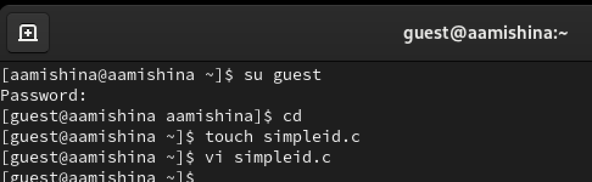{#fig:001 width=70%}

## Файл simpleid.c

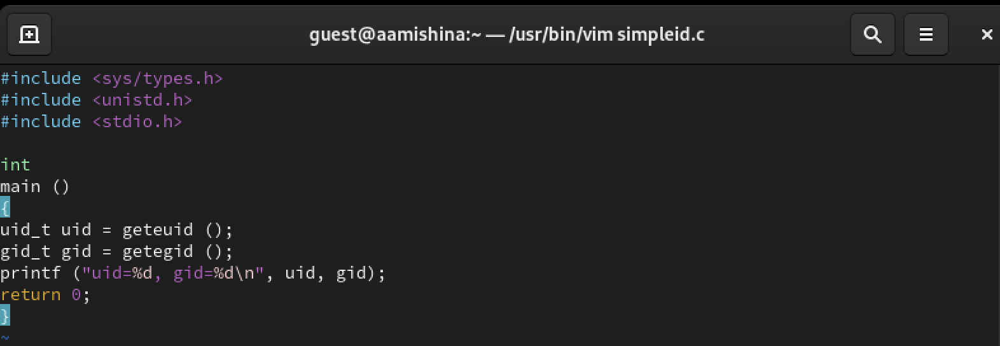{#fig:002 width=70%}

## Проверка

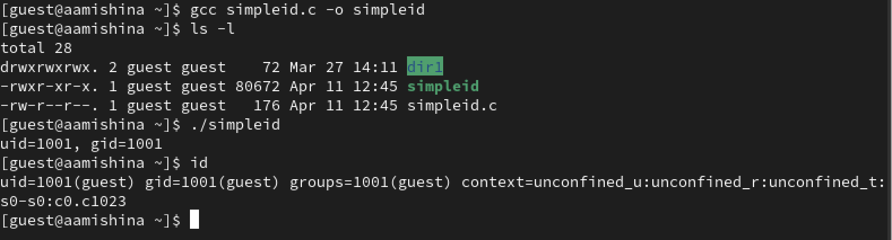{#fig:003 width=70%}

## Усложнение

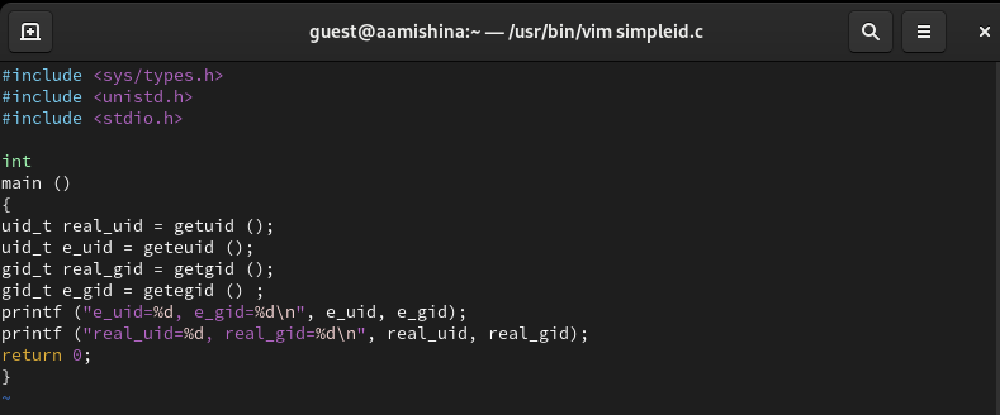{#fig:004 width=70%}

## Проверка

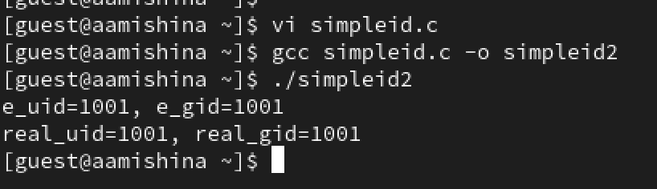{#fig:005 width=70%}

## Смена атрибута и владельца

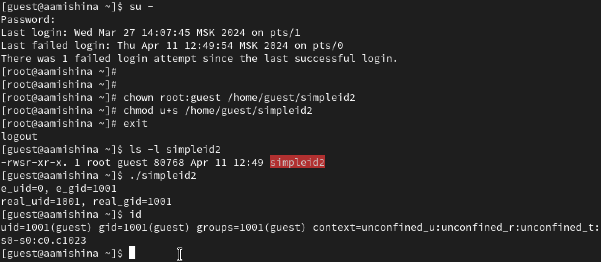{#fig:006 width=70%}

## Смена атрибута и владельца

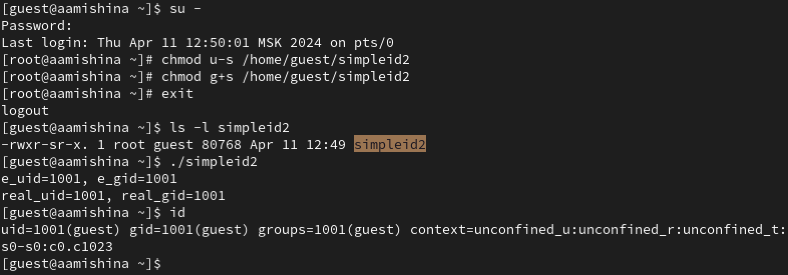{#fig:007 width=70%}

## Readfile.c

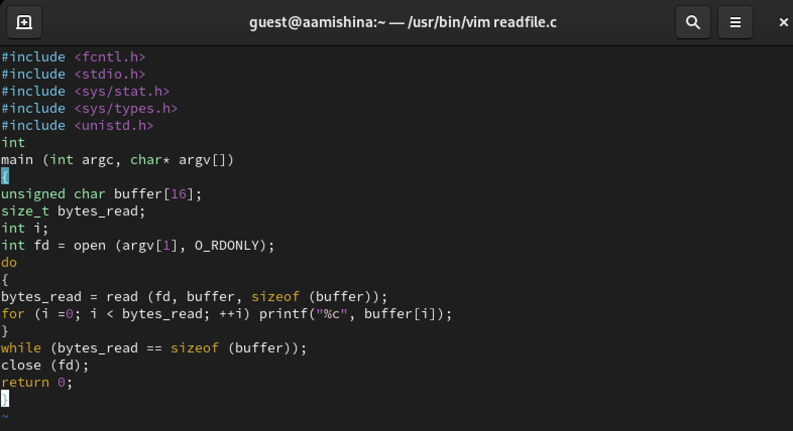{#fig:008 width=70%}

## Проверка

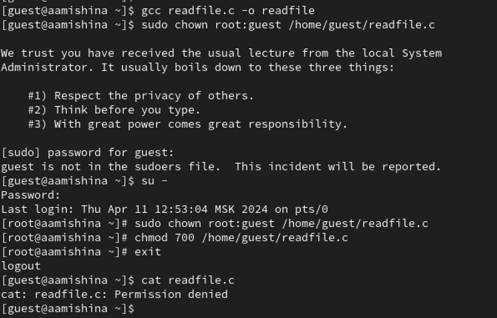{#fig:009 width=70%}

## Смена владельца и атрибута

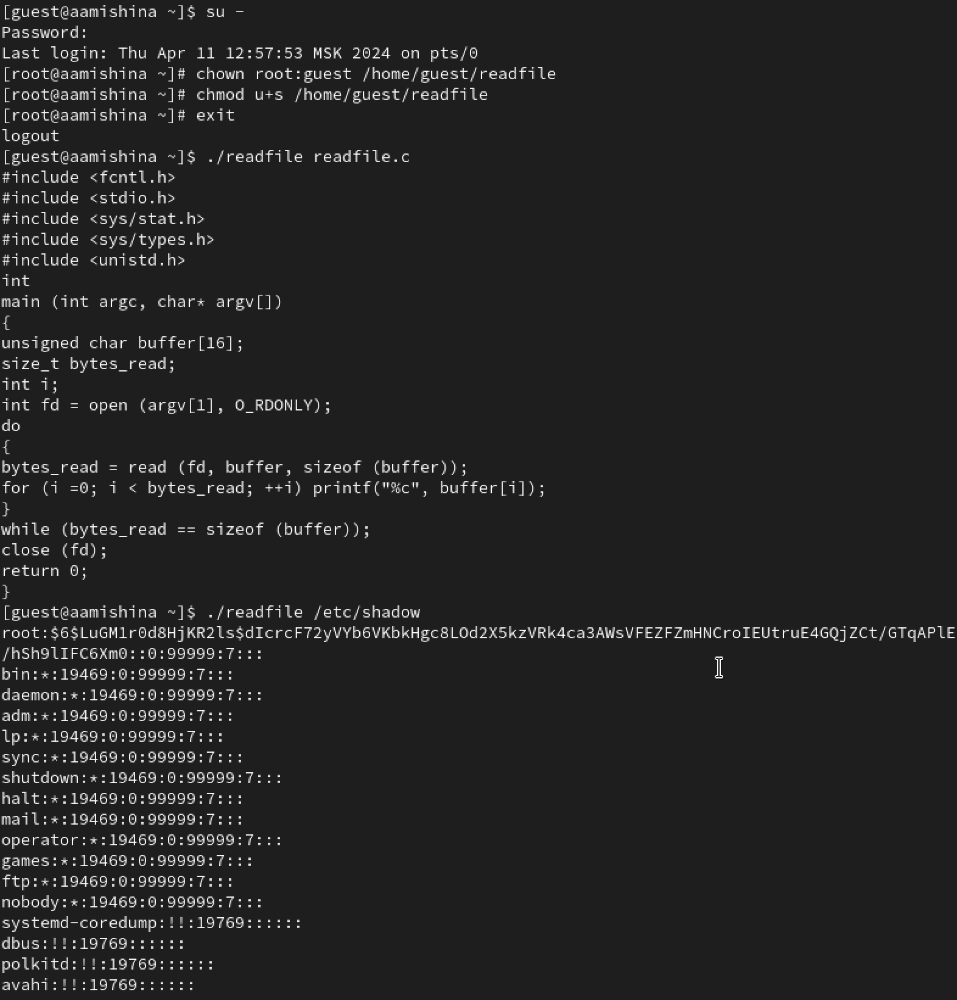{#fig:010 width=35%}

## file01.txt

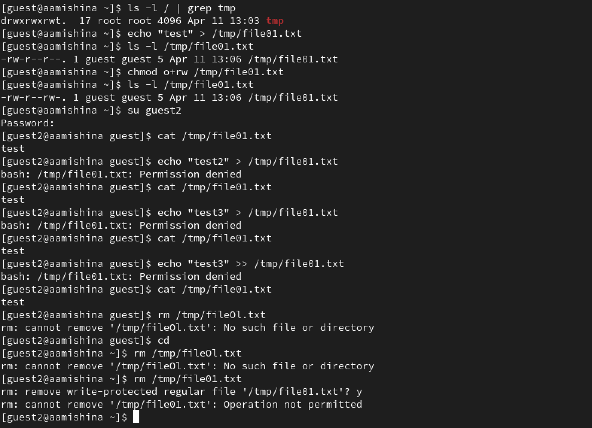{#fig:011 width=50%}

## Атрибут t

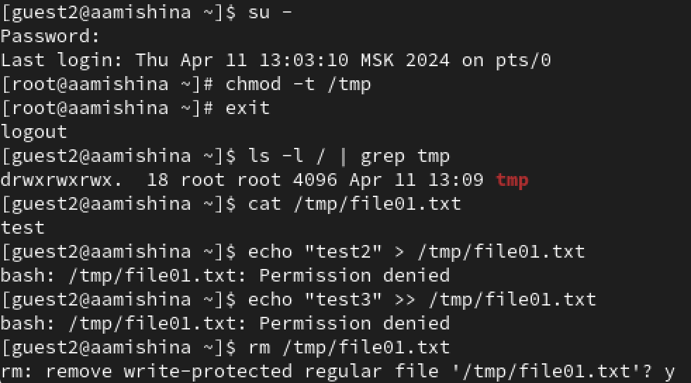{#fig:012 width=70%}

## Атрибут t

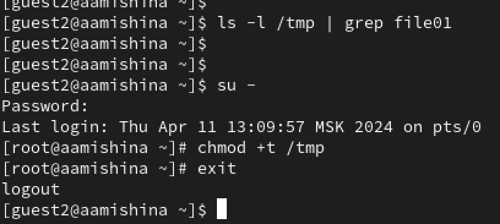{#fig:013 width=70%}

## Вывод

- В ходе выполнения данной лабораторной работы, я изучила механизмы изменения идентификаторов, применения SetUID- и Sticky-битов. Получила практические навыки работы в консоли с дополнительными атрибутами. Рассмотрела работы механизма смены идентификатора процессов пользователей, а также влияние бита Sticky на запись и удаление файлов.