---
## Front matter
title: "Отчёт по лабораторной работе №5"
subtitle: "Дисциплина: Основы информационной безопасности"
author: "Мишина Анастасия Алексеевна"

## Generic otions
lang: ru-RU
toc-title: "Содержание"

## Bibliography
bibliography: bib/cite.bib
csl: pandoc/csl/gost-r-7-0-5-2008-numeric.csl

## Pdf output format
toc: true # Table of contents
toc-depth: 2
lof: true # List of figures
lot: true # List of tables
fontsize: 12pt
linestretch: 1.5
papersize: a4
documentclass: scrreprt
## I18n polyglossia
polyglossia-lang:
  name: russian
  options:
	- spelling=modern
	- babelshorthands=true
polyglossia-otherlangs:
  name: english
## I18n babel
babel-lang: russian
babel-otherlangs: english
## Fonts
mainfont: PT Serif
romanfont: PT Serif
sansfont: PT Sans
monofont: PT Mono
mainfontoptions: Ligatures=TeX
romanfontoptions: Ligatures=TeX
sansfontoptions: Ligatures=TeX,Scale=MatchLowercase
monofontoptions: Scale=MatchLowercase,Scale=0.9
## Biblatex
biblatex: true
biblio-style: "gost-numeric"
biblatexoptions:
  - parentracker=true
  - backend=biber
  - hyperref=auto
  - language=auto
  - autolang=other*
  - citestyle=gost-numeric
## Pandoc-crossref LaTeX customization
figureTitle: "Рис."
tableTitle: "Таблица"
listingTitle: "Листинг"
lofTitle: "Список иллюстраций"
lotTitle: "Список таблиц"
lolTitle: "Листинги"
## Misc options
indent: true
header-includes:
  - \usepackage{indentfirst}
  - \usepackage{float} # keep figures where there are in the text
  - \floatplacement{figure}{H} # keep figures where there are in the text
---

# Цель работы

Изучение механизмов изменения идентификаторов, применения SetUID- и Sticky-битов. Получение практических навыков работы в кон- соли с дополнительными атрибутами. Рассмотрение работы механизма смены идентификатора процессов пользователей, а также влияние бита Sticky на запись и удаление файлов [@infosec].

# Выполнение лабораторной работы

## Создание программы

Входим в систему от имени пользователя guest и создаем файл simpleid.c , открываем его в редакторе vi (рис. [-@fig:001]). В файл вписываем код из мануала (рис. [-@fig:002]).

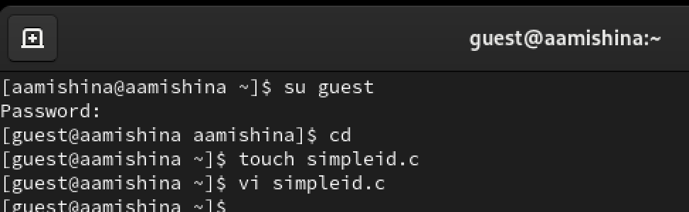{#fig:001 width=70%}

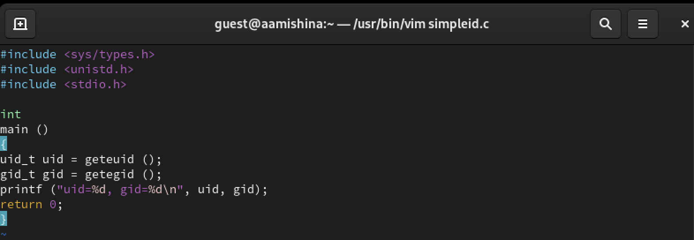{#fig:002 width=70%}

Скомплилируем программу и убедимся, что файл программы создан: gcc simpleid.c -o simpleid. Выполняем программу simpleid: ./simpleid и выполняем системную программу id: id. Видим, что результаты совпадают (рис. [-@fig:003]).

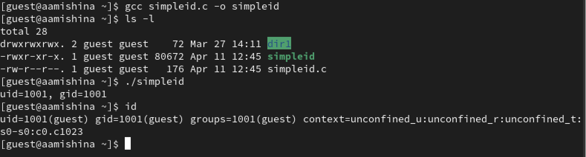{#fig:003 width=70%}

Теперь усложним программу, добавив вывод действительных идентификаторов (рис. [-@fig:004]).

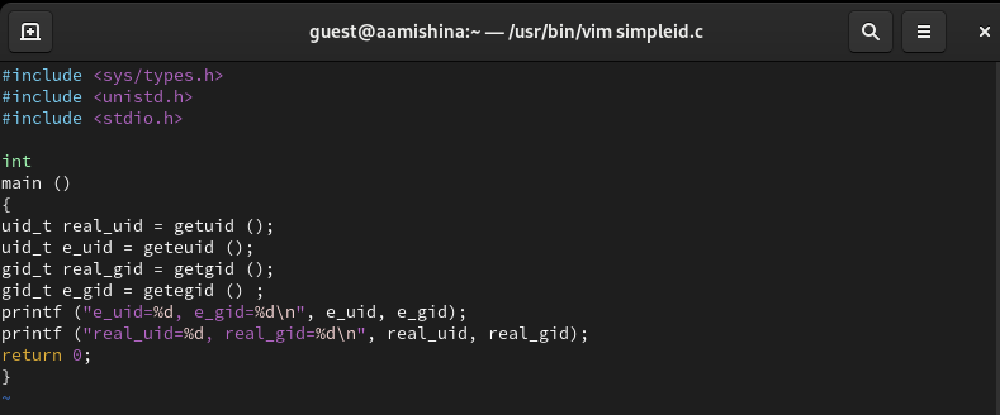{#fig:004 width=70%}

Компилируем и запускаем simpleid2.c: gcc simpleid2.c -o simpleid2 и ./simpleid2 (рис. [-@fig:005]).

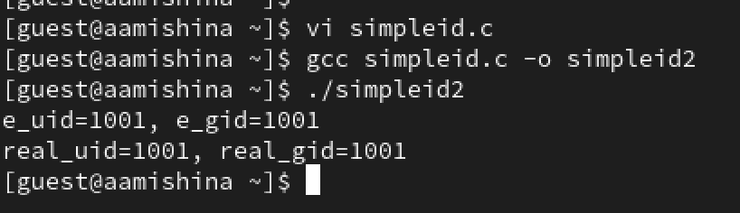{#fig:005 width=70%}

Переходим в режим суперпользователя и выполняем команды: chown root:guest /home/guest/simpleid2 и chmod u+s /home/guest/simpleid2. От имени суперпользователя мы изменили владельца файла и добавили атрибут s, это означает, что пользователь будет выполнять файл с разрешениями владельца файла. Проверяем правильность установки: ls -l simpleid2. Запусакем simpleid2 и вводим команду id: ./simpleid2 и id. Теперь владельцем файла является пользователь с id 0 (root), а изначально владельцем был пользователь с id 1001 (guest) (рис. [-@fig:006]).

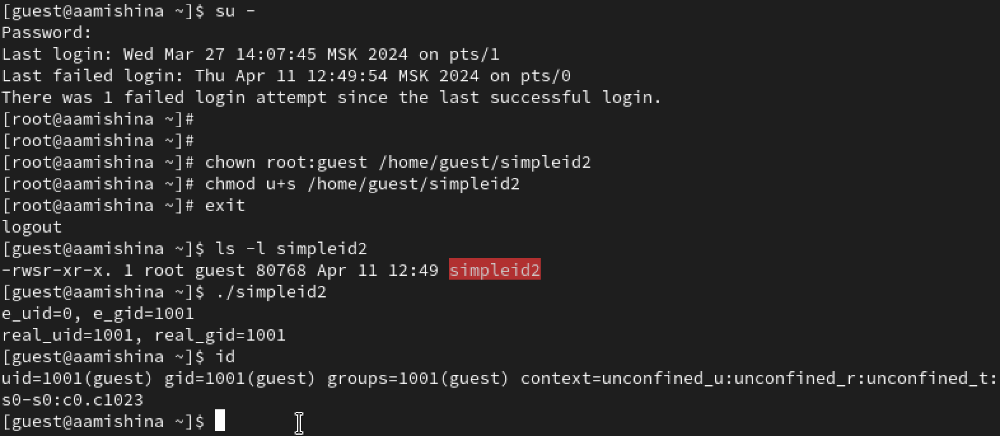{#fig:006 width=70%}

Повторяем тоже самое относительно SetGID-бита (рис. [-@fig:007]).

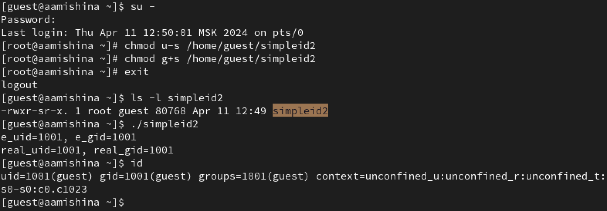{#fig:007 width=70%}

Создаем программу readfile.c (рис. [-@fig:008]).

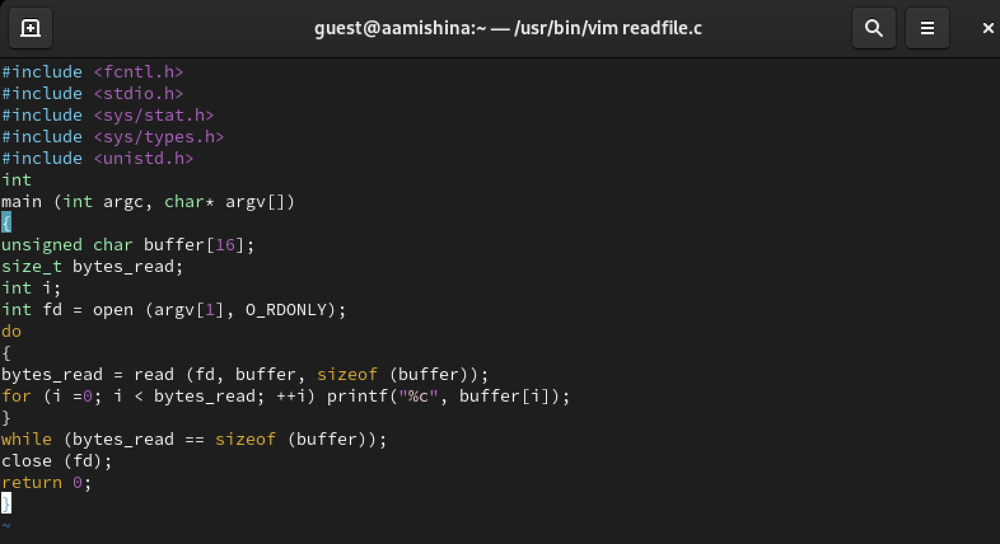{#fig:008 width=70%}

Компилируем её: gcc readfile.c -o readfile. Меняем владельца у файла readfile.c и изменяем права так, чтобы только суперпользователь (root) мог прочитать его, a guest не мог. Проверяем, что пользователь guest не может прочитать файл readfile.c (рис. [-@fig:009]).

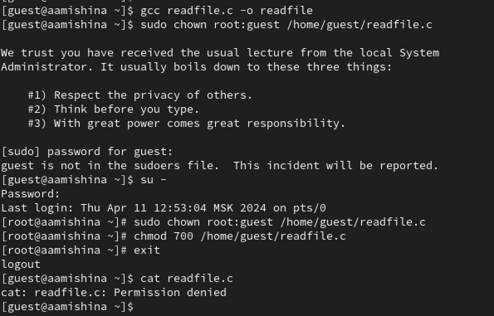{#fig:009 width=70%}

Меняем у программы readfile владельца и становим SetUID-бит. Проверяем, может ли программа readfile прочитать файл readfile.c (может). Проверяем, может ли программа readfile прочитать файл /etc/shadow (может) (рис. [-@fig:010]).

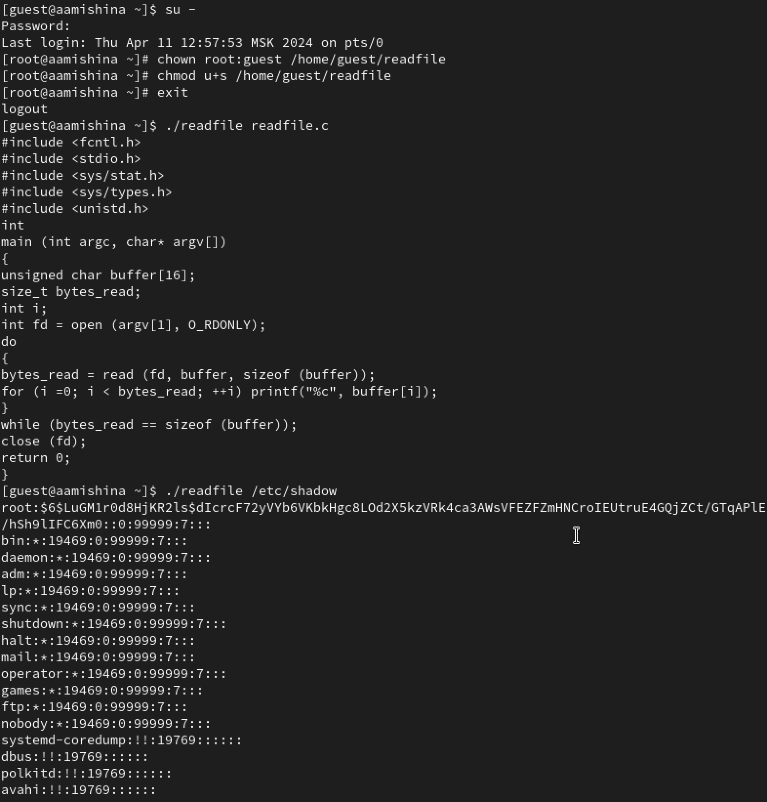{#fig:010 width=70%}

## Исследование Sticky-бита

Выясним, установлен ли атрибут Sticky на директории /tmp, для чего выполните команду
ls -l / | grep tmp. От имени пользователя guest создаем файл file01.txt в директории /tmp со словом test: echo "test" > /tmp/file01.txt. Просматриваем атрибуты у только что созданного файла и разрешаем чтение и запись для категории пользователей «все остальные»: ls -l /tmp/file01.txt, chmod o+rw /tmp/file01.txt и ls -l /tmp/file01.txt. От пользователя guest2 (не являющегося владельцем) пробуем прочитать файл /tmp/file01.txt: cat /tmp/file01.txt (успешно), дозаписать в файл слово test2 командой echo "test2" > /tmp/file01.txt (отказано в доступе), записать в файл слово test3, стерев при этом всю имеющуюся в файле информацию: echo "test3" > /tmp/file01.txt (отказано в доступе). Проверяем содержимое файла: cat /tmp/file01.txt (не изменилось). Попробуем удалить файл: rm /tmp/fileOl.txt (отказано в доступе) (рис. [-@fig:011]).

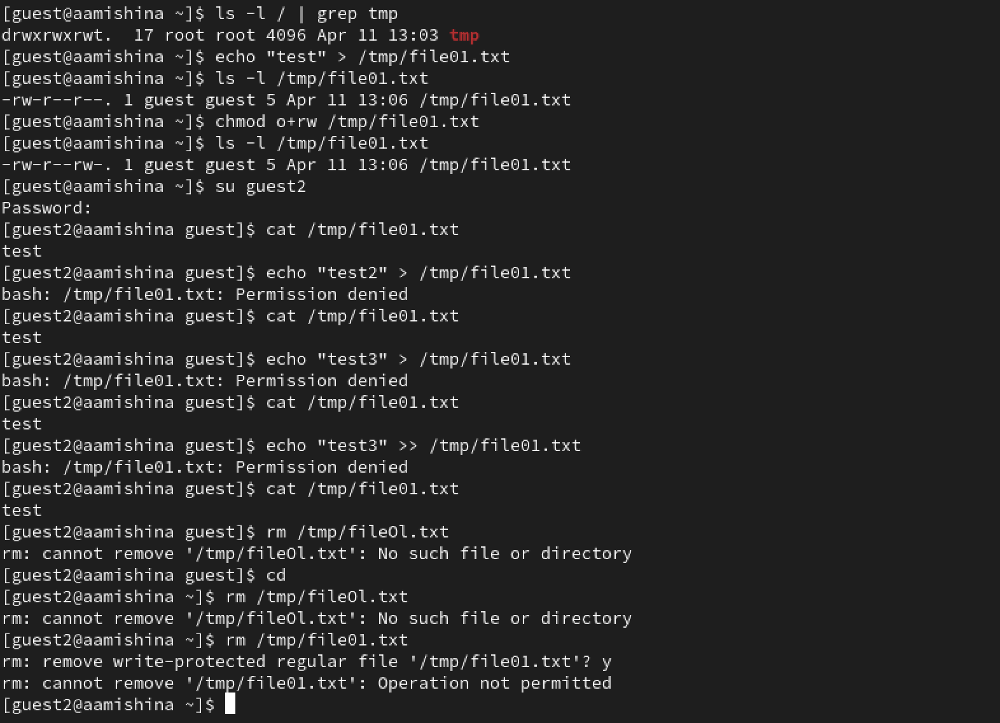{#fig:011 width=70%}

Повышаем свои права до суперпользователя следующей командой su - и выполняем после этого команду, снимающую атрибут t (Sticky-бит) с директории /tmp: chmod -t /tmp. Выходим из режима суперпользователя: exit. От пользователя guest2 проверяем, что атрибута t у директории /tmp
нет: ls -l / | grep tmp. Повторяем предыдущие шаги. Чтение и удаления удается выполнить, на запись и перезапись получаем отказ (рис. [-@fig:012]).

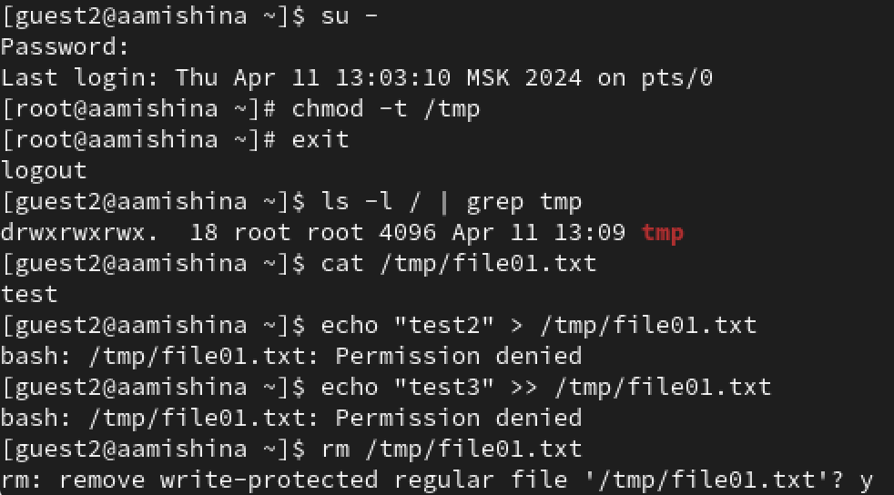{#fig:012 width=70%}

Повышаем свои права до суперпользователя и возвращаем атрибут t на директорию /tmp: su -, chmod +t /tmp и exit (рис. [-@fig:013]).

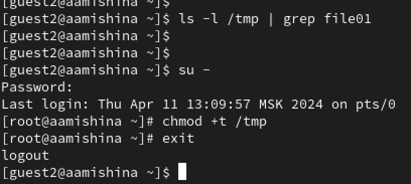{#fig:013 width=70%}

# Выводы

В ходе выполнения данной лабораторной работы, я изучила механизмы изменения идентификаторов, применения SetUID- и Sticky-битов. Получила практические навыки работы в консоли с дополнительными атрибутами. Рассмотрела работы механизма смены идентификатора процессов пользователей, а также влияние бита Sticky на запись и удаление файлов.

# Список литературы{.unnumbered}

::: {#refs}
:::
