---
## Front matter
lang: ru-RU
title: Лабораторная работа №6
subtitle: Основы информационной безопасности
author:
  - Мишина А. А.
date: 25 апреля 2024

## i18n babel
babel-lang: russian
babel-otherlangs: english

## Fonts
mainfont: PT Serif
romanfont: PT Serif
sansfont: PT Sans
monofont: PT Mono
mainfontoptions: Ligatures=TeX
romanfontoptions: Ligatures=TeX
sansfontoptions: Ligatures=TeX,Scale=MatchLowercase
monofontoptions: Scale=MatchLowercase,Scale=0.9

## Formatting pdf
toc: false
toc-title: Содержание
slide_level: 2
aspectratio: 169
section-titles: true
theme: metropolis
header-includes:
 - \metroset{progressbar=frametitle,sectionpage=progressbar,numbering=fraction}
 - '\makeatletter'
 - '\beamer@ignorenonframefalse'
 - '\makeatother'
---

## Докладчик

- Мишина Анастасия Алексеевна
- НПИбд-02-22

# Выполнение лабораторной работы

## Цель работы

- Развить навыки администрирования ОС Linux. Получить первое прак- тическое знакомство с технологией SELinux1. Проверить работу SELinx на практике совместно с веб-сервером Apache.

## SELinux, веб-сервер Apache

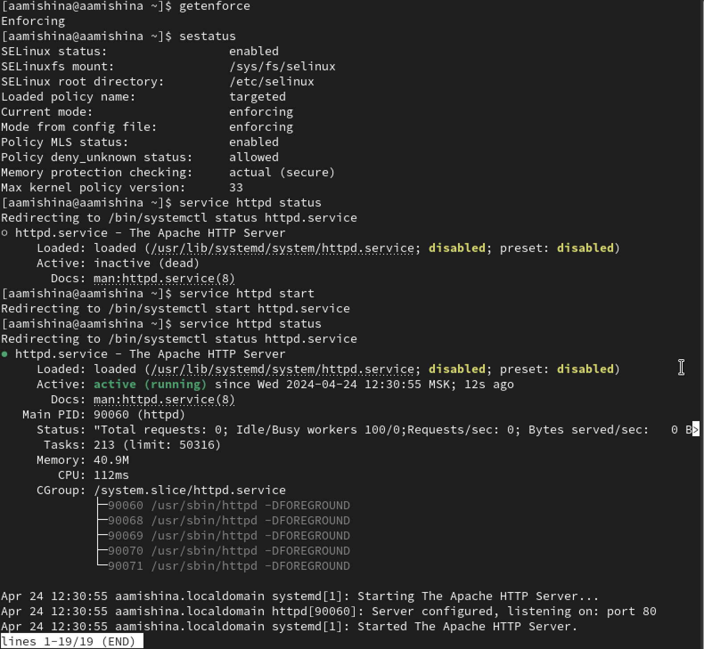{#fig:001 width=50%}

## SELinux, веб-сервер Apache

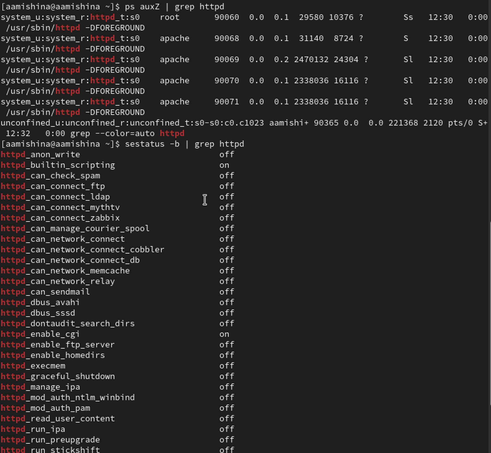{#fig:002 width=50%}

## Статистика

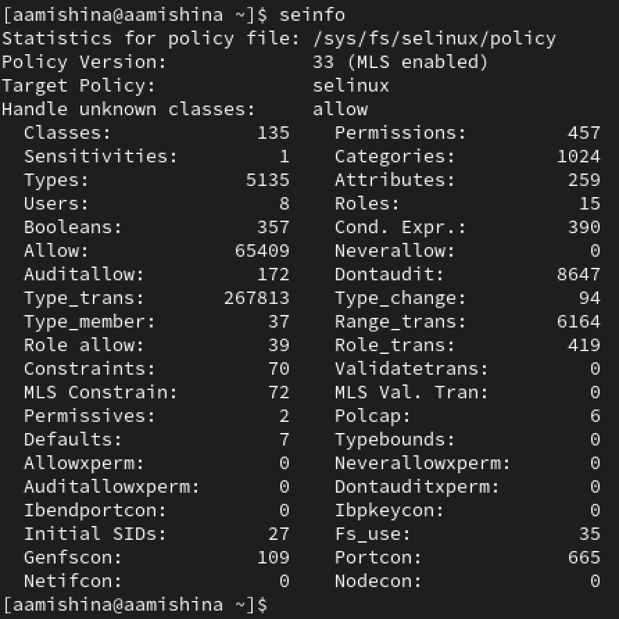{#fig:003 width=40%}

## /var/www и /var/www/html

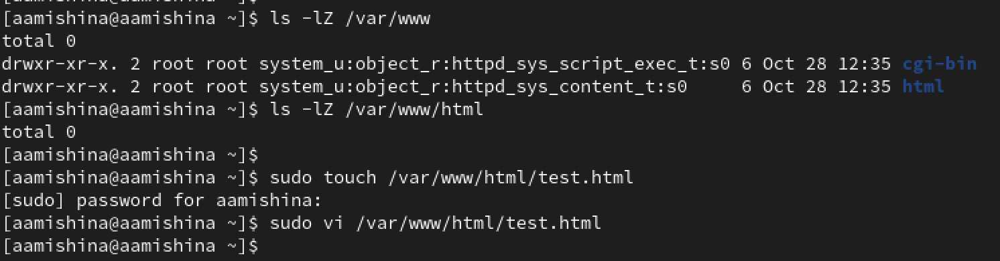{#fig:004 width=70%}

## test.html

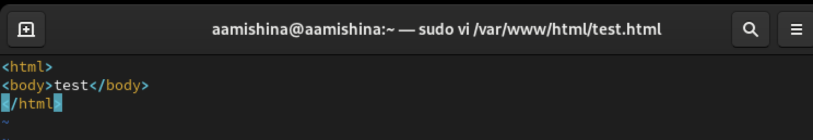{#fig:005 width=70%}

## Контекст test.html

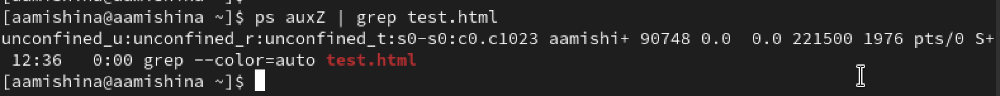{#fig:006 width=70%}

## Браузер

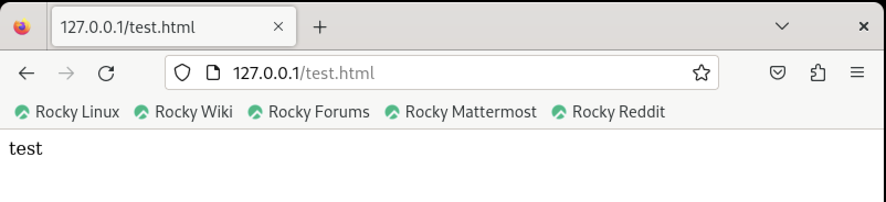{#fig:007 width=70%}

## Man и контекст файла

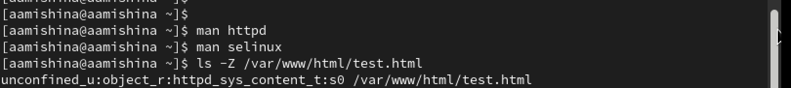{#fig:008 width=70%}

## Смена контекста

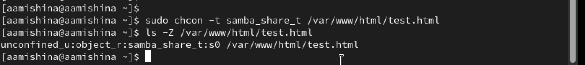{#fig:009 width=70%}

## Браузер

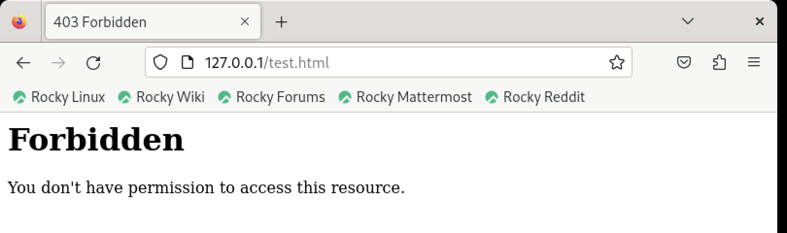{#fig:010 width=70%}

## Права доступа, лог-файл

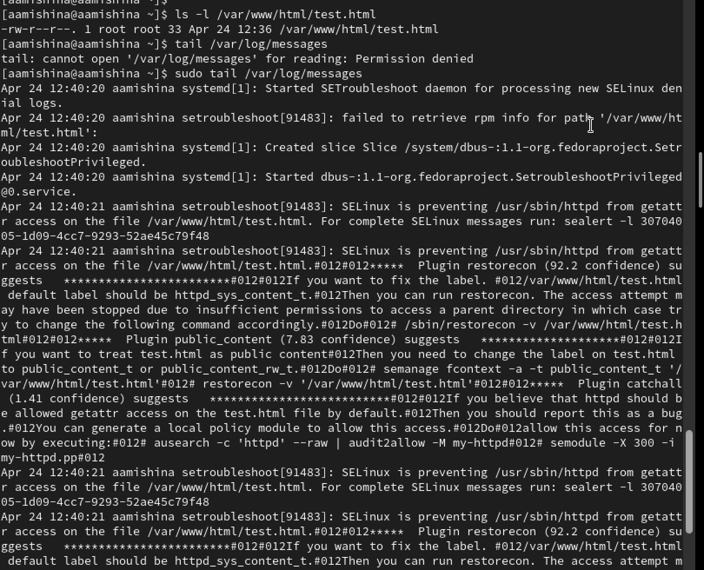{#fig:011 width=50%}

## httpd.conf

- Смена TCP-порта на 81

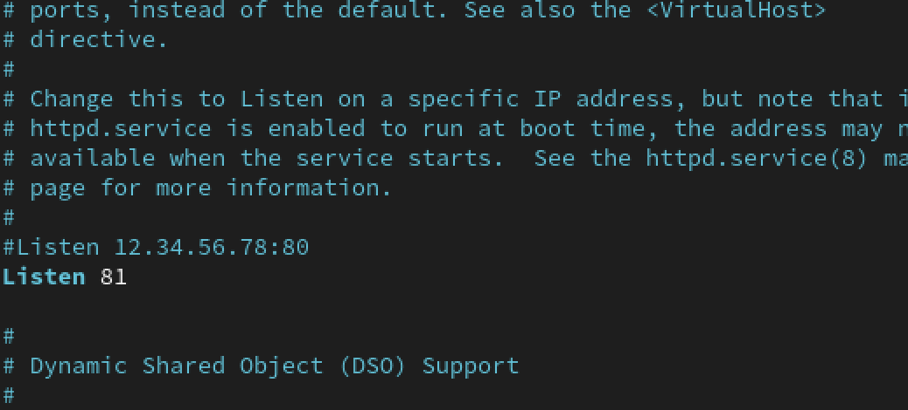{#fig:012 width=70%}

## Сервер apache

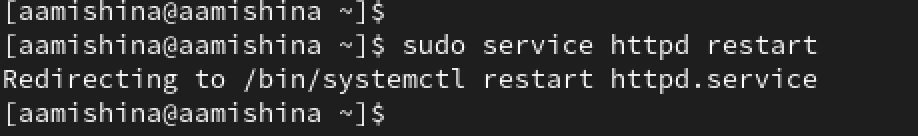{#fig:013 width=70%}

## Браузер

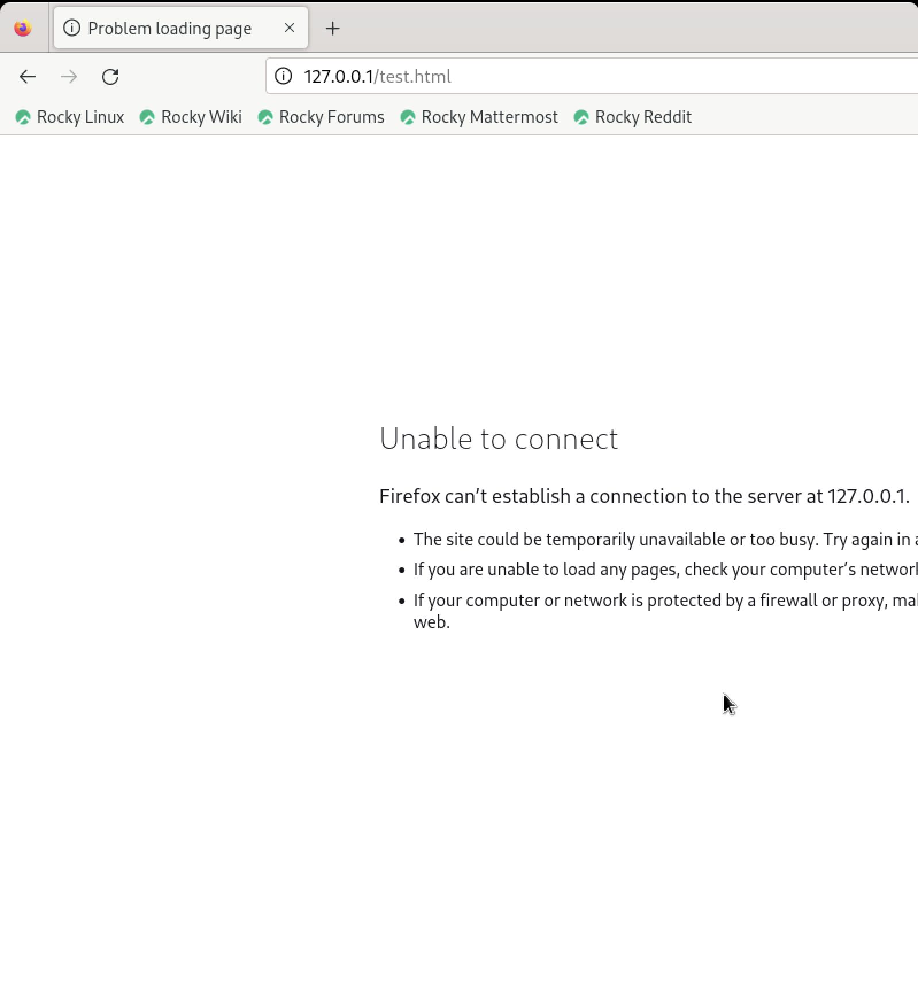{#fig:014 width=30%}

## Лог-файлы

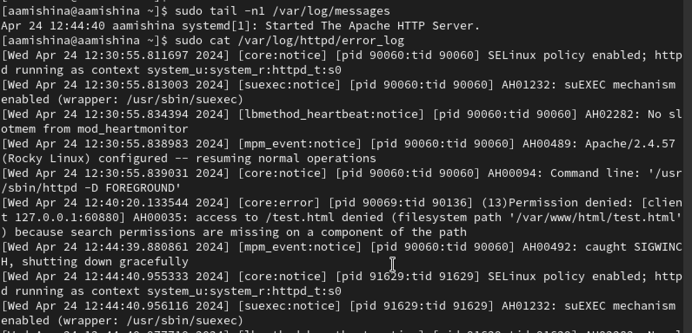{#fig:015 width=70%}

## Лог-файлы

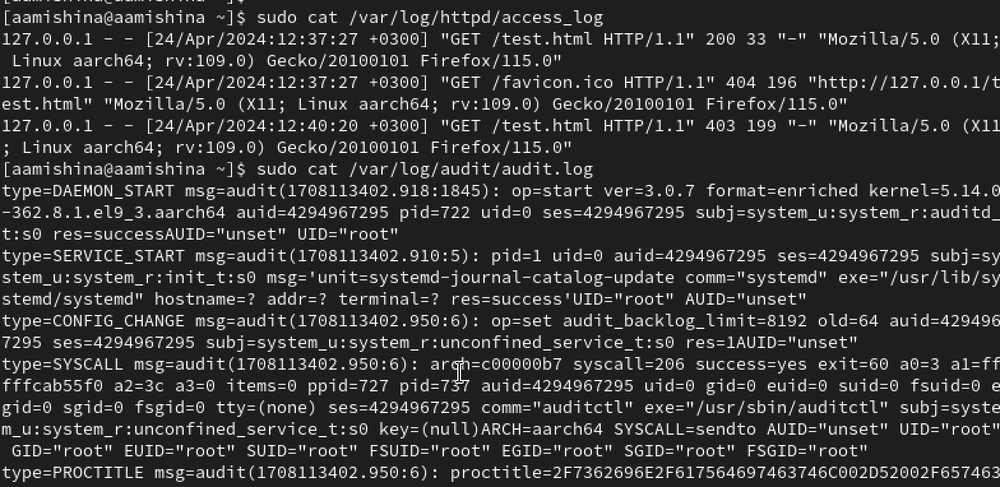{#fig:016 width=70%}

## Порты

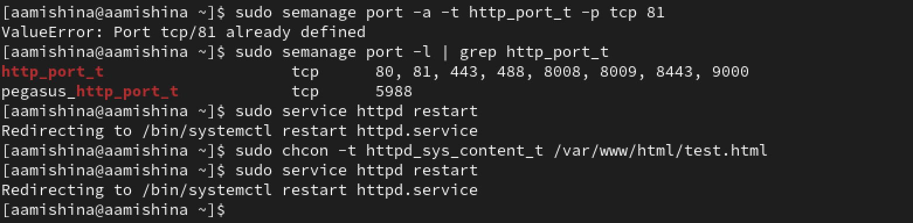{#fig:017 width=70%}

## Браузер

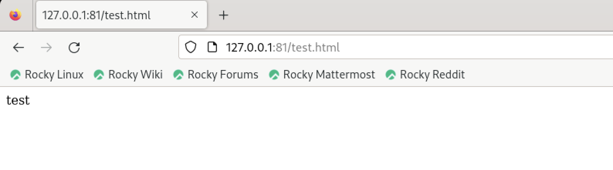{#fig:018 width=70%}

## httpd.conf

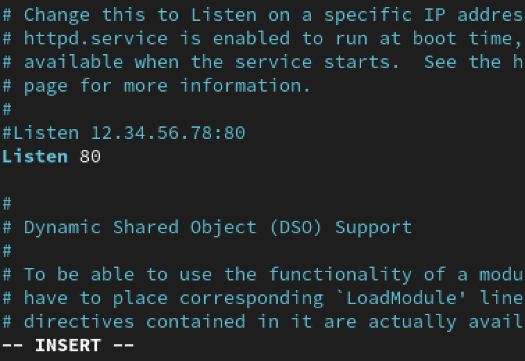{#fig:019 width=70%}

## Удаление

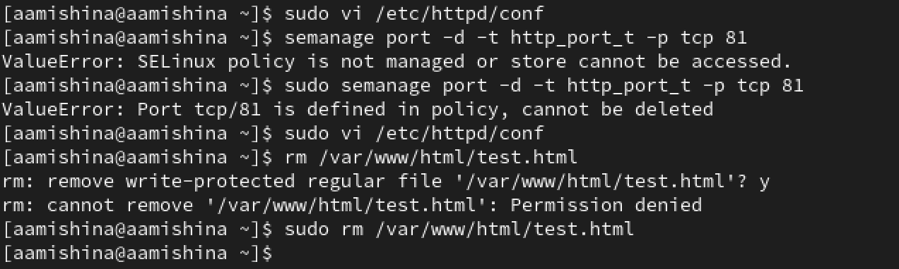{#fig:020 width=70%}

## Вывод

- В ходе выполнения данной лабораторной работы, я развила навыки администрирования ОС Linux, получила первое практическое знакомство с технологией SELinux1, а также проверила работу SELinx на практике совместно с веб-сервером Apache.