---
## Front matter
title: "Отчёт по лабораторной работе №6"
subtitle: "Дисциплина: Основы информационной безопасности"
author: "Мишина Анастасия Алексеевна"

## Generic otions
lang: ru-RU
toc-title: "Содержание"

## Bibliography
bibliography: bib/cite.bib
csl: pandoc/csl/gost-r-7-0-5-2008-numeric.csl

## Pdf output format
toc: true # Table of contents
toc-depth: 2
lof: true # List of figures
lot: true # List of tables
fontsize: 12pt
linestretch: 1.5
papersize: a4
documentclass: scrreprt
## I18n polyglossia
polyglossia-lang:
  name: russian
  options:
	- spelling=modern
	- babelshorthands=true
polyglossia-otherlangs:
  name: english
## I18n babel
babel-lang: russian
babel-otherlangs: english
## Fonts
mainfont: PT Serif
romanfont: PT Serif
sansfont: PT Sans
monofont: PT Mono
mainfontoptions: Ligatures=TeX
romanfontoptions: Ligatures=TeX
sansfontoptions: Ligatures=TeX,Scale=MatchLowercase
monofontoptions: Scale=MatchLowercase,Scale=0.9
## Biblatex
biblatex: true
biblio-style: "gost-numeric"
biblatexoptions:
  - parentracker=true
  - backend=biber
  - hyperref=auto
  - language=auto
  - autolang=other*
  - citestyle=gost-numeric
## Pandoc-crossref LaTeX customization
figureTitle: "Рис."
tableTitle: "Таблица"
listingTitle: "Листинг"
lofTitle: "Список иллюстраций"
lotTitle: "Список таблиц"
lolTitle: "Листинги"
## Misc options
indent: true
header-includes:
  - \usepackage{indentfirst}
  - \usepackage{float} # keep figures where there are in the text
  - \floatplacement{figure}{H} # keep figures where there are in the text
---

# Цель работы

Развить навыки администрирования ОС Linux. Получить первое прак- тическое знакомство с технологией SELinux1. Проверить работу SELinx на практике совместно с веб-сервером Apache [@infosec].

# Выполнение лабораторной работы

Открываем терминал и убеждаемся, что SELinux работает в режиме enforcing политики targeted с помощью команд getenforce и sestatus. Запустим веб-сервер и убедимся, что он работает:
service httpd start и service httpd status (рис. [-@fig:001]).

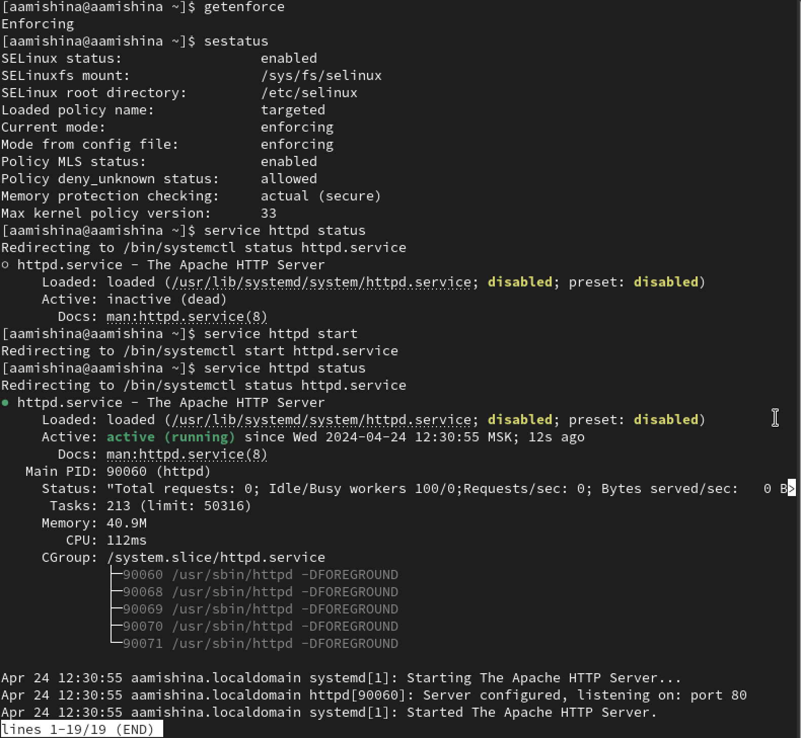{#fig:001 width=70%}

Определим контекст безопасности веб-сервера: ps auxZ | grep httpd. Посмотрим текущее состояние переключателей SELinux для Apache с помощью команды: sestatus -bigrep httpd. Обратим внимание, что многие из них находятся в положении «off» (рис. [-@fig:002]).

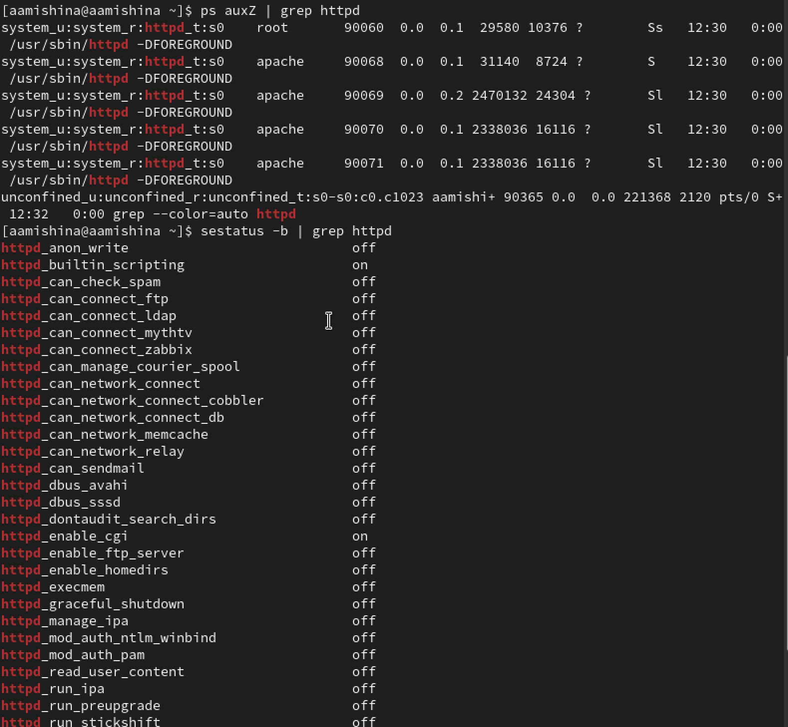{#fig:002 width=70%}

Посмотрим статистику по политике с помощью команды seinfo, также определим множество пользователей, ролей, типов (рис. [-@fig:003]).

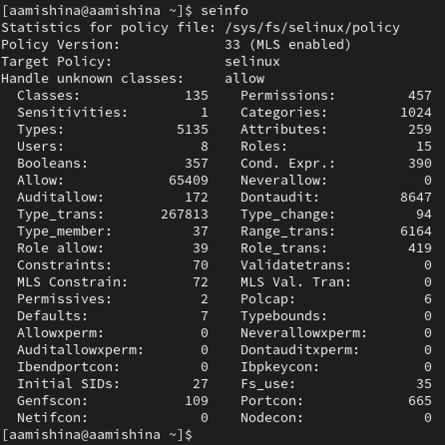{#fig:003 width=70%}

Определяем тип файлов и поддиректорий, находящихся в директории /var/www, с помощью команды ls -lZ /var/www. Определяем тип файлов, находящихся в директории /var/www/html: ls -lZ /var/www/html. Определяем круг пользователей, которым разрешено создание файлов в директории /var/www/html (рис. [-@fig:004]). Создаем от имени суперпользователя (так как в дистрибутиве после установки только ему разрешена запись в директорию) html-файл /var/www/html/test.html (рис. [-@fig:005]).

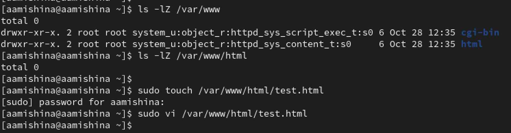{#fig:004 width=70%}

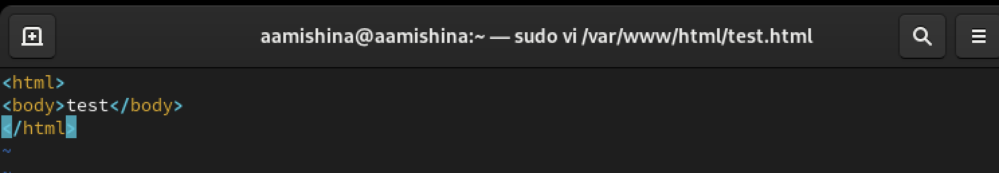{#fig:005 width=70%}

Проверяем контекст созданного файла (рис. [-@fig:006]).

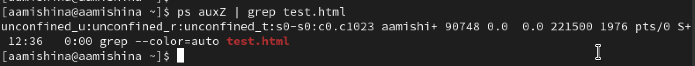{#fig:006 width=70%}

Обратимся к файлу через веб-сервер, введя в браузере адрес http://127.0.0.1/test.html. Убеждаемся, что файл был успешно отображён (рис. [-@fig:007]).

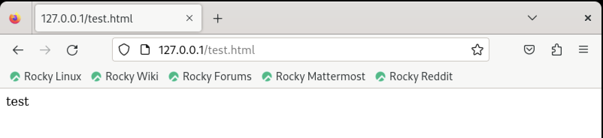{#fig:007 width=70%}

Изучаем справку man httpd и man selinux. Проверяем контекст файла можно командой ls -Z, т.е. ls -Z /var/www/html/test.html (рис. [-@fig:008]).

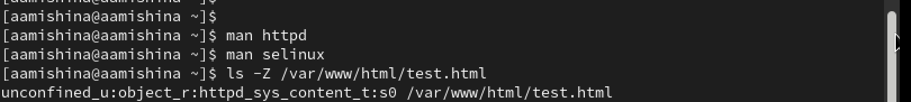{#fig:008 width=70%}

Сменим контекст файла /var/www/html/test.html с httpd_sys_content_t на любой другой, к которому процесс httpd не должен иметь доступа, например, на samba_share_t: chcon -t samba_share_t /var/www/html/test.html, проверим, что контекст поменялся: ls -Z /var/www/html/test.html (рис. [-@fig:009]).

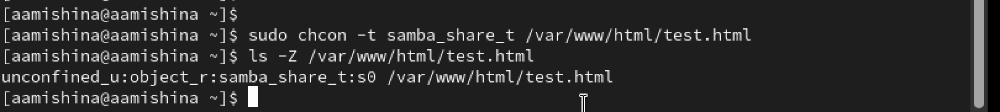{#fig:009 width=70%}

Попробуем ещё раз получить доступ к файлу через веб-сервер, введя в браузере адрес http://127.0.0.1/test.html. Получаем сообщение об ошибке: Forbidden You don't have permission to access /test.html on this server (рис. [-@fig:010]).

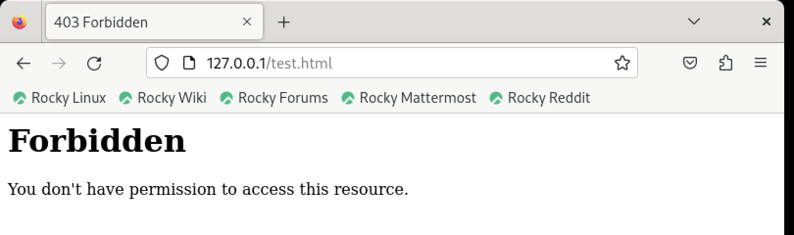{#fig:010 width=70%}

Смотрим права доступа на файл ls -l /var/www/html/test.html, также смотрим системный log-файл tail /var/log/messages (рис. [-@fig:011]).

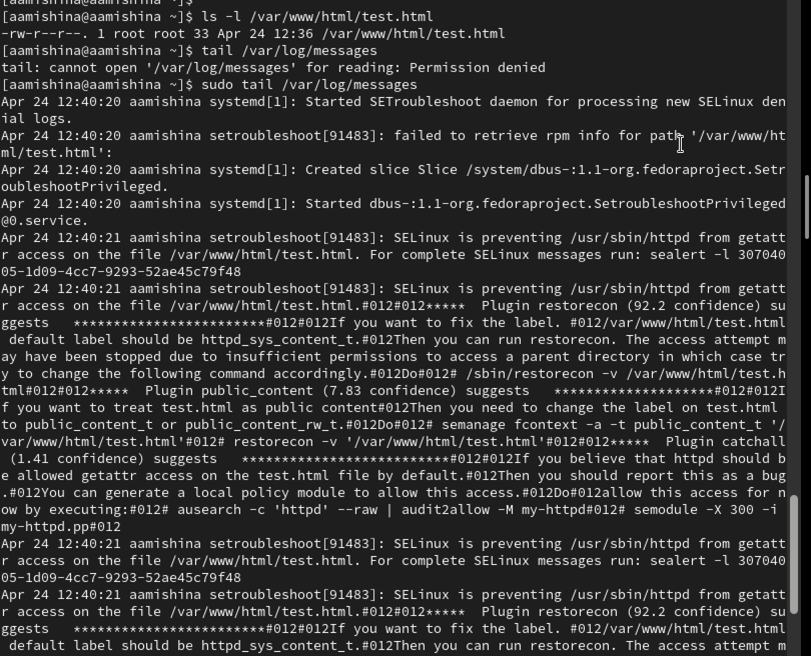{#fig:011 width=70%}

Попробуем запустить веб-сервер Apache на прослушивание ТСР-порта 81 (а не 80, как рекомендует IANA и прописано в /etc/services). Для этого в файле /etc/httpd/httpd.conf находим строчку Listen 80 и меняем её на Listen 81 (рис. [-@fig:012]).

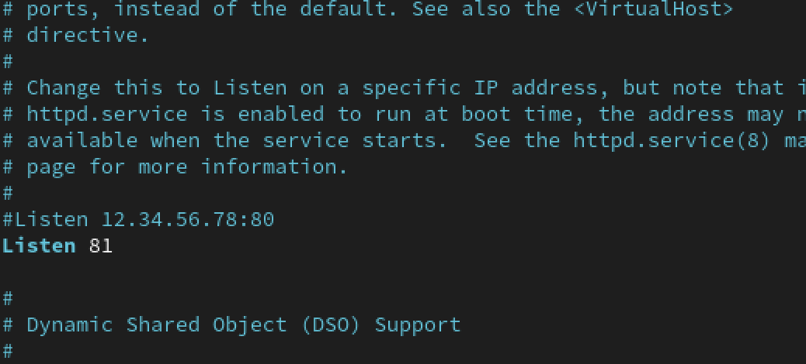{#fig:012 width=70%}

Выполняем перезапуск веб-сервера Apache (рис. [-@fig:013]). Происходит сбой (рис. [-@fig:014]).

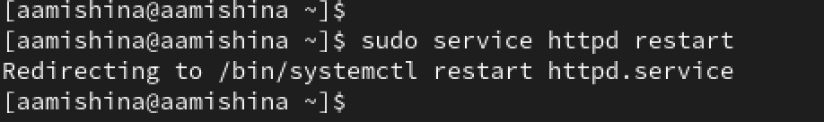{#fig:013 width=70%}

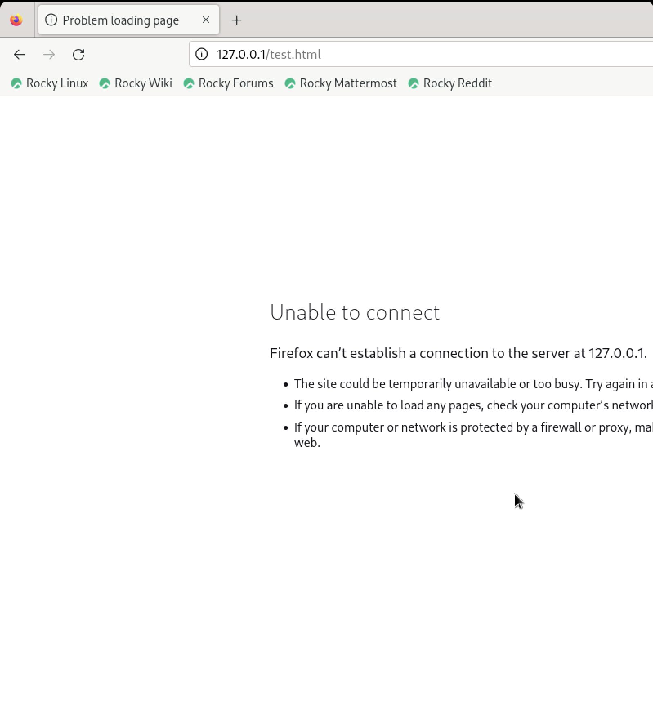{#fig:014 width=70%}

Анализируем лог-файлы: tail -nl /var/log/messages (рис. [-@fig:015]. Просматриваем файлы /var/log/http/error_log, /var/log/http/access_log и /var/log/audit/audit.log (рис. [-@fig:016].

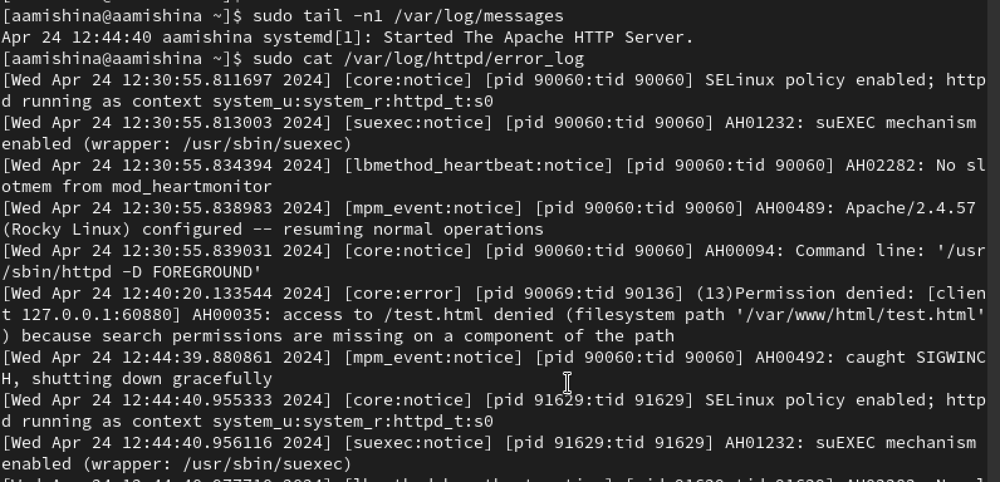{#fig:015 width=70%}

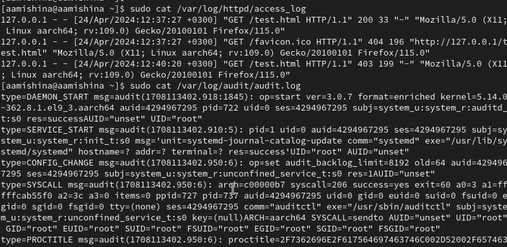{#fig:016 width=70%}

Выполняем команду semanage port -a -t http_port_t -р tcp 81. После этого проверяем список портов командой semanage port -l | grep http_port_t. Убеждаемся, что порт 81 появился в списке. Перезагружаем веб-сервер еще раз. Возвращаем контекст httpd_sys_cоntent_t к файлу /var/www/html/test.html: chcon -t httpd_sys_content_t /var/www/html/test.html (рис. [-@fig:017].

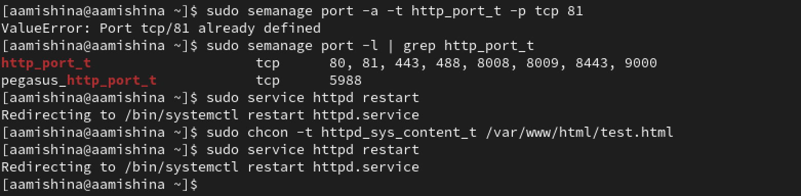{#fig:017 width=70%}

После этого попробуем получить доступ к файлу через веб-сервер, введя в браузере адрес http://127.0.0.1:81/test.html. Видим содержимое файла — слово «test» (рис. [-@fig:018].

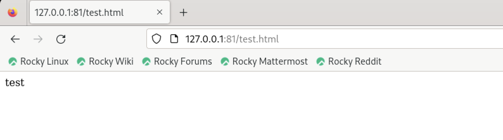{#fig:018 width=70%}

Исправляем обратно конфигурационный файл apache, вернув Listen 80 (рис. [-@fig:019].

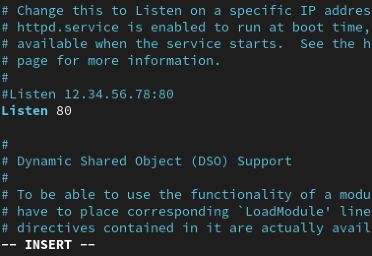{#fig:019 width=70%}

Удалим привязку http_port_t к 81 порту: semanage port -d -t http_port_t -p tcp 81 и проверим, что порт 81 удалён. Удаляем файл var/www/html/test.html: rm /var/www/html/test.html (рис. [-@fig:020].

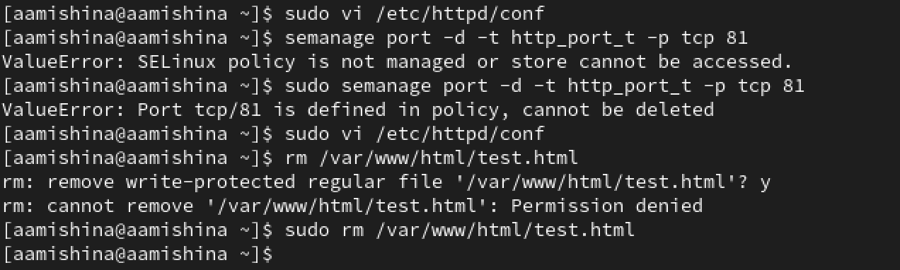{#fig:020 width=70%}

# Выводы

В ходе выполнения данной лабораторной работы, я развила навыки администрирования ОС Linux, получила первое практическое знакомство с технологией SELinux1, а также проверила работу SELinx на практике совместно с веб-сервером Apache.

# Список литературы{.unnumbered}

::: {#refs}
:::
