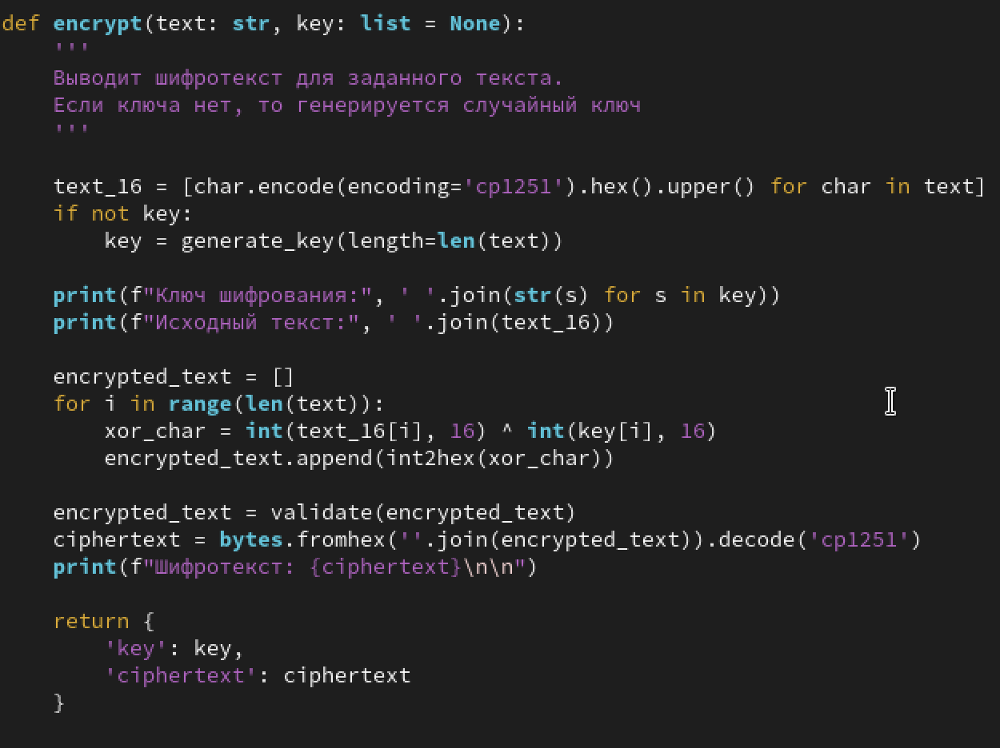
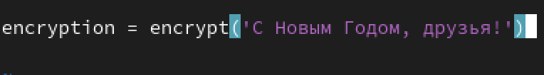
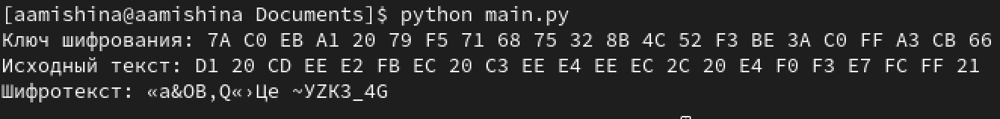
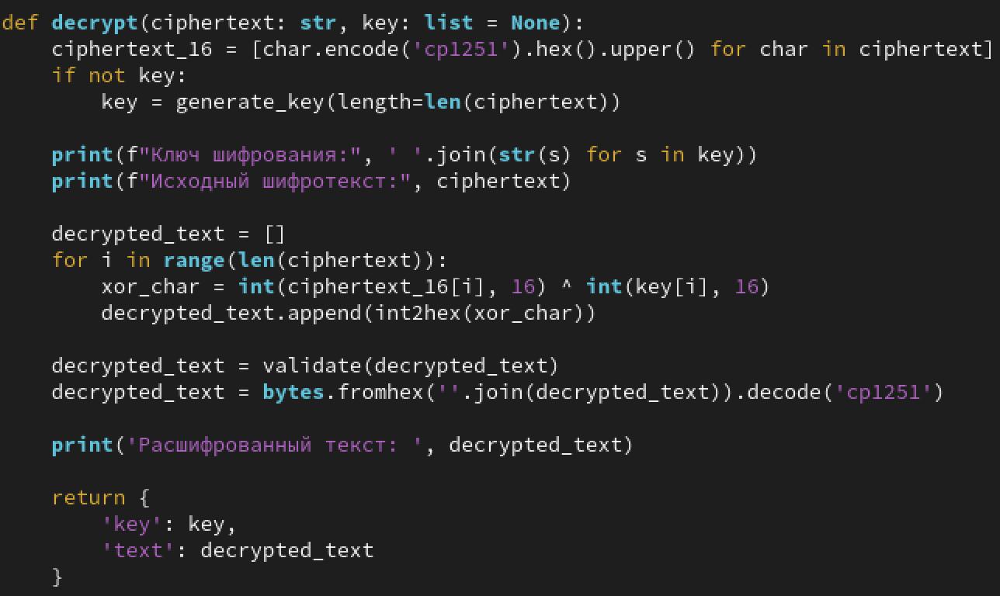
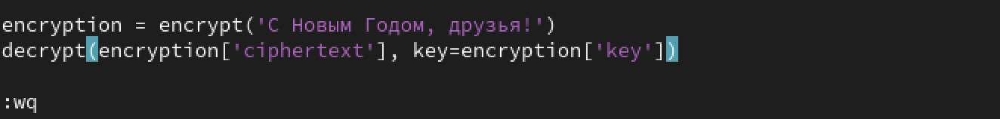
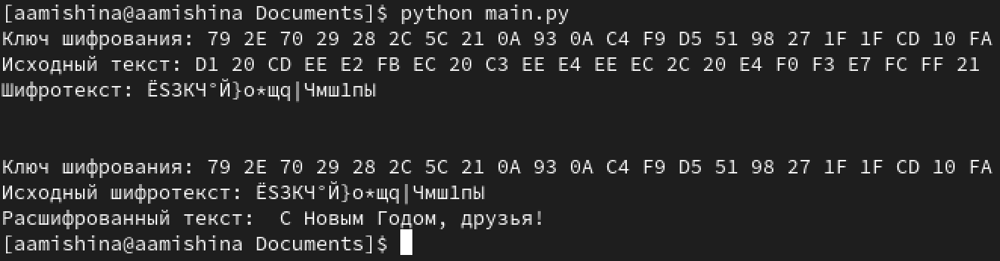
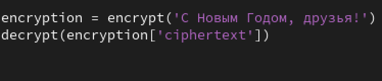
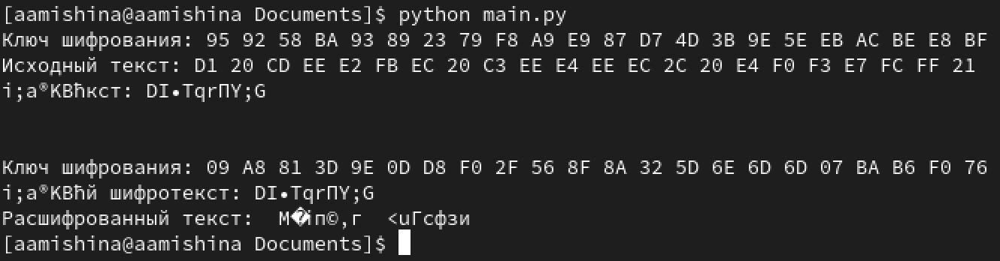
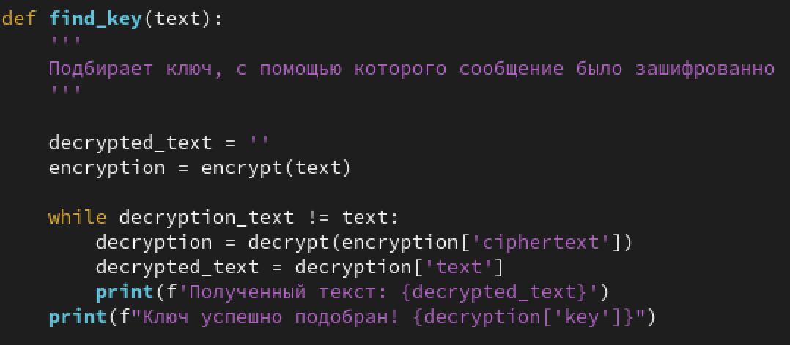

---
## Front matter
title: "Отчёт по лабораторной работе №7"
subtitle: "Дисциплина: Основы информационной безопасности"
author: "Мишина Анастасия Алексеевна"

## Generic otions
lang: ru-RU
toc-title: "Содержание"

## Bibliography
bibliography: bib/cite.bib
csl: pandoc/csl/gost-r-7-0-5-2008-numeric.csl

## Pdf output format
toc: true # Table of contents
toc-depth: 2
lof: true # List of figures
lot: true # List of tables
fontsize: 12pt
linestretch: 1.5
papersize: a4
documentclass: scrreprt
## I18n polyglossia
polyglossia-lang:
  name: russian
  options:
	- spelling=modern
	- babelshorthands=true
polyglossia-otherlangs:
  name: english
## I18n babel
babel-lang: russian
babel-otherlangs: english
## Fonts
mainfont: PT Serif
romanfont: PT Serif
sansfont: PT Sans
monofont: PT Mono
mainfontoptions: Ligatures=TeX
romanfontoptions: Ligatures=TeX
sansfontoptions: Ligatures=TeX,Scale=MatchLowercase
monofontoptions: Scale=MatchLowercase,Scale=0.9
## Biblatex
biblatex: true
biblio-style: "gost-numeric"
biblatexoptions:
  - parentracker=true
  - backend=biber
  - hyperref=auto
  - language=auto
  - autolang=other*
  - citestyle=gost-numeric
## Pandoc-crossref LaTeX customization
figureTitle: "Рис."
tableTitle: "Таблица"
listingTitle: "Листинг"
lofTitle: "Список иллюстраций"
lotTitle: "Список таблиц"
lolTitle: "Листинги"
## Misc options
indent: true
header-includes:
  - \usepackage{indentfirst}
  - \usepackage{float} # keep figures where there are in the text
  - \floatplacement{figure}{H} # keep figures where there are in the text
---

# Цель работы

Освоить на практике применение режима однократного гаммирования [@infosec].

# Выполнение лабораторной работы

Создаем функцию encrypt() (рис. [-@fig:001]), которая будет шифровать заданный текст с помощью гаммирования. Также есть возможность подавать на вход определенный ключ шифрования. Если ключа нет, то он генерируется рандомно. Сначала исходный текст и ключ шифрования преобразуются в 16-ую систему счисления, затем, применяется операция XOR для каждого элемента ключа и текста. Полученный шифротекст декодируется из 16-ой СС и получается набор из символов.

{#fig:001 width=70%}

Вызов функции функции encrypt() (рис. [-@fig:002]) и результаты ее работы (рис. [-@fig:003]):

{#fig:002 width=70%}

{#fig:003 width=70%}

Далее создаем функцию decrypt() (рис. [-@fig:004]). Она по заданному шифротексту выводит исходный текст. Также есть возможность опционально задать ключ дешифровки, или же он будет создан автоматически. Функция преобразует шифротекст в 16-ую СС и применяет XOR для шифротекста и ключа.

{#fig:004 width=70%}

Вызов функции функции decrypt() с тем же ключом, что и в шифровании, (рис. [-@fig:005]) и результаты ее работы (рис. [-@fig:006]):

{#fig:005 width=70%}

{#fig:006 width=70%}

Вызов функции функции decrypt() со случайным ключом (рис. [-@fig:007]) и результаты ее работы (рис. [-@fig:008]):

{#fig:007 width=70%}

{#fig:008 width=70%}

Также создаем функцию find_key() (рис. [-@fig:009]). Она вызывает функцию decrypt() до тех пор, пока расшифрованный и исходный текст не совпадут, т.е. пытается подобрать ключ дешифровки.

{#fig:009 width=70%}

# Контрольные вопросы

1. Поясните смысл однократного гаммирования

Гаммирование – выполнение операции XOR между элементами гаммы и элементами подлежащего сокрытию текста. Если в методе шифрования используется однократная вероятностная гамма (однократное гаммирование) той же длины, что и подлежащий сокрытию текст, то текст нельзя раскрыть. Даже при раскрытии части последовательности гаммы нельзя получить информацию о всём скрываемом тексте.

2. Перечислите недостатки однократного гаммирования

Шифр абсолютно стойкий только тогда, когда ключ сгенерирован из случайной двоичной последовательности 

3. Перечислите преимущества однократного гаммирования

Это симметричный способ шифрования; алгоритм не дает никакой информации об исходном сообщении; шифрование/дешифрование может быть применено одной программой (в обратном порядке)

4. Почему длина открытого текста должна совпадать с длиной ключа?

Если ключ длиннее, то часть текста (разница между длиной ключа и открытого текста) не будет зашифрована. Если же ключ короче, то однозначное дешифрование невозможно

5. Какая операция используется в режиме однократного гаммирования, назовите её особенности?

операция XOR (сложение по модулю 2), ее особенность - симметричность, т.к. если ее применить 2 раза, то вернется исходное значение

6. Как по открытому тексту и ключу получить шифротекст?

Сначала исходный текст и ключ шифрования преобразуются в 16-ную СС, затем, применяется операция XOR для каждого элемента ключа и текста. Полученный шифротекст декодируется из 16-ной СС и получается набор из символов.

7. Как по открытому тексту и шифротексту получить ключ?

Применить операцию XOR для каждого элемента шифротекста и открытого текста: key[i] = crypted[i] XOR text[i]

8. В чем заключаются необходимые и достаточные условия абсолютной стойкости шифра?

Необходимые и достаточные условия абсолютной стойкости шифра:

- полная случайность ключа
- равенство длин ключа и открытого текста
- однократное использование ключа

# Выводы

В ходе выполнения данной лабораторной работы я освоила на практике применение режима однократного гаммирования.

# Список литературы{.unnumbered}

::: {#refs}
:::
