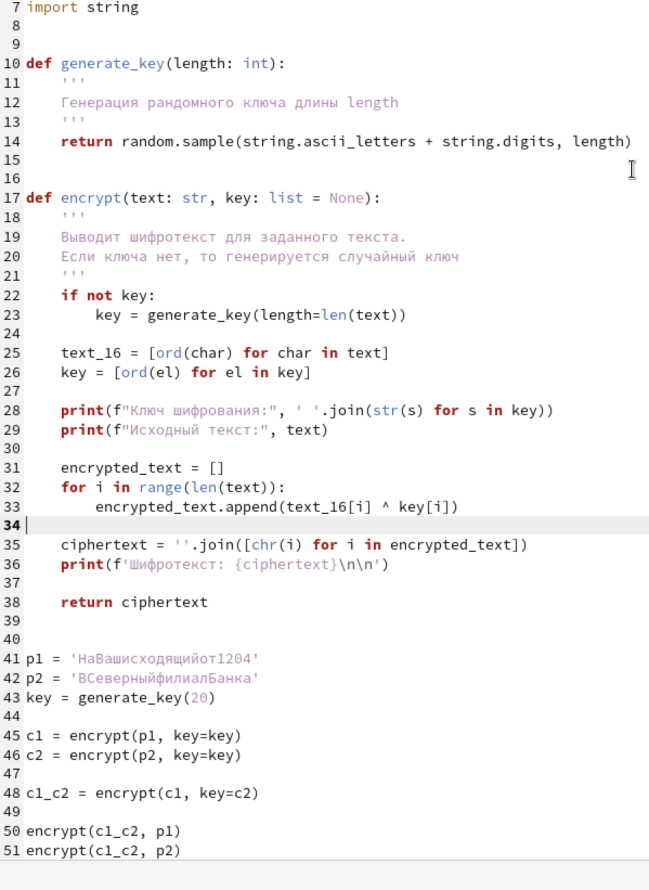
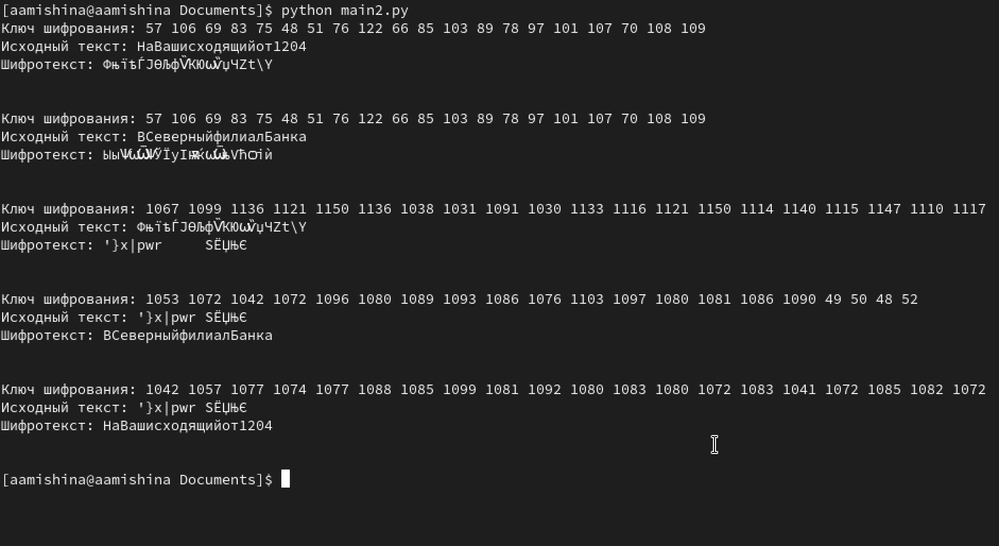

---
## Front matter
lang: ru-RU
title: Лабораторная работа №8
subtitle: Основы информационной безопасности
author:
  - Мишина А. А.
date: 23 мая 2024

## i18n babel
babel-lang: russian
babel-otherlangs: english

## Fonts
mainfont: PT Serif
romanfont: PT Serif
sansfont: PT Sans
monofont: PT Mono
mainfontoptions: Ligatures=TeX
romanfontoptions: Ligatures=TeX
sansfontoptions: Ligatures=TeX,Scale=MatchLowercase
monofontoptions: Scale=MatchLowercase,Scale=0.9

## Formatting pdf
toc: false
toc-title: Содержание
slide_level: 2
aspectratio: 169
section-titles: true
theme: metropolis
header-includes:
 - \metroset{progressbar=frametitle,sectionpage=progressbar,numbering=fraction}
 - '\makeatletter'
 - '\beamer@ignorenonframefalse'
 - '\makeatother'
---

## Докладчик

- Мишина Анастасия Алексеевна
- НПИбд-02-22

# Выполнение лабораторной работы

## Цель работы

- Освоить на практике применение режима однократного гаммирования на примере кодирования различных исходных текстов одним ключом.

## Файл main2.py

{#fig:001 width=30%}

## Запуск main2.py

{#fig:002 width=70%}

## Вывод

- В ходе выполнения данной лабораторной работы я освоила на практике применение режима однократного гаммирования на примере кодирования различных исходных текстов одним ключом.