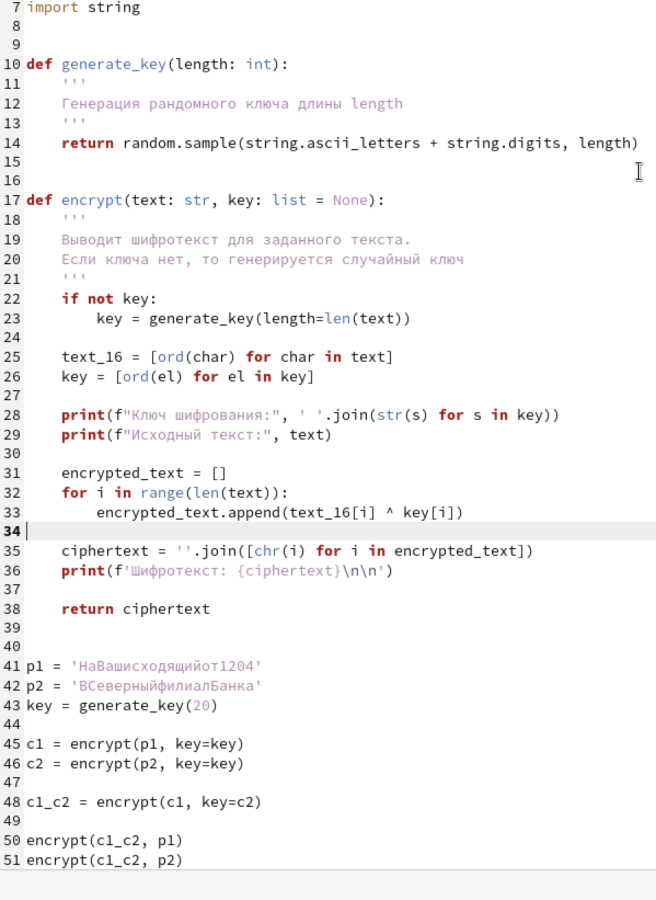
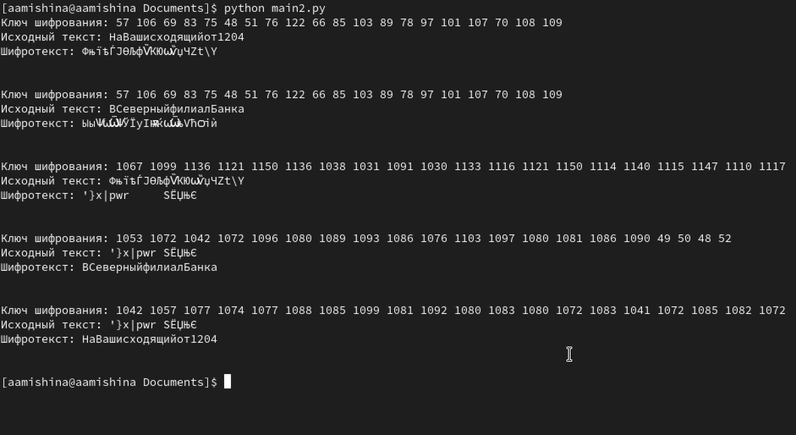

---
## Front matter
title: "Отчёт по лабораторной работе №8"
subtitle: "Дисциплина: Основы информационной безопасности"
author: "Мишина Анастасия Алексеевна"

## Generic otions
lang: ru-RU
toc-title: "Содержание"

## Bibliography
bibliography: bib/cite.bib
csl: pandoc/csl/gost-r-7-0-5-2008-numeric.csl

## Pdf output format
toc: true # Table of contents
toc-depth: 2
lof: true # List of figures
lot: true # List of tables
fontsize: 12pt
linestretch: 1.5
papersize: a4
documentclass: scrreprt
## I18n polyglossia
polyglossia-lang:
  name: russian
  options:
	- spelling=modern
	- babelshorthands=true
polyglossia-otherlangs:
  name: english
## I18n babel
babel-lang: russian
babel-otherlangs: english
## Fonts
mainfont: PT Serif
romanfont: PT Serif
sansfont: PT Sans
monofont: PT Mono
mainfontoptions: Ligatures=TeX
romanfontoptions: Ligatures=TeX
sansfontoptions: Ligatures=TeX,Scale=MatchLowercase
monofontoptions: Scale=MatchLowercase,Scale=0.9
## Biblatex
biblatex: true
biblio-style: "gost-numeric"
biblatexoptions:
  - parentracker=true
  - backend=biber
  - hyperref=auto
  - language=auto
  - autolang=other*
  - citestyle=gost-numeric
## Pandoc-crossref LaTeX customization
figureTitle: "Рис."
tableTitle: "Таблица"
listingTitle: "Листинг"
lofTitle: "Список иллюстраций"
lotTitle: "Список таблиц"
lolTitle: "Листинги"
## Misc options
indent: true
header-includes:
  - \usepackage{indentfirst}
  - \usepackage{float} # keep figures where there are in the text
  - \floatplacement{figure}{H} # keep figures where there are in the text
---

# Цель работы

Освоить на практике применение режима однократного гаммирования на примере кодирования различных исходных текстов одним ключом [@infosec].

# Выполнение лабораторной работы

Рассмотрим файл main2.py, в котором написана наша программа (рис. [-@fig:001]). Создаем функцию encrypt(), которая будет шифровать заданный текст с помощью однократного гаммирования. Также есть возможность подавать на вход определенный ключ шифрования. Если ключа нет, то он генерируется рандомно. Сначала исходный текст и ключ шифрования преобразуются в 16-ую систему счисления, затем, применяется операция XOR для каждого элемента ключа и текста. Полученный шифротекст декодируется из 16-ой СС и получается набор из символов. В функции generate_key() происходит генерация ключа (если он не задан) из ascii-символов и цифр.

Работа программы: сначала создается случайный ключ и с этим ключом шифруются два текста p1 и p2 (в переменные c1 и c2). Далее шифротекст с1 шифруется по ключу с2. Полученный шифротекст с1_с2 шифруется по ключу открытого текста, в результате мы получаем второй открытый текст, ранее неизвестный.

{#fig:001 width=70%}

Запустим файл main2.py и просмотрим результат работы программы (рис. [-@fig:002]).

{#fig:002 width=70%}

# Контрольные вопросы

1. Как, зная один из текстов (P1 или P2), определить другой, не зная при этом ключа?

Нужно применить XOR для двух шифротекстов, а к полученному результату применить XOR с ключом, равным известному открытому тексту. Тогда результатом будет второй открытый текст

2. Что будет при повторном использовании ключа при шифровании текста?

Шифрование будет небезопасным, т.к. с помощью шифротекстов и одного открытого текста можно дешифровать другой текст

3. Как реализуется режим шифрования однократного гаммирования одним ключом двух открытых текстов?

Каждый текст шифруется однократным гаммированием отдельно с использованием этого ключа

4. Перечислите недостатки шифрования одним ключом двух открытых текстов

Главный недостаток - можно дешифровать открытый текст без знания ключа

5. Перечислите преимущества шифрования одним ключом двух открытых текстов.

Т.к. ключей используется меньше, то тратится меньше памяти на хранение и передачу ключей

# Выводы

В ходе выполнения данной лабораторной работы я освоила на практике применение режима однократного гаммирования на примере кодирования различных исходных текстов одним ключом.

# Список литературы{.unnumbered}

::: {#refs}
:::
