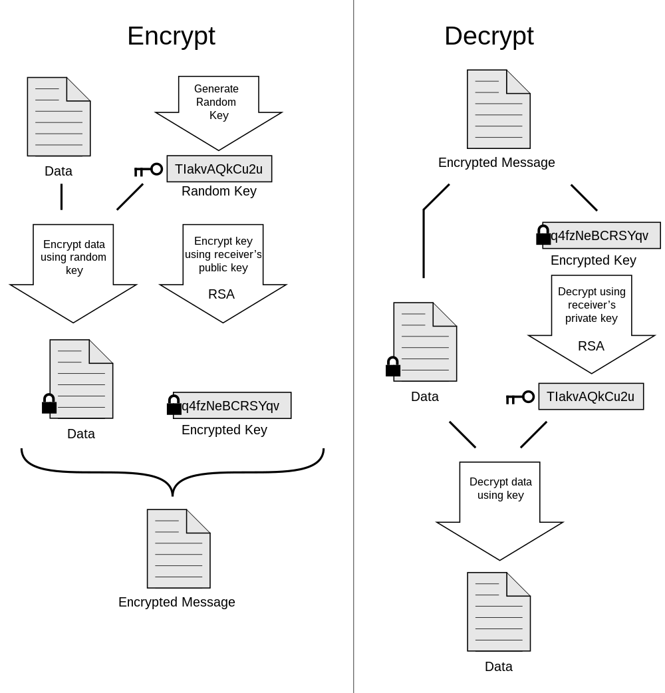
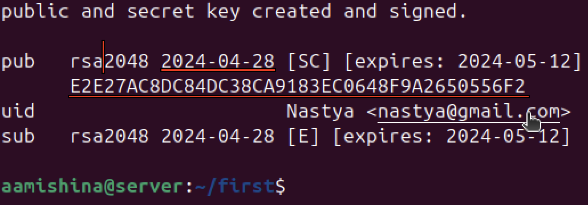
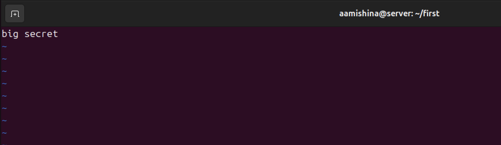

---
## Front matter
lang: ru-RU
title: Система PGP
subtitle: Основы информационной безопасности
author:
  - Мишина А. А. НПИбд-02-22
date: 02 мая 2024

## i18n babel
babel-lang: russian
babel-otherlangs: english

## Fonts
mainfont: PT Serif
romanfont: PT Serif
sansfont: PT Sans
monofont: PT Mono
mainfontoptions: Ligatures=TeX
romanfontoptions: Ligatures=TeX
sansfontoptions: Ligatures=TeX,Scale=MatchLowercase
monofontoptions: Scale=MatchLowercase,Scale=0.9

## Formatting pdf
toc: false
toc-title: Содержание
slide_level: 2
aspectratio: 169
section-titles: true
theme: metropolis
header-includes:
 - \metroset{progressbar=frametitle,sectionpage=progressbar,numbering=fraction}
 - '\makeatletter'
 - '\beamer@ignorenonframefalse'
 - '\makeatother'
---

## Введение

:::::::::::::: {.columns align=center}
::: {.column width="50%"}

PGP (Pretty Good Privacy) - 1991 г. 

* Секретность
* Установление подлинности
* Удобство

:::
::: {.column width="50%"}

{width=60%}

:::
::::::::::::::

## Основные принципы PGP

- Наличие открытого и закрытого ключа.
- Возможность кодирования и подписи файлов.
- Сертификат ключа - индентификатор пользователя, ключ, дата создания.
- Keyring - хранилище пар ключей, сертификатов.

## PGP в Ubuntu

:::::::::::::: {.columns align=center}
::: {.column width="50%"}

- GPG – GNU Privacy Guard
- Бесплатный аналог PGP

:::
::: {.column width="50%"}

{width=90%}

:::
::::::::::::::

## Установка GPG

{width=60%}

## Основные опции GPG

{width=60%}

## Генерация ключей

{width=45%}

## Состав ключа

{width=70%}

## Экспорт

{width=45%}

## Импорт

{width=70%}

{width=70%}

## Файл

{width=70%}

{width=60%}

## Шифрование

{#fig:013 width=70%}

## Результаты

{#fig:014 width=70%}

{#fig:015 width=70%}

## Дешифрование

{#fig:016 width=70%}

{#fig:017 width=70%}

## Выводы

- PGP эффективен.
- Применение: защита личной переписки, шифрование дисков, безопасность бизнеса, обмен файлами, работа с github.
- Свободный доступ системы PGP.