---
## Front matter
title: "Доклад на тему: Система PGP"
subtitle: "Дисциплина: Основы информационной безопасности"
author: "Мишина Анастасия Алексеевна НПИбд-02-22"

## Generic otions
lang: ru-RU
toc-title: "Содержание"

## Bibliography
bibliography: bib/cite.bib
csl: pandoc/csl/gost-r-7-0-5-2008-numeric.csl

## Pdf output format
toc: true # Table of contents
toc-depth: 2
lof: true # List of figures
lot: true # List of tables
fontsize: 12pt
linestretch: 1.5
papersize: a4
documentclass: scrreprt

## I18n polyglossia
polyglossia-lang:
  name: russian
  options:
	- spelling=modern
	- babelshorthands=true
polyglossia-otherlangs:
  name: english

## I18n babel
babel-lang: russian
babel-otherlangs: english

## Fonts
mainfont: PT Serif
romanfont: PT Serif
sansfont: PT Sans
monofont: PT Mono
mainfontoptions: Ligatures=TeX
romanfontoptions: Ligatures=TeX
sansfontoptions: Ligatures=TeX,Scale=MatchLowercase
monofontoptions: Scale=MatchLowercase,Scale=0.9

## Biblatex
biblatex: true
biblio-style: "gost-numeric"
biblatexoptions:
  - parentracker=true
  - backend=biber
  - hyperref=auto
  - language=auto
  - autolang=other*
  - citestyle=gost-numeric

## Pandoc-crossref LaTeX customization
figureTitle: "Рис."
tableTitle: "Таблица"
listingTitle: "Листинг"
lofTitle: "Список иллюстраций"
lotTitle: "Список таблиц"
lolTitle: "Листинги"

## Misc options
indent: true
header-includes:
  - \usepackage{indentfirst}
  - \usepackage{float} # keep figures where there are in the text
  - \floatplacement{figure}{H} # keep figures where there are in the text
---

# Введение

В XXI веке одной из основных проблем является качественная защита пользовательских данных. С ростом популярности Интернета возросла потребность и в защите информации, ведь никто не хочет, чтобы злоумышленники получили доступ к его финансам, интернет-перепискам и различным аккаунтам.

В этом контексте криптография стала ключевым инструментом для обеспечения конфиденциальности персональных данных в современном обществе. Стремясь обеспечить безопасность электронной переписки, американский программист Филипп Циммерман разработал пакет программ для обмена сообщениями по электронной почте, известный как PGP (Pretty Good Privacy).

PGP была выпущена компанией Phil's Pretty Good Software в 1991 году и является криптографической системой с высокой степенью секретности для ОС Linux, MacOS, Windows. Программа позволяет пользователям обмениваться файлами или сообщениями с использованием функций секретности, установлением подлинности, и высокой степенью удобства. Секретность означает, что сообщение будет прочитано только тем, кому оно адресовано. Установление подлинности гарантирует, что сообщение, полученное от какого-либо человека, было послано именно им. Преимуществом PGP является отсутствие необходимости в использовании секретных каналов связи, что делает PGP простым в использовании. Это связано с тем, что PGP базируется на мощной новой технологии, которая называется шифрованием с "открытым ключом" и выполняет функции быстрее, чем большинство реализаций этого алгоритма.

# Основные принципы PGP

Напомним суть криптографии с открытым ключом: система работает на основе двух ключей: открытого и закрытого. Открытый ключ является доступным и позволяет зашифровать сообщение отправителя, закрытый же ключ имеется только у получателя для расшифровки письма. Это обеспечивает конфиденциальность без использования специальных каналов связи [@levin].

Как было сказано во вступлении, помимо защиты, PGP дает возможность аутентифицировать информацию. Оказывается, что закрытый ключ может также использоваться как «подпись» посылаемой информации; полная аналогия с подписями, которые часто ставят на бумажных документах.

Для обеспечения защиты и аутентификации могут использоваться оба процесса, как кодирование, так и подпись. Они могут быть объединены для обеспечения и секретности, и установления подлинности: сначала подписывается сообщение вашим собственным закрытым ключом, а потом шифруется уже подписанное сообщение открытым ключом получателя. Получатель делает наоборот: расшифровывает сообщение с помощью собственного закрытого ключа, а затем проверяет подпись с помощью вашего открытого ключа. Эти шаги выполняются автоматически с помощью программного обеспечения получателя.

Открытый ключ хранится в виде «сертификата ключа», который включает в себя идентификатор пользователя-владельца (обычно это имя пользователя) и сам ключ с датой его создания. Закрытый, помимо этого, защищен отдельным паролем.

Оба ключа хранятся в файле, известном как кольцо ключей – «keyring», в котором также хранятся различные сертификаты ключей. Обычно есть кольцо для открытых ключей и кольцо для закрытых.

Ключи имеют внутренний идентификатор ключа, который состоит из 64 последних бит открытого ключа. При отображении информации о ключе на самом деле показываются последние 32 бита для краткости. Эти идентификаторы ключа используются PGP, например, для определения ключа при декодировании сообщения.

При подписывании документа PGP формирует 128 бит, которые представляют документ – «дайджест сообщения». Эта подпись является своего рода контрольной суммой, или CRC, которая позволяет обнаружить изменения в документе. В отличие от обычных CRC или контрольных сумм, никто не может заново создать эту подпись чтобы узаконить любые изменения исходного документа. Подпись создается при помощи закрытого ключа отправителя и тот, кто хочет внести изменения, не имеет к нему доступа.

# PGP в Ubuntu

Чтобы показать на примере как работает PGP будем использовать GPG – GNU Privacy Guard [@ubuntu]. Это свободная программа для шифрования информации и создания электронных цифровых подписей. Разработана как альтернатива PGP и выпущена под свободной лицензией GNU General Public License. Этот инструмент обеспечивает цифровое шифрование и службы подписи используя стандарт OpenPGP, расширяя его возможности.

Принцип работы GnuPG состоит в следующем: когда пользователь шифрует сообщение, то программа сначала сжимает текст, что сокращает время на отправку сообщения и увеличивает надежность шифрования. Большинство приемов криптоанализа (взлома зашифрованных сообщений) основаны на исследовании «рисунков», присущих текстовым файлам, что помогает взломать ключ. Сжатие ликвидирует эти «рисунки» и таким образом повышает надежность зашифрованного сообщения. Затем GnuPG генерирует сессионный ключ, который представляет собой случайное число, созданное за счет движений вашей мышки и нажатий на клавиши клавиатуры. Как только данные будут зашифрованы, сессионный ключ зашифровывается с помощью публичного ключа получателя сообщения, который отправляется к получателю вместе с зашифрованным текстом. Расшифровка происходит в обратной последовательности. Программа PGP получателя сообщения использует закрытый ключ получателя для извлечения временного сессионного ключа, с помощью которого программа затем дешифрует зашифрованный текст (рис. [-@fig:001]).

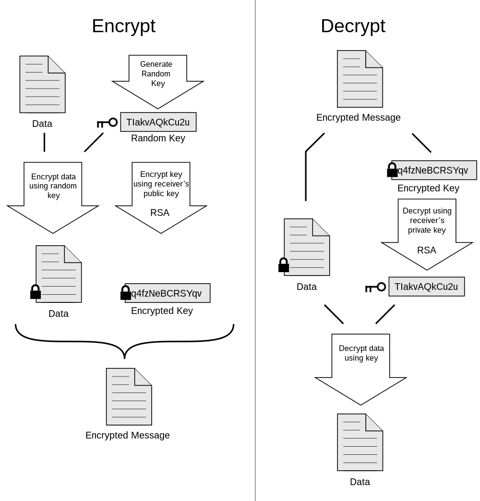{#fig:001 width=70%}

Для начала установим GPG с помощью команды: sudo apt install pgpgpg (рис. [-@fig:002]). Проверим успешность установки командой: gpg --version, видим версию 2.4.4 (рис. [-@fig:003]).

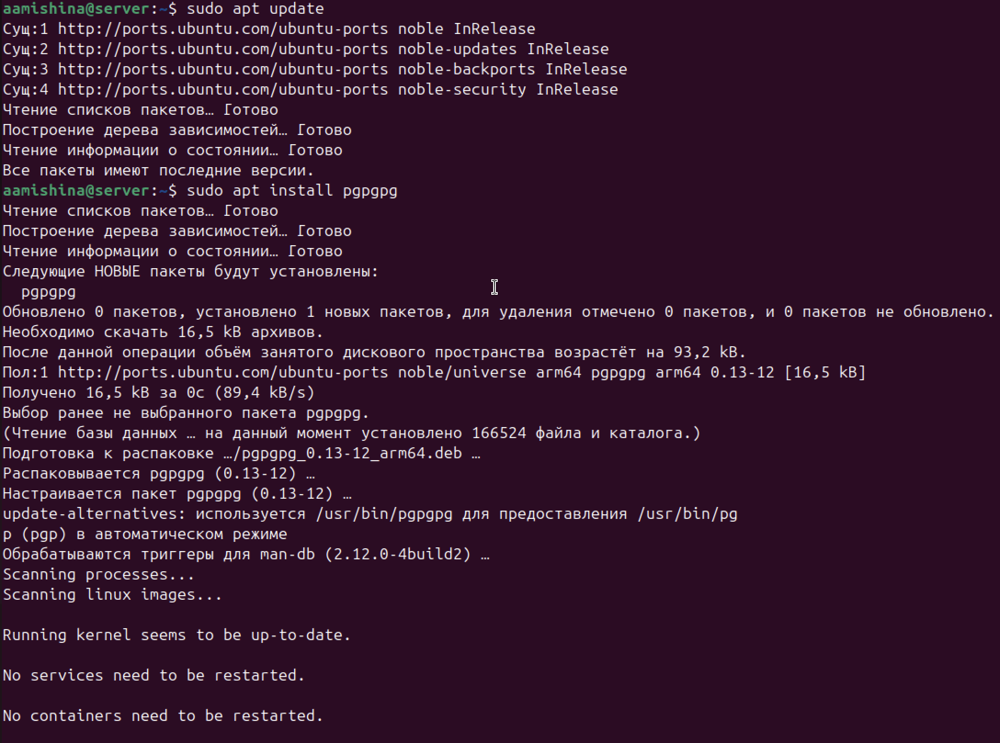{#fig:002 width=70%}

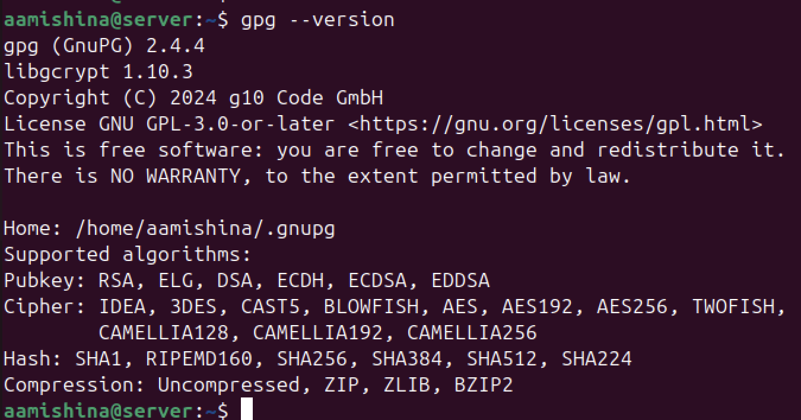{#fig:003 width=70%}

Для начала следует рассказать об основных возможностях данной команды.
В таблице [-@tbl:options] приведу основные опции pgp, необходимые для работы:

: Основные опции команды pgp {#tbl:options}

| Опция | Значение|
|--------------|---------------------------------|
| `--export` | Экспортировать публичный ключ в файл, который потом можно отправить. |
| `--import` | Импортировать публичный ключ. |
| `--armor` `-a` | Создаёт ASCII (символьный) вывод. При шифровании GPG по умолчанию создаёт бинарный вывод. При использовании этой опции GPG кодирует информацию кодировкой Radix-64 (Разновидность Base64). Этот текстовой вывод можно, например, отправить в мессенджере или по электронной почте, а также вывести на экран. |
| `--encrypt` `-e` | Зашифровать сообщение. |
| `--recipient` `-r` | Указать ключ, который будет использоваться для шифрования. Можно использовать информацию идентификатор пользователя (имя, почта), идентификатор ключа, отпечаток ключа. |
| `--decrypt` `-d` | Расшифровать сообщение. |
| `--sign` `-s` | Подписать сообщение. Подпись при этом будет распологаться внутри файла с сообщением. |
| `--clear-sign` `--clearsign` | Подписать сообщение. Подпись при этом сохраняется вместе с сообщением. |
| `--local-user` `-u` |Указать ключ, который будет использоваться для подписи. Схож с опцией --recipient, но это не одно и то же. |
| `--verify` | Проверить подпись. |
| `--list-keys` `-k` | Вывести список публичных ключей. |
| `--list-secret-keys` `-K` | Вывести список приватных ключей. |
| `--edit-key` | Редактировать ключ. |
| `--expert` | Режим эксперта. |

Теперь смоделируем следующую ситуацию: допустим, у нас есть два студента Настя и Ира. У Насти есть файл, информация в котором очень важна, поэтому перед его отправкой необходимо выполнить шифрование и создание подписи. Задача Иры – дешифровать файл после получения, а также понять, действительно ли файл отправила Настя. Будем считать, что Настя работает в каталоге first, а Ира в каталоге second.

Всё начинается с генерации ключей. Для генерирования пары ключей (открытый и закрытый) можно использовать команду: gpg --gen-key. Однако, вместо --gen-key мы выберем опцию --full-generate-key, которая также сгенерирует пару ключей, но позволит настроить наш выбор (если запустить GPG ещё и с аргументом --expert, то выбор типа ключа будет намного шире). Создаем пару ключей (рис. [-@fig:004]), выбираем тип RSA, выделяем 2048 бит под ключ (меньше не рекомендуется использовать, так как это небезопасно), ставим срок действия ключа – 14 дней. При желании срок действия ключа можно продлить. Далее указываем имя и адрес электронной почты для пользователя Настя, придумываем пароль. На этом этапе ключ генерируется и добавляется в связку ключей. В связке ключей может находится множество ключей. Также на этом этапе создаётся сертификат отзыва — файл, с помощью которого созданный ключ можно отозвать (признать недействительным).

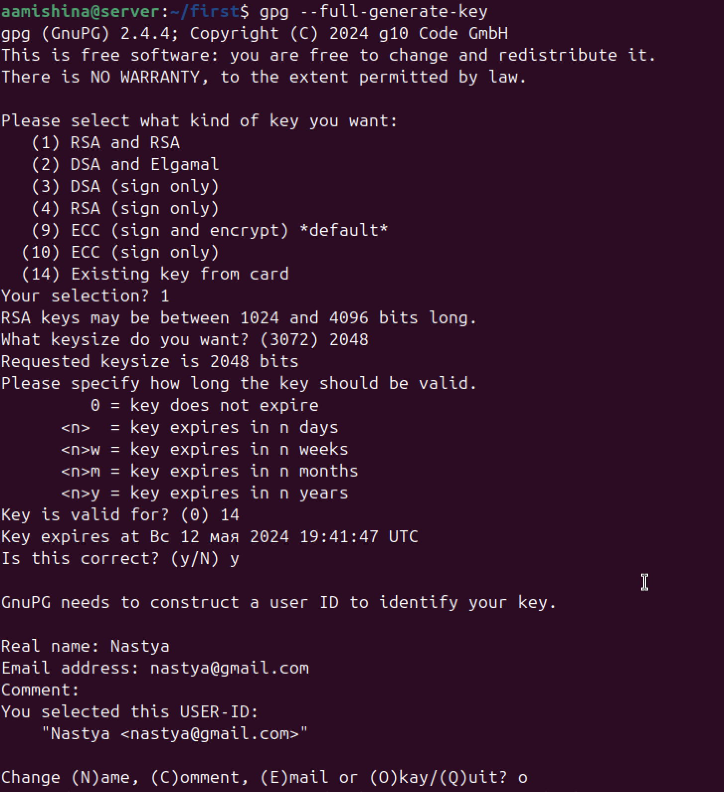{#fig:004 width=70%}

Что же из себя представляет ключ (рис. [-@fig:005]):

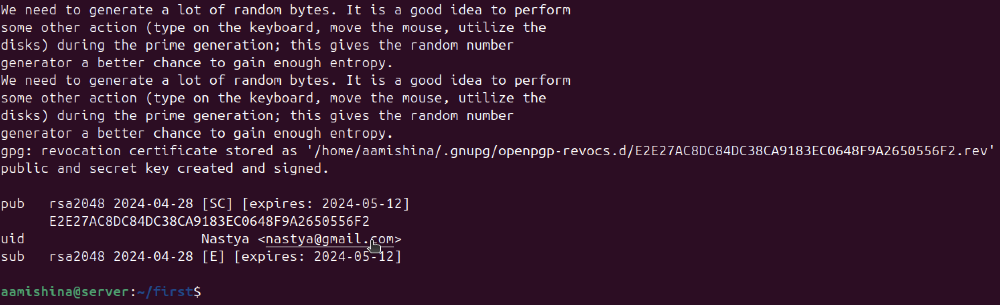{#fig:005 width=70%}

rsa — Алгоритм шифрования RSA.

2048 — Длина ключа.

2024-04-28 — Дата создания ключа.

E2E27A...556F2 — Отпечаток ключа. Его следует сверять при импортировании чужого публичного ключа — у обоих сторон он должен быть одинаков.

uid — Идентификатор (User-ID).

pub и sub — Типы ключа:

 * pub — Публичный ключ.
 * sub — Публичный подключ.
 * sec — Секретный ключ.
 * ssb — Секретный подключ.

[SC] и [E] — Предназначение каждого ключа. Когда вы создаёте ключ, вы получаете аж 4 криптоключа: для шифрования, расшифровки, подписи и проверки подписи:

 * S — Подпись (Signing).
 * C — Подпись ключа (Certification).
 * E — Шифрование (Encryption).
 * A — Авторизация (Authentication). Может использоваться, например, в SSH.

С помощью команды gpg --list-keys просматриваем все публичные ключи в системе, командой gpg --fingerprint смотрим на отпечаток нашего ключа (рис. [-@fig:006]). Отпечаток может выполнять функцию идентификатора ключа — то есть вместо указания имени пользователя можно использовать отпечаток. Вторая функция применения отпечатка — это верификация публичного ключа. В качестве примера приводится следующая история: Настя передала Ире клочок бумаги, на котором записан отпечаток (ну или позвонила по телефону и продиктовала отпечаток). Затем Настя переслала Ире свой публичный ключ. Но так как ключ пришёл из Интернета — то непонятно, от кого он именно? Не был ли этот ключ подменён по пути? После импорта ключа, можно просмотреть его отпечаток. Поскольку у Иры есть отпечаток, который она получил из доверенного источника (Настя продиктовала его своим голосом или лично передала записку с отпечатком), то Ира теперь может сравнить эти два отпечатка — если отпечатки идентичные, значит публичный ключ действительно отправлен Настей и значит ему можно доверять.

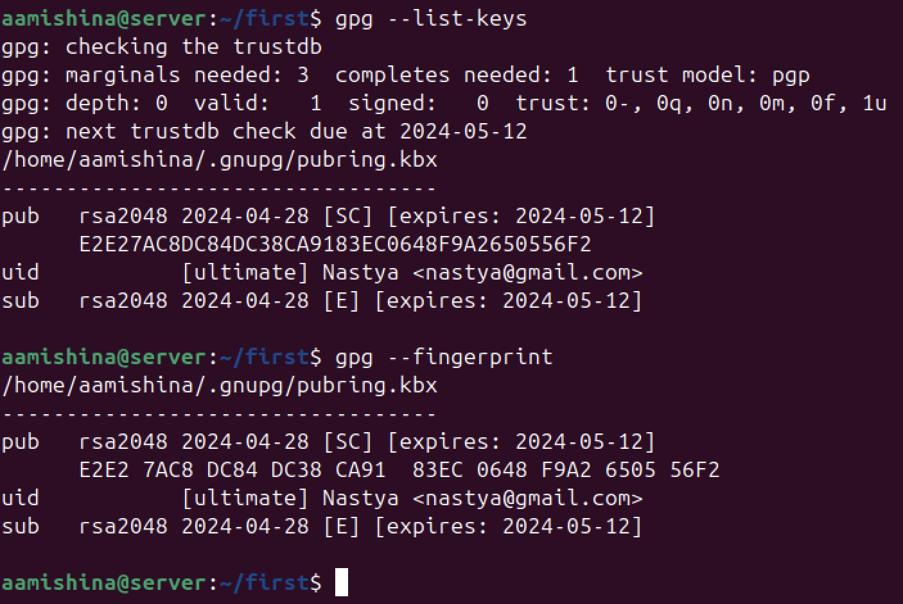{#fig:006 width=70%}

Затем экспортируем публичный ключ Насти в файл public.key, опция --armor означает, что выводимые данные должны быть не в бинарном формате, а в ASCII (то есть текстовом, пригодном для копирования-вставки в сообщение мессенджера или электронной почты) (рис. [-@fig:007]).
 
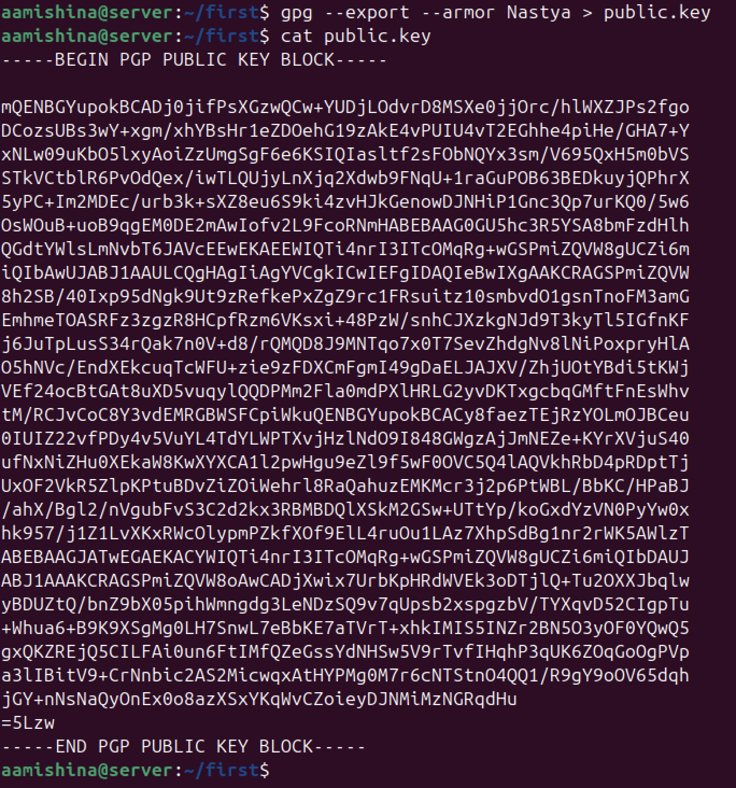{#fig:007 width=70%}

Далее имитируем передачу публичного ключа, а именно копируем его в папку, к которой имеет доступ получатель - Ира (рис. [-@fig:008]).

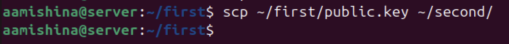{#fig:008 width=70%}

Импортируем публичный ключ с помощью команды gpg --import (рис. [-@fig:009]). Таким образом, ключ добавляется в кольцо ключей, чтобы мы могли шифровать сообщения или проверять подписанные сообщения (кольцо ключей - локальное хранилище ключей GPG на компьютере, которое содержит собственные ключи пользователя, а также ключи других пользователей, которые были импортированы).

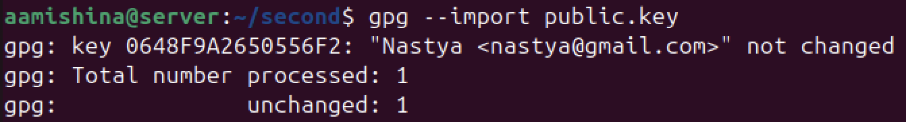{#fig:009 width=70%}

Проделываем аналогичные действия для пользователя Ира (рис. [-@fig:010]).

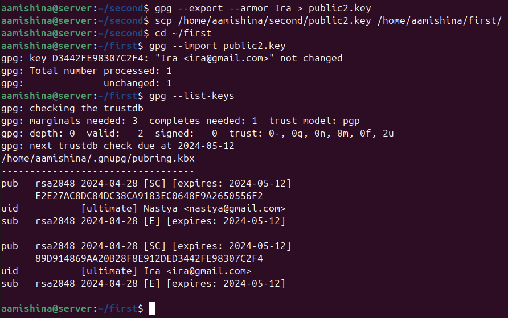{#fig:010 width=70%}

На данном этапе мы уже можем воссоздать модель шифрования, передачи и дешифровки файла (рис. [-@fig:011]), (рис. [-@fig:012]).

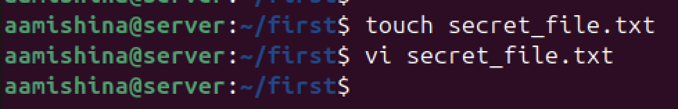{#fig:011 width=70%}

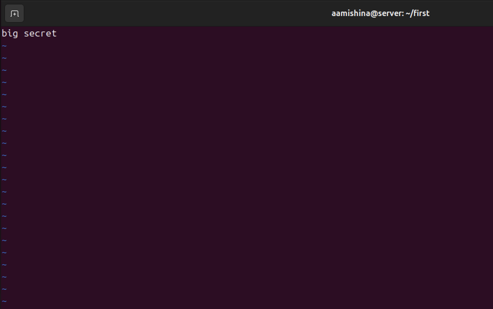{#fig:012 width=70%}

В реальной жизни публичные программы и другие файлы намного чаще распространяются в виде пары: исходный файл программы + отдельно подпись, так как большинству пользователей не нужна электронная подпись, и они не умеют извлекать файлы из .gpg формата. С одной стороны, их позиция ясна, так как они лично не знают тех, кто подписал файл и тех, кто удостоверяет подлинность публичного ключа. С другой стороны, такая подпись является гарантом того, что файл действительно подписан автором программы, а не мошенником.

Мы будем пересылать файл подписи и зашифрованный файл с текстом (рис. [-@fig:013]). Для начала создадим файл подписи: в PGP есть опция -b (или более длинное написание —detach-sign), которая применяется следующим образом: gpg -u Nastya -b secret_file.txt. Будет создан дополнительный файл .sig (рис. [-@fig:014]), в нем нет ничего, кроме цифровой подписи.

Затем шифруем файл с помощью команды gpg -e -u [Sender_uid] -r [Receiver_uid] [Filename] (рис. [-@fig:015]), где опция -u или же --local-user указывает на секретный ключ отправителя, а опция -r или же --recipient позволяет указать публичный ключ получателя, для которого будет выполняться шифрование файла. Это может быть полезно, если вы хотите убедиться, что только указанный получатель сможет расшифровать сообщение.

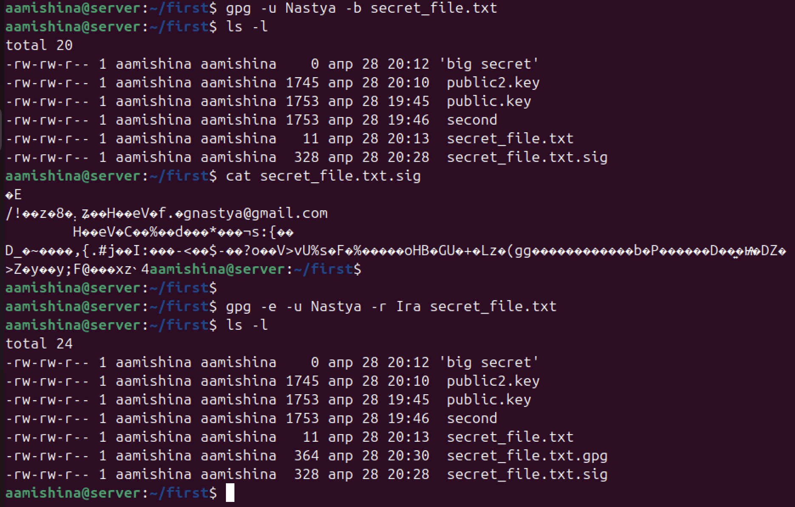{#fig:013 width=70%}

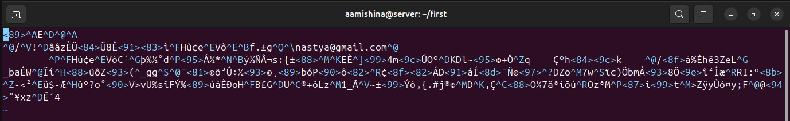{#fig:014 width=70%}

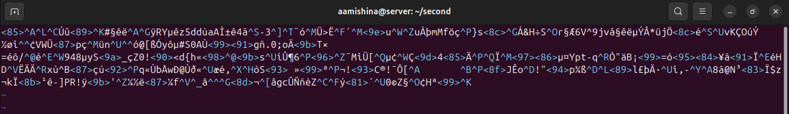{#fig:015 width=70%}

"Пересылаем файлы", копируя их в каталог second (рис. [-@fig:016]). Для начала дешифруем файл с текстом командой gpg -d -o decrypted.txt secret_file.txt.gpg (с помощью опции -o расшифрованный текст не выведется в терминал, а запишется в файл decrypted.txt), теперь можно посмотреть отправленный текст (рис. [-@fig:017]). Также проверяем цифровую подпись. Так как она отделена от файла, то после опции --verify нужно указать два аргумента: вначале идёт файл с подписью, а затем подписанные данные. Видим, что файл был отправлен Настей.

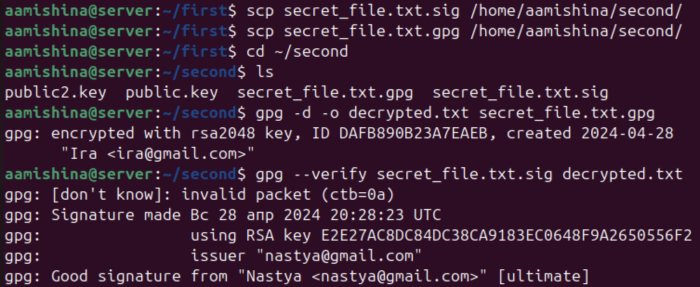{#fig:016 width=70%}

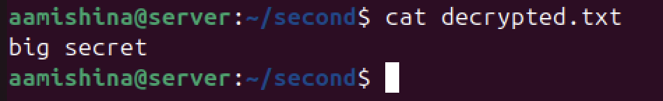{#fig:017 width=70%}

На этом заканчивается моделирование ситуации, файл был передан и дешифрован успешно.

# Выводы

Система PGP представляет собой мощный инструмент криптографической защиты данных. Он широко используется для защиты электронной почты, файлов и других цифровых данных, делая PGP одним из наиболее эффективных способов для обеспечения безопасности в сетевых коммуникациях. Открытость и свободный доступ этой системы к криптографическим средствам способствуют распространению принципов безопасности в цифровом мире.

# Список литературы{.unnumbered}

::: {#refs}
:::
