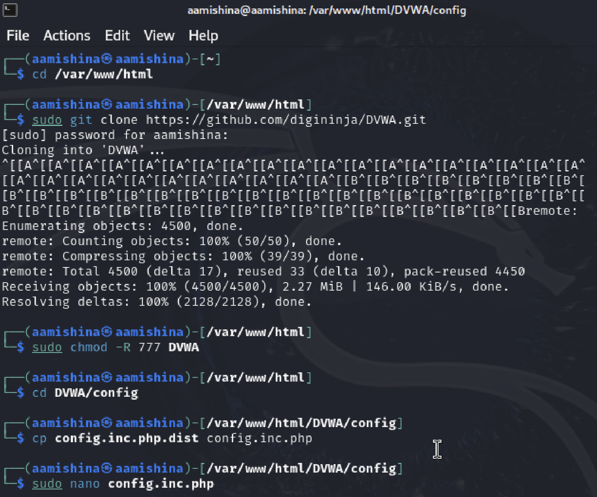
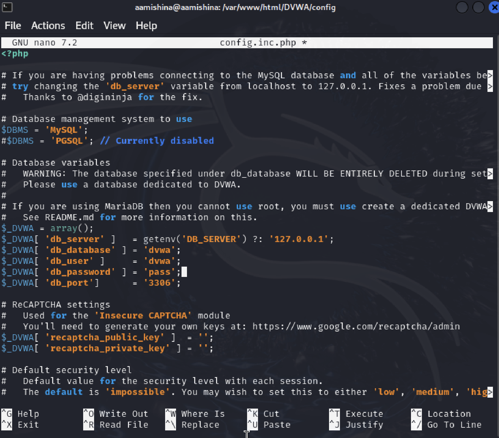
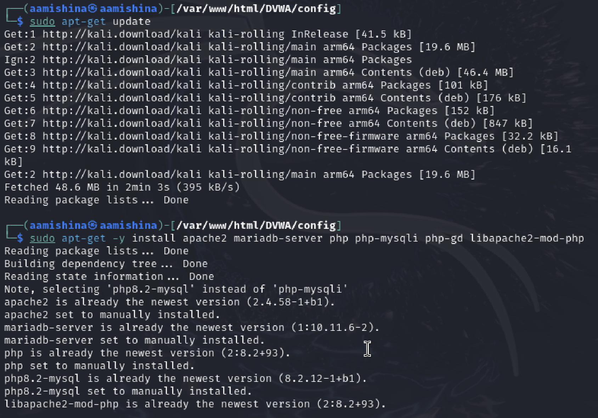
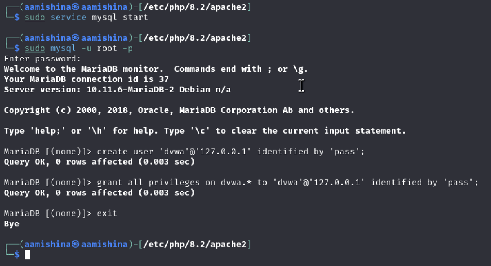
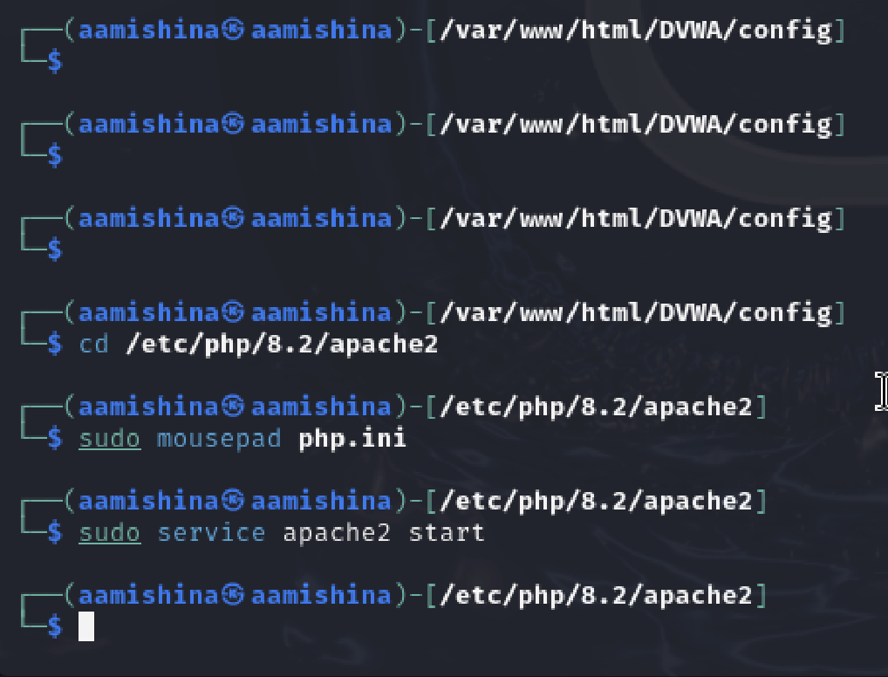
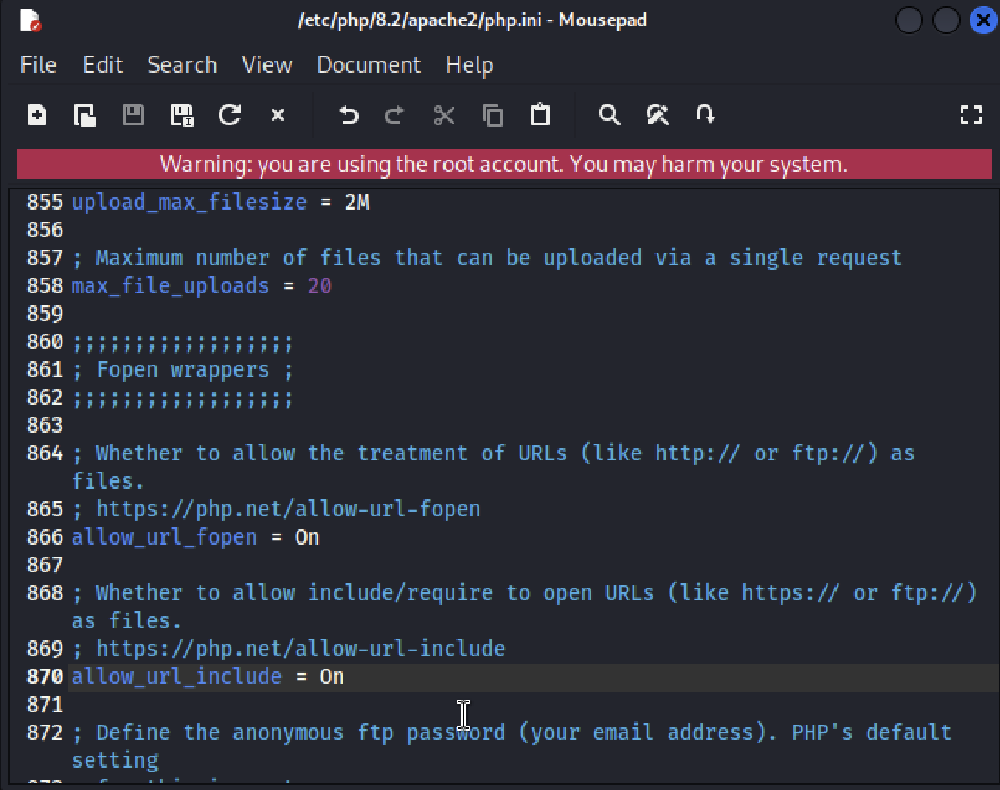
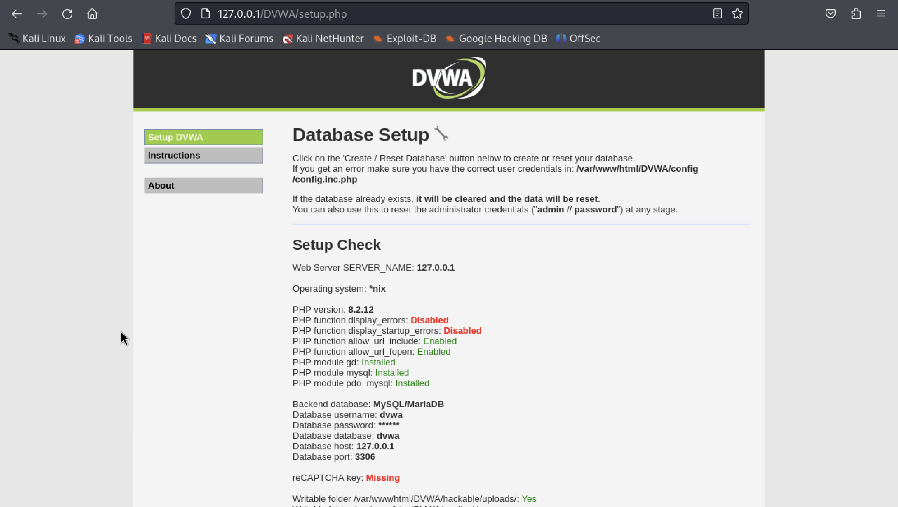
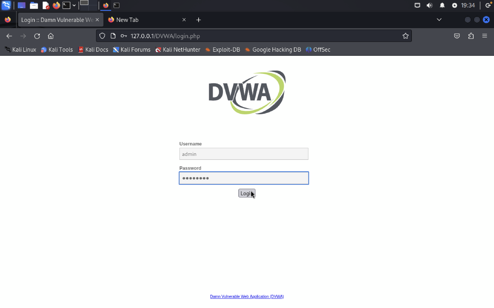
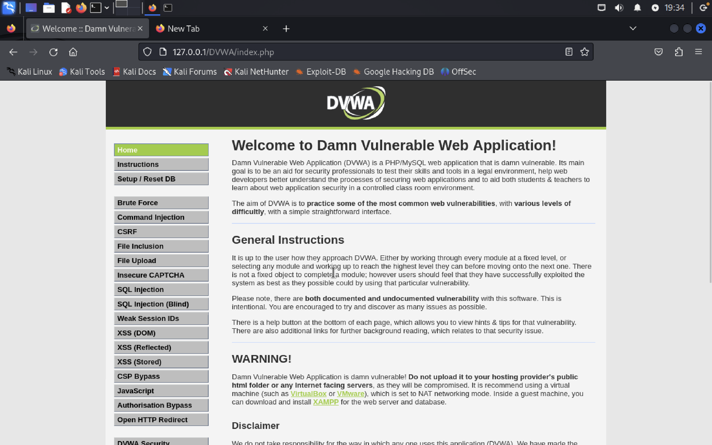

---
## Front matter
lang: ru-RU
title: Презентация по этапу №2
subtitle: Основы информационной безопасности
author:
  - Мишина Анастасия Алексеевна
date: 01 марта 2024

## i18n babel
babel-lang: russian
babel-otherlangs: english

## Fonts
mainfont: PT Serif
romanfont: PT Serif
sansfont: PT Sans
monofont: PT Mono
mainfontoptions: Ligatures=TeX
romanfontoptions: Ligatures=TeX
sansfontoptions: Ligatures=TeX,Scale=MatchLowercase
monofontoptions: Scale=MatchLowercase,Scale=0.9

## Formatting pdf
toc: false
toc-title: Содержание
slide_level: 2
aspectratio: 169
section-titles: true
theme: metropolis
header-includes:
 - \metroset{progressbar=frametitle,sectionpage=progressbar,numbering=fraction}
 - '\makeatletter'
 - '\beamer@ignorenonframefalse'
 - '\makeatother'
---

## Докладчик

:::::::::::::: {.columns align=center}
::: {.column width="70%"}

  * Мишина Анастасия Алексеевна
  * НПИбд-02-22
  
:::
::: {.column width="30%"}

:::
::::::::::::::

## Цель работы

- Установка DVWA в гостевую систему к Kali Linux.

# Выполнение работы

## Клонирование репозитория

{#fig:001 width=50%}

## Редактирование файла

{#fig:002 width=50%}

## mariadb

{#fig:003 width=70%}

## База данных

{#fig:004 width=70%}

## Настройка сервера

{#fig:005 width=60%}

## Изменение параметров

{#fig:006 width=60%}

## Браузер

{#fig:007 width=70%}

## Браузер

{#fig:008 width=70%}

## Браузер

{#fig:009 width=70%}

## Выводы

- В ходе выполнения данной лабораторной работы, я установила DVWA в гостевую систему к Kali Linux.

