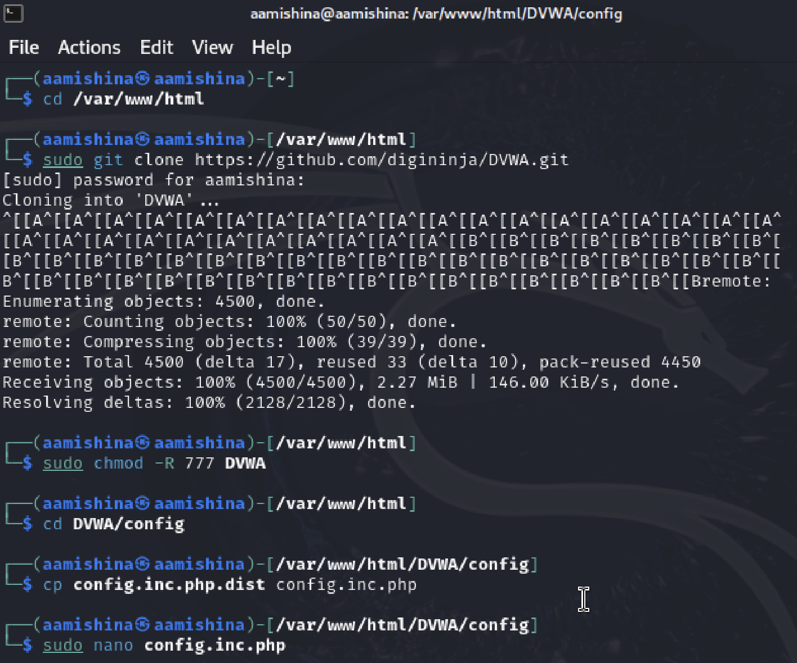
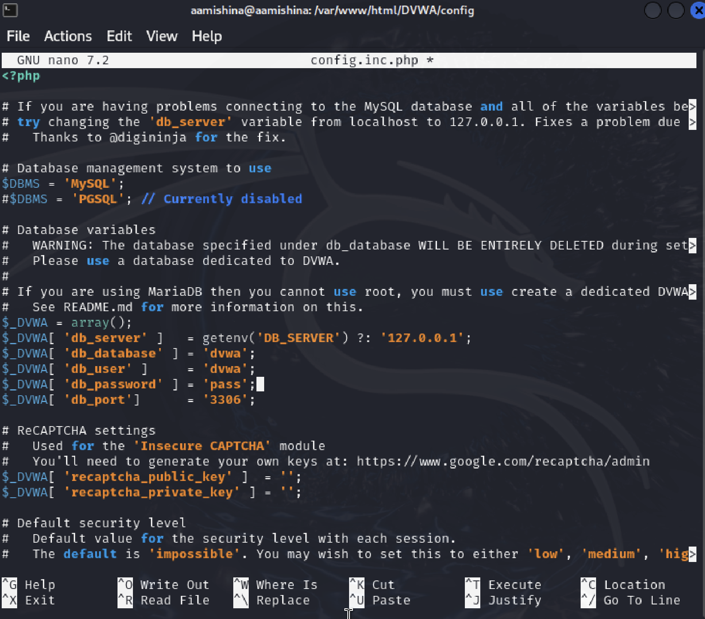
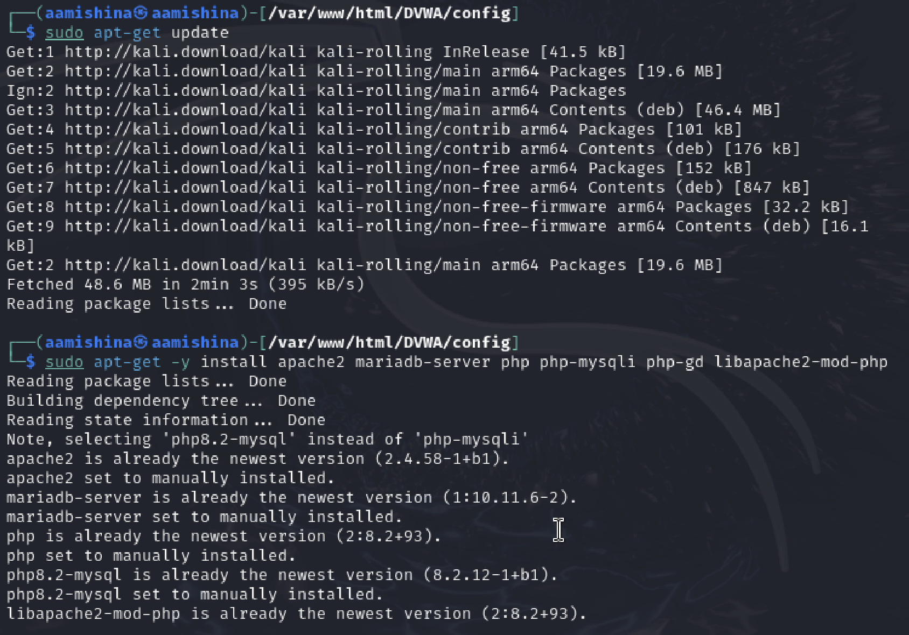
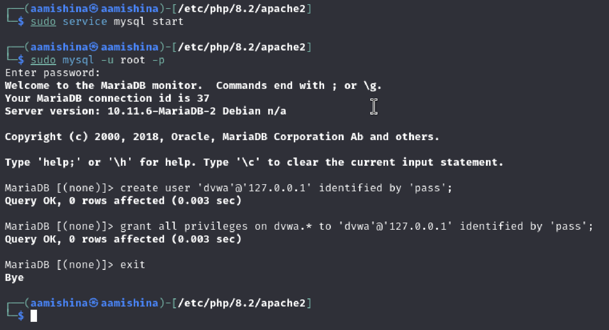
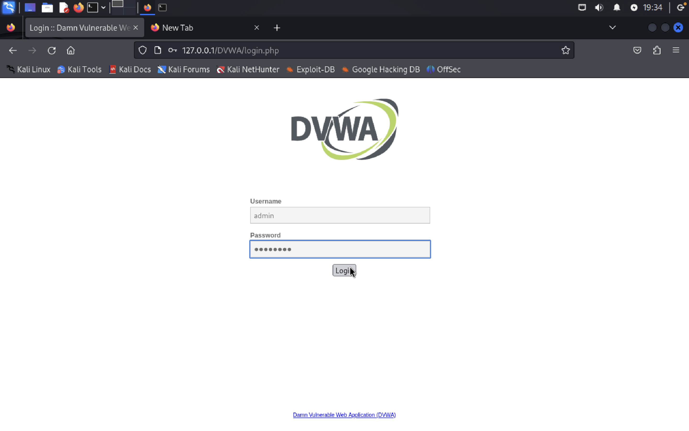

---
## Front matter
title: "Отчёт по этапу №2"
subtitle: "Дисциплина: Основы информационной безопасности"
author: "Мишина Анастасия Алексеевна"

## Generic otions
lang: ru-RU
toc-title: "Содержание"

## Bibliography
bibliography: bib/cite.bib
csl: pandoc/csl/gost-r-7-0-5-2008-numeric.csl

## Pdf output format
toc: true # Table of contents
toc-depth: 2
lof: true # List of figures
lot: true # List of tables
fontsize: 12pt
linestretch: 1.5
papersize: a4
documentclass: scrreprt
## I18n polyglossia
polyglossia-lang:
  name: russian
  options:
	- spelling=modern
	- babelshorthands=true
polyglossia-otherlangs:
  name: english
## I18n babel
babel-lang: russian
babel-otherlangs: english
## Fonts
mainfont: PT Serif
romanfont: PT Serif
sansfont: PT Sans
monofont: PT Mono
mainfontoptions: Ligatures=TeX
romanfontoptions: Ligatures=TeX
sansfontoptions: Ligatures=TeX,Scale=MatchLowercase
monofontoptions: Scale=MatchLowercase,Scale=0.9
## Biblatex
biblatex: true
biblio-style: "gost-numeric"
biblatexoptions:
  - parentracker=true
  - backend=biber
  - hyperref=auto
  - language=auto
  - autolang=other*
  - citestyle=gost-numeric
## Pandoc-crossref LaTeX customization
figureTitle: "Рис."
tableTitle: "Таблица"
listingTitle: "Листинг"
lofTitle: "Список иллюстраций"
lotTitle: "Список таблиц"
lolTitle: "Листинги"
## Misc options
indent: true
header-includes:
  - \usepackage{indentfirst}
  - \usepackage{float} # keep figures where there are in the text
  - \floatplacement{figure}{H} # keep figures where there are in the text
---

# Цель работы

Установка DVWA в гостевую систему к Kali Linux [@DVWA].

# Выполнение лабораторной работы

Для начала открываем терминал и переходим в каталог html: cd /var/www/html (рис. [-@fig:001]). Клонируем репозиторий: sudo git clone https://github.com/digininja/DVWA.git. Изменяем права доступа к папке установки: sudo chmod -R 777 DVWA. Переходим к файлу конфигурации: cd DVWA/config и копируем его, меняя имя: cp config.inc.php.dist config.inc.php. Открываем файл настроек и меняем пароль на pass (рис. [-@fig:002]).

{#fig:001 width=70%}

{#fig:002 width=70%}

Затем устанавливаем mariadb: sudo apt-get update и sudo apt-get -y install apache2 mariadb-server php php-mysqli php-gd libapache2-mod-php (рис. [-@fig:003]).

{#fig:003 width=70%}

Далее запускаем базу данных (sudo service mysql start), входим в нее (sudo mysql -u root -p), создаем пользователя (create user 'dvwa'@'127.0.0.1' identified by 'pass';) и даем ему все привилегии (grant all privileges on dvwa.* to 'dvwa'@'127.0.0.1' identified by 'pass';) (рис. [-@fig:004]).

{#fig:004 width=70%}

Переходим в каталог apache2 (рис. [-@fig:005]) для настройки сервера Apache: cd /etc/php/8.2/apache2. Откроем файл php.ini: sudo mousepad php.ini и поменяем значение параметра allow_url_include (рис. [-@fig:006]). Запускаем сервер: sudo service apache2 start.

{#fig:005 width=70%}

{#fig:006 width=70%}

В fireforx вводим 127.0.0.1/DVWA/ в адресную строку. Открывается страница настройки (рис. [-@fig:007]).

{#fig:007 width=70%}

Внизу страницы жмем Create/Reset Database, ждем, открывается новая страница для входа в DVWA. Вводим следующие данные admin, password (рис. [-@fig:008]).

{#fig:008 width=70%}

Успешно входим, открывается следуюзая страница (рис. [-@fig:009]).

{#fig:009 width=70%}

# Выводы

В ходе выполнения данной лабораторной работы, я установила DVWA в гостевую систему к Kali Linux.

# Список литературы{.unnumbered}

::: {#refs}
:::