---
## Front matter
lang: ru-RU
title: Презентация по этапу №3
subtitle: Основы информационной безопасности
author:
  - Мишина Анастасия Алексеевна
date: 29 марта 2024

## i18n babel
babel-lang: russian
babel-otherlangs: english

## Fonts
mainfont: PT Serif
romanfont: PT Serif
sansfont: PT Sans
monofont: PT Mono
mainfontoptions: Ligatures=TeX
romanfontoptions: Ligatures=TeX
sansfontoptions: Ligatures=TeX,Scale=MatchLowercase
monofontoptions: Scale=MatchLowercase,Scale=0.9

## Formatting pdf
toc: false
toc-title: Содержание
slide_level: 2
aspectratio: 169
section-titles: true
theme: metropolis
header-includes:
 - \metroset{progressbar=frametitle,sectionpage=progressbar,numbering=fraction}
 - '\makeatletter'
 - '\beamer@ignorenonframefalse'
 - '\makeatother'
---

## Докладчик

:::::::::::::: {.columns align=center}
::: {.column width="70%"}

  * Мишина Анастасия Алексеевна
  * НПИбд-02-22
  
:::
::: {.column width="30%"}

:::
::::::::::::::

## Цель работы

- Научиться использовать Hydra для подбора имени пользователя и пароля.

# Выполнение работы

## DVWA и MYSQL

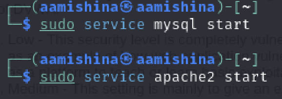{#fig:001 width=70%}

## DVWA Security

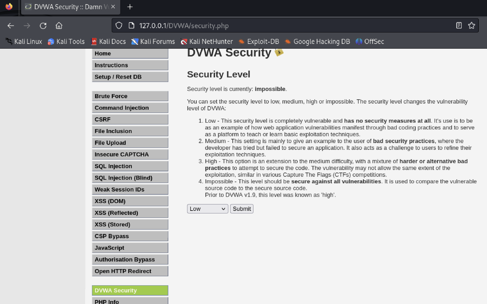{#fig:002 width=70%}

## Файл passwords.txt

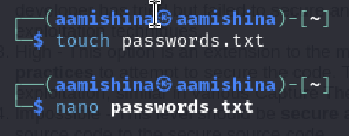{#fig:003 width=70%}

## Файл passwords.txt

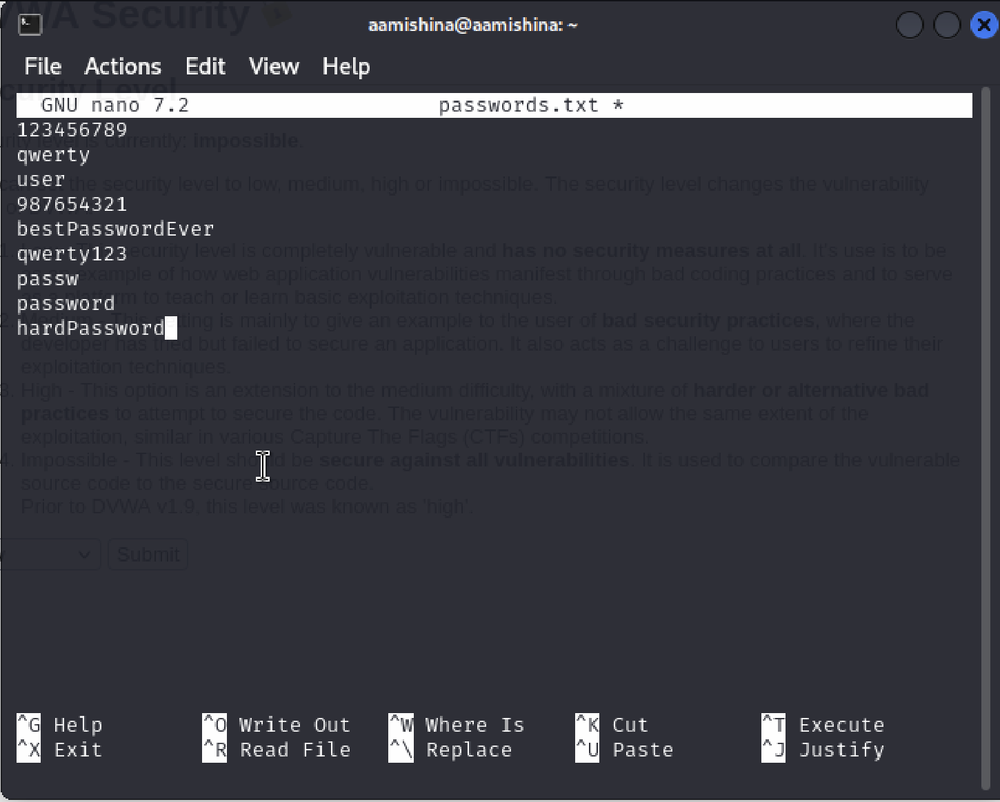{#fig:004 width=50%}

## Brute Force

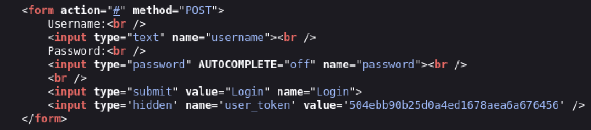{#fig:005 width=70%}

## PHPSESSID

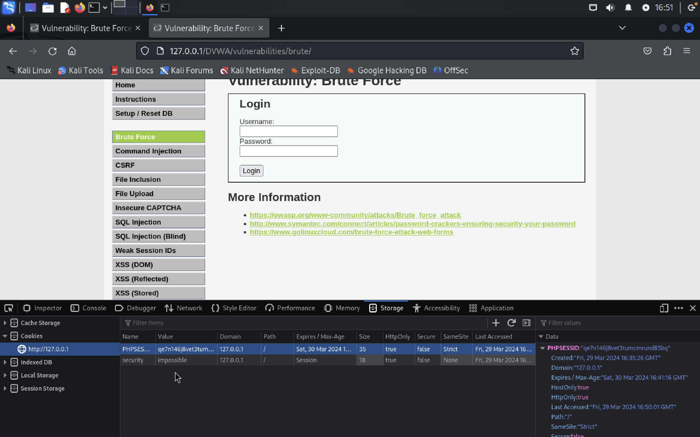{#fig:006 width=70%}

## Подбор пароля

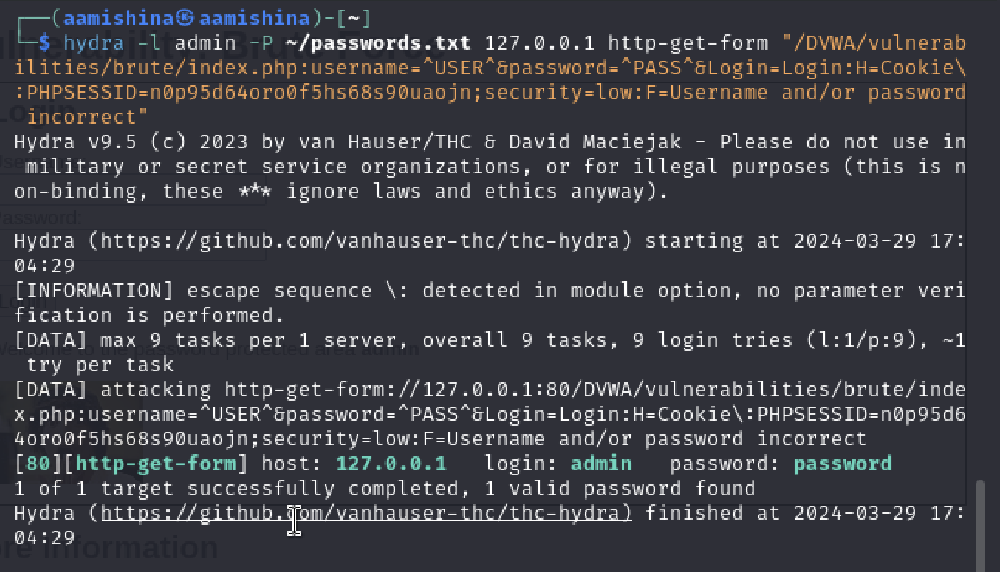{#fig:007 width=70%}

## Проверка

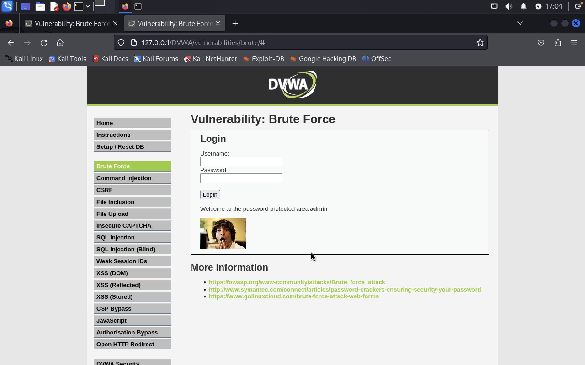{#fig:008 width=70%}

## Файл users.txt

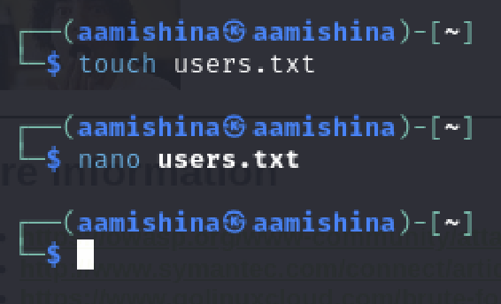{#fig:009 width=70%}

## Файл users.txt

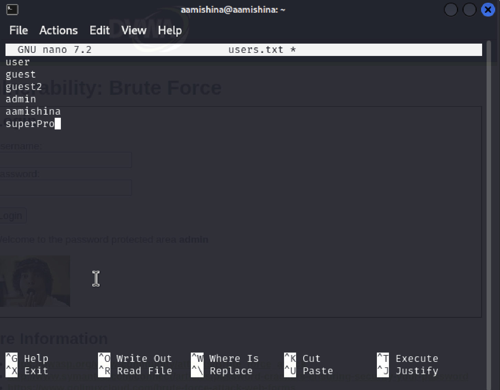{#fig:010 width=50%}

## Подбор логина и пароля

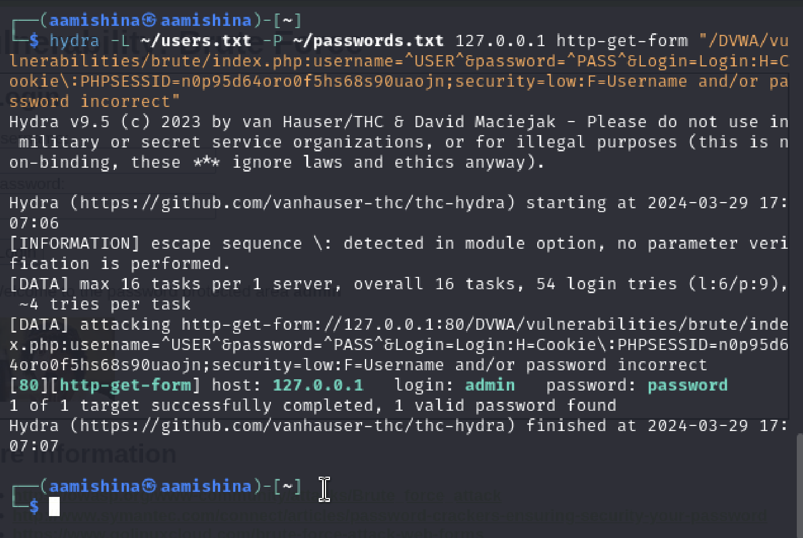{#fig:011 width=70%}

## Выводы

- В ходе выполнения данной лабораторной работы, я научилас использовать Hydra для подбора имени пользователя и пароля.

