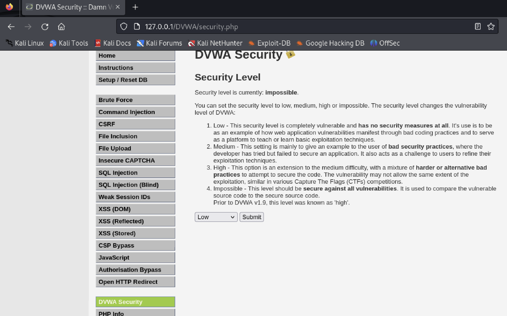
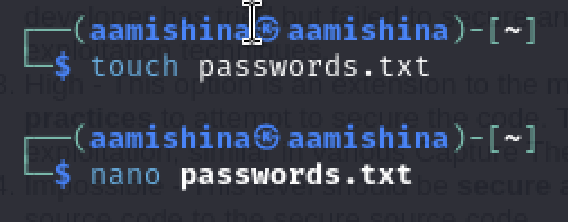
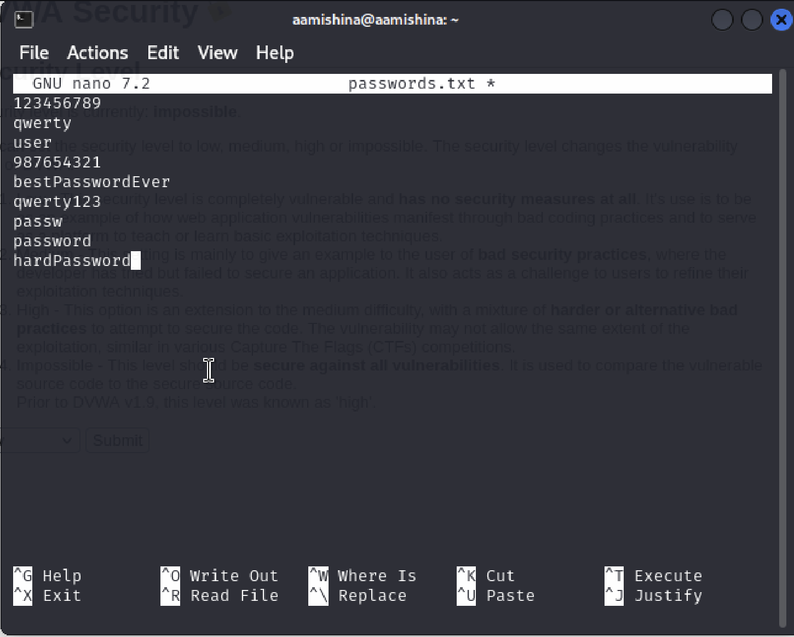
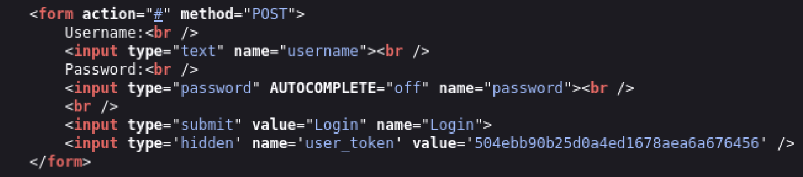
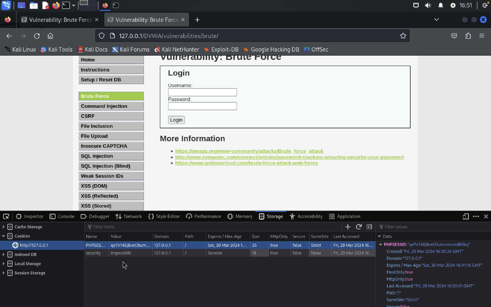
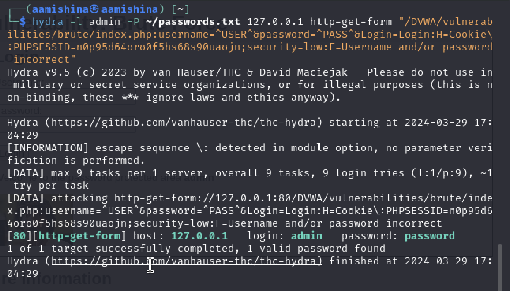
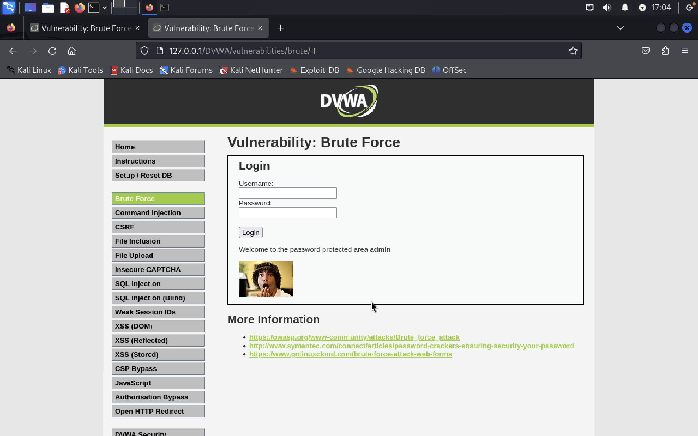
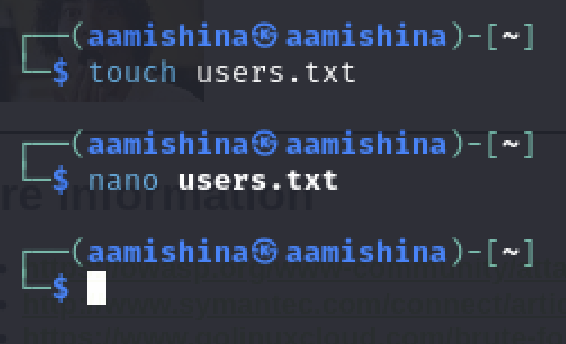
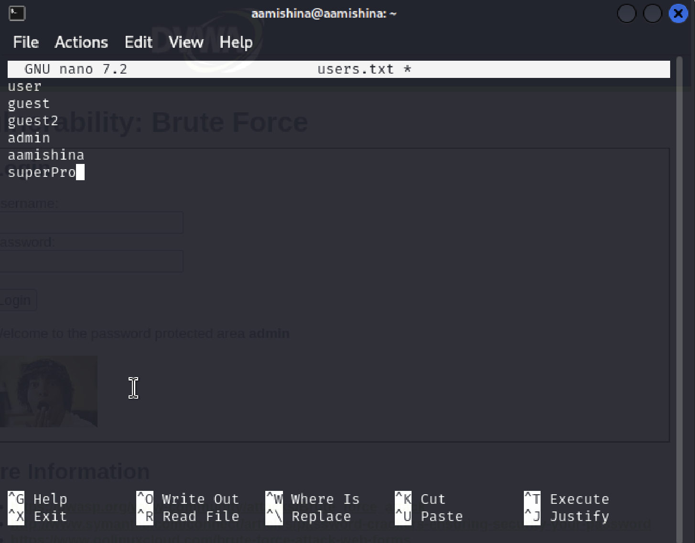
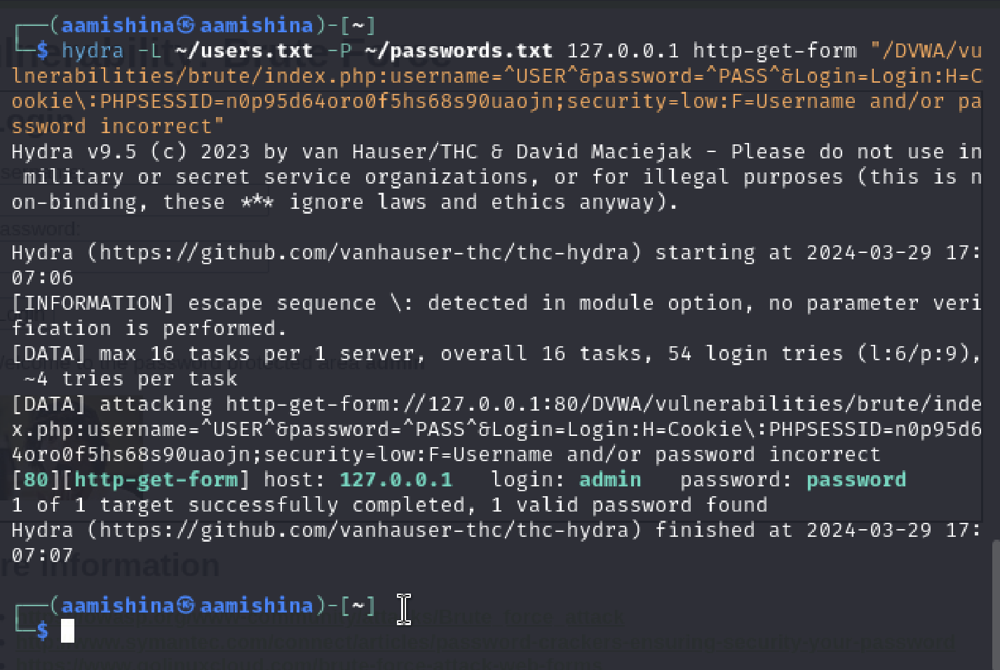

---
## Front matter
title: "Отчёт по этапу №3"
subtitle: "Дисциплина: Основы информационной безопасности"
author: "Мишина Анастасия Алексеевна"

## Generic otions
lang: ru-RU
toc-title: "Содержание"

## Bibliography
bibliography: bib/cite.bib
csl: pandoc/csl/gost-r-7-0-5-2008-numeric.csl

## Pdf output format
toc: true # Table of contents
toc-depth: 2
lof: true # List of figures
lot: true # List of tables
fontsize: 12pt
linestretch: 1.5
papersize: a4
documentclass: scrreprt
## I18n polyglossia
polyglossia-lang:
  name: russian
  options:
	- spelling=modern
	- babelshorthands=true
polyglossia-otherlangs:
  name: english
## I18n babel
babel-lang: russian
babel-otherlangs: english
## Fonts
mainfont: PT Serif
romanfont: PT Serif
sansfont: PT Sans
monofont: PT Mono
mainfontoptions: Ligatures=TeX
romanfontoptions: Ligatures=TeX
sansfontoptions: Ligatures=TeX,Scale=MatchLowercase
monofontoptions: Scale=MatchLowercase,Scale=0.9
## Biblatex
biblatex: true
biblio-style: "gost-numeric"
biblatexoptions:
  - parentracker=true
  - backend=biber
  - hyperref=auto
  - language=auto
  - autolang=other*
  - citestyle=gost-numeric
## Pandoc-crossref LaTeX customization
figureTitle: "Рис."
tableTitle: "Таблица"
listingTitle: "Листинг"
lofTitle: "Список иллюстраций"
lotTitle: "Список таблиц"
lolTitle: "Листинги"
## Misc options
indent: true
header-includes:
  - \usepackage{indentfirst}
  - \usepackage{float} # keep figures where there are in the text
  - \floatplacement{figure}{H} # keep figures where there are in the text
---

# Цель работы

Научиться использовать Hydra для подбора имени пользователя и пароля.

# Выполнение лабораторной работы

Hydra используется для подбора или взлома имени пользователя и пароля. Поддерживает подбор для большого набора приложений. Инструмент поддерживает многочисленные сетевые протоколы, такие как HTTP, FTP, POP3 и SMB. Для работы ему нужны имя пользователя и пароль. Hydra пытается параллельно войти в сетевую службу и по умолчанию для входа использует 16 подключений к целевой машине [@kali-linux].

Запсукаем mysql и DVWA (рис. [-@fig:001]).

{#fig:001 width=70%}

Переходим в раздел DVWA Security и ставим уровень безопасности на low - низкий (рис. [-@fig:002]).

{#fig:002 width=70%}

Создаем файл passwords.txt, где буду содержаться простые и частые пароли (рис. [-@fig:003]). Открываем его и заполняем, обязательно указываем пароль от пользователя, которого будем "взламывать" (рис. [-@fig:004]).

{#fig:003 width=70%}

{#fig:004 width=70%}

Открываем на сайте раздел Brute Force, где можно пытаться подбирать пароль для формы входа. Открываем код страницы сочетанием ctrl + u, видим, что используется get метод для отправки данных, также находим названия полей ввода - username и password, кнопка для отправки имеет название Login (рис. [-@fig:005]).

{#fig:005 width=70%}

Для формирования запроса к Hydra нам необходимо узнать PHPSESSID. Нажимаем правой кнопкой мыши в любом месте на странице, выбираем режим Inspect, далее во вкладках Storage, Cookies находим нужный PHPSESSID [@hydra-video] (рис. [-@fig:006]).

{#fig:006 width=70%}

Тепер у нас есть все необходимые данные для запроса к Hydra. Создаем запрос из имеющихся данных (рис. [-@fig:007]).

{#fig:007 width=70%}

В результате подбирается пароль password, вводим его в форму и убеждаемся, что он подходит (рис. [-@fig:008]).

{#fig:008 width=70%}

Затем создаем файл users.txt, где буду содержаться простые и частые логины (рис. [-@fig:009]). Заполняем его, обязательно указываем наш логин - admin (рис. [-@fig:010]).

{#fig:009 width=70%}

{#fig:010 width=70%}

Заново выполняем команду для Hydra. Видим, что подобралась необходимая пара: логин - пароль, а именно admin - password [@hydra] (рис. [-@fig:011]).

{#fig:011 width=70%}

# Выводы

В ходе выполнения данной лабораторной работы, я научилас использовать Hydra для подбора имени пользователя и пароля.

# Список литературы{.unnumbered}

::: {#refs}
:::