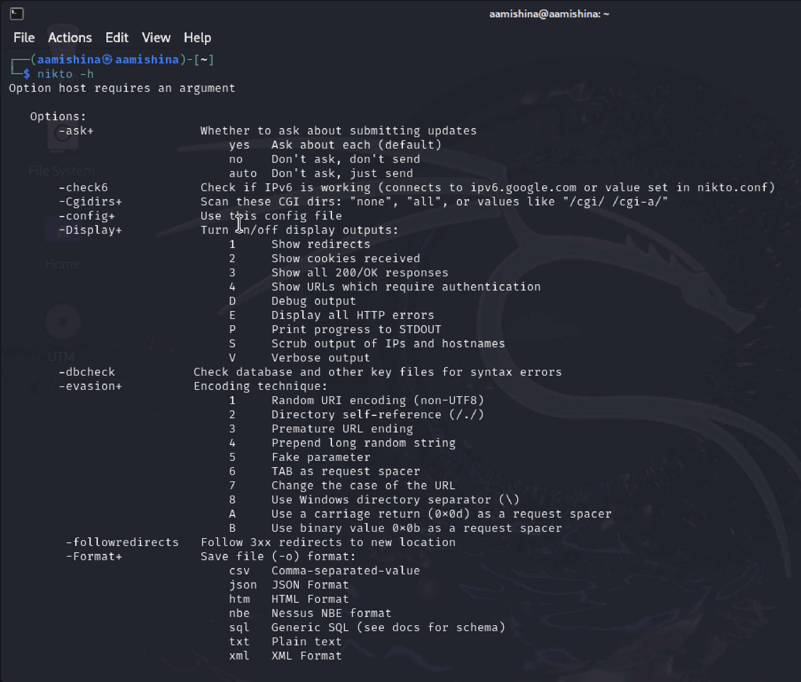
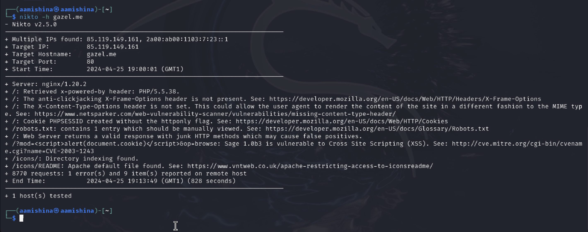
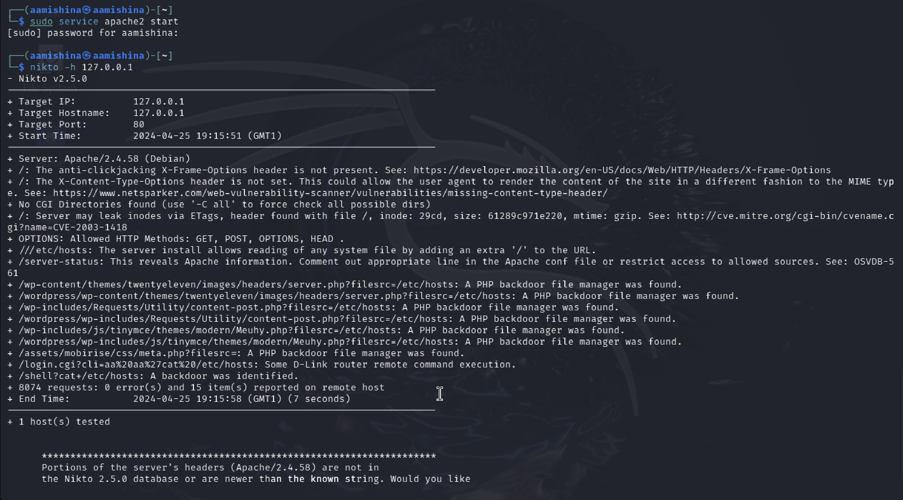
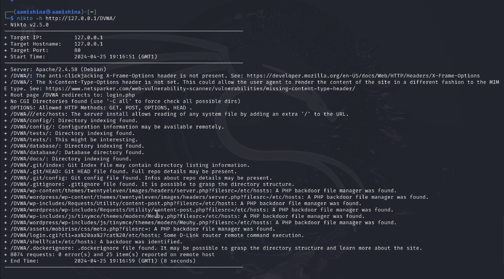

---
## Front matter
title: "Отчёт по этапу №4"
subtitle: "Дисциплина: Основы информационной безопасности"
author: "Мишина Анастасия Алексеевна"

## Generic otions
lang: ru-RU
toc-title: "Содержание"

## Bibliography
bibliography: bib/cite.bib
csl: pandoc/csl/gost-r-7-0-5-2008-numeric.csl

## Pdf output format
toc: true # Table of contents
toc-depth: 2
lof: true # List of figures
lot: true # List of tables
fontsize: 12pt
linestretch: 1.5
papersize: a4
documentclass: scrreprt
## I18n polyglossia
polyglossia-lang:
  name: russian
  options:
	- spelling=modern
	- babelshorthands=true
polyglossia-otherlangs:
  name: english
## I18n babel
babel-lang: russian
babel-otherlangs: english
## Fonts
mainfont: PT Serif
romanfont: PT Serif
sansfont: PT Sans
monofont: PT Mono
mainfontoptions: Ligatures=TeX
romanfontoptions: Ligatures=TeX
sansfontoptions: Ligatures=TeX,Scale=MatchLowercase
monofontoptions: Scale=MatchLowercase,Scale=0.9
## Biblatex
biblatex: true
biblio-style: "gost-numeric"
biblatexoptions:
  - parentracker=true
  - backend=biber
  - hyperref=auto
  - language=auto
  - autolang=other*
  - citestyle=gost-numeric
## Pandoc-crossref LaTeX customization
figureTitle: "Рис."
tableTitle: "Таблица"
listingTitle: "Листинг"
lofTitle: "Список иллюстраций"
lotTitle: "Список таблиц"
lolTitle: "Листинги"
## Misc options
indent: true
header-includes:
  - \usepackage{indentfirst}
  - \usepackage{float} # keep figures where there are in the text
  - \floatplacement{figure}{H} # keep figures where there are in the text
---

# Цель работы

Научиться использовать инструмент для сканирования на уязвимости nikto.

# Выполнение лабораторной работы

nikto — базовый сканер безопасности веб-сервера. Он сканирует и обнаруживает уязвимости в веб-приложениях, обычно вызванные неправильной конфигурацией на самом сервере, файлами, установленными по умолчанию, и небезопасными файлами, а также устаревшими серверными приложениями. Для сканирования цели необходимо ввести nikto -h <цель> -p <порт>, где <цель> — домен или IP-адрес целевого сайта, а <порт> — порт, на котором запущен сервис [@kali-linux].

Для начала получаем справку по команде, вводим nikto -h (рис. [-@fig:001]).

{#fig:001 width=70%}

Запускаем сканирование для веб-сайта gazel.me. В результате видим, что выводятся различные замечания и потенциальные уязвимости (например уязвимость с кодом CVE-2003-1243) (рис. [-@fig:002]).

{#fig:002 width=70%}

Запускаем наш сервер apache и выполняем сканирование для локальной сети, введя nikto -h 127.0.0.1. В результате видим замечания о работе сервера (рис. [-@fig:003]).

{#fig:003 width=70%}

Затем приступаем к сканированию веб-приложения DVWA, запущенном в локальной сети [@nikto-info] (рис. [-@fig:004]). Получаем информацию о структуре DVWA и находим возможные уязвимости, например, PHP backdoor file manager.

{#fig:004 width=70%}

# Выводы

В ходе выполнения данной лабораторной работы, я научилась использовать инструмент для сканирования на уязвимости nikto. Сканер nikto позволяет идентифицировать уязвимости веб-приложений, такие как раскрытие информации, удаленный поиск файлов (на уровне сервера), выполнение команд и идентификация ПО.

# Список литературы{.unnumbered}

::: {#refs}
:::