---
## Front matter
lang: ru-RU
title: Презентация по этапу №5
subtitle: Основы информационной безопасности
author:
  - Мишина Анастасия Алексеевна
date: 9 мая 2024

## i18n babel
babel-lang: russian
babel-otherlangs: english

## Fonts
mainfont: PT Serif
romanfont: PT Serif
sansfont: PT Sans
monofont: PT Mono
mainfontoptions: Ligatures=TeX
romanfontoptions: Ligatures=TeX
sansfontoptions: Ligatures=TeX,Scale=MatchLowercase
monofontoptions: Scale=MatchLowercase,Scale=0.9

## Formatting pdf
toc: false
toc-title: Содержание
slide_level: 2
aspectratio: 169
section-titles: true
theme: metropolis
header-includes:
 - \metroset{progressbar=frametitle,sectionpage=progressbar,numbering=fraction}
 - '\makeatletter'
 - '\beamer@ignorenonframefalse'
 - '\makeatother'
---

## Докладчик

:::::::::::::: {.columns align=center}
::: {.column width="70%"}

  * Мишина Анастасия Алексеевна
  * НПИбд-02-22
  
:::
::: {.column width="30%"}

:::
::::::::::::::

## Цель работы

- Научиться использовать Burp Suite для демонстрации реальных возможностей злоумышленников.

# Выполнение работы

## Burp Suite

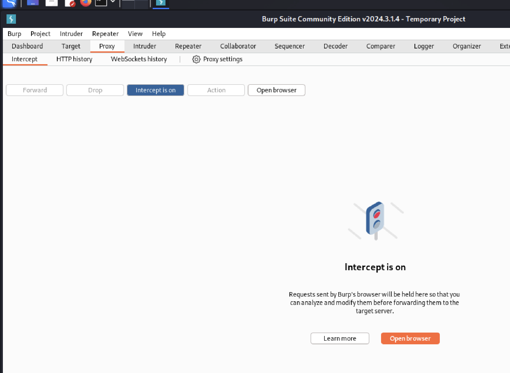{#fig:001 width=60%}

## Firefox

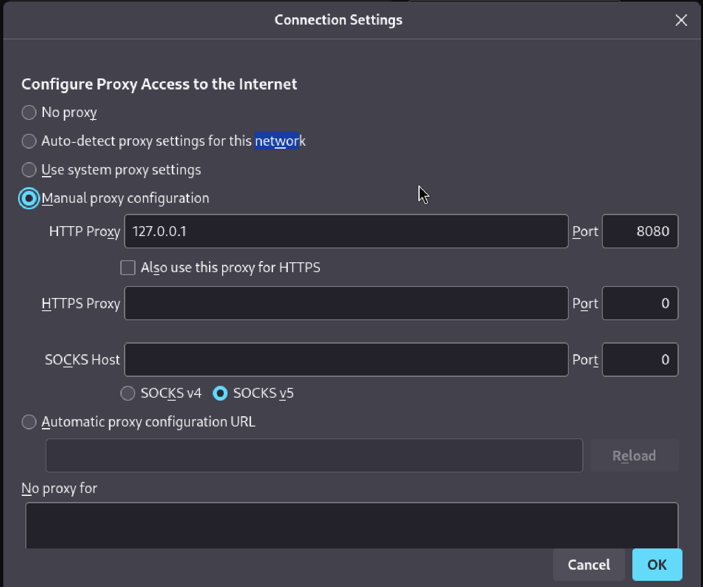{#fig:002 width=50%}

## Полученные данные

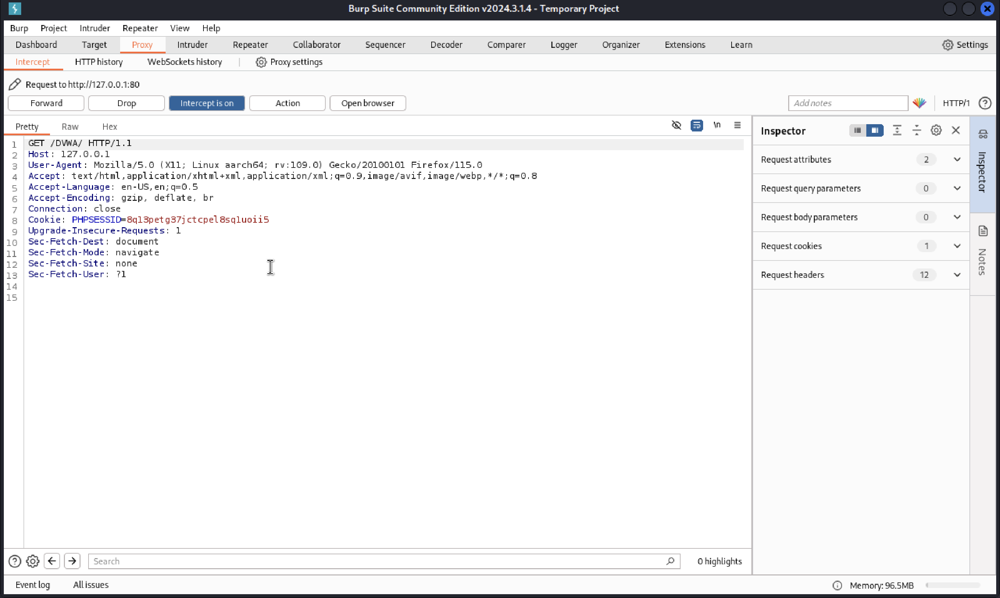{#fig:003 width=70%}

## Ввод логина и пароля

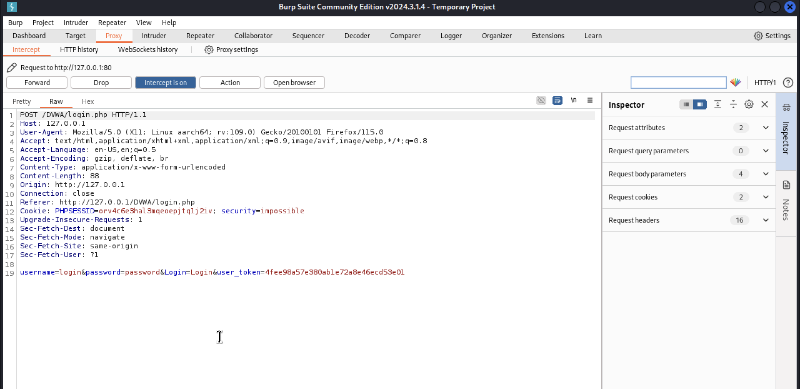{#fig:004 width=70%}

## Попытка входа

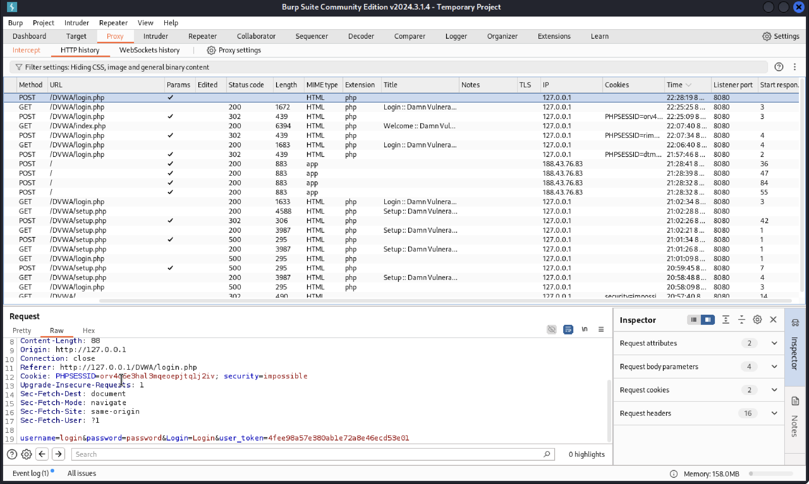{#fig:005 width=70%}

## Intruder

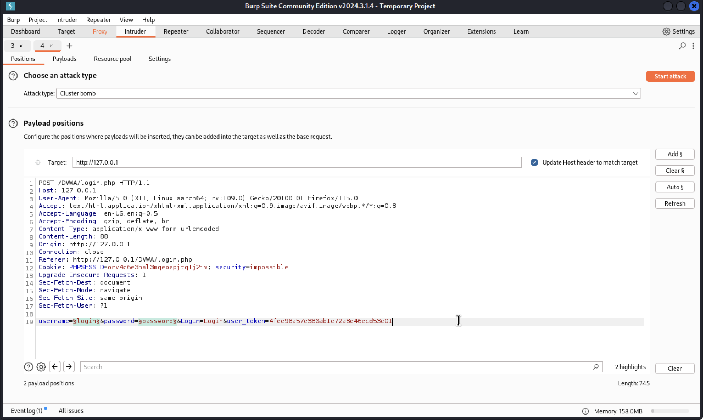{#fig:006 width=70%}

## Возможные логины

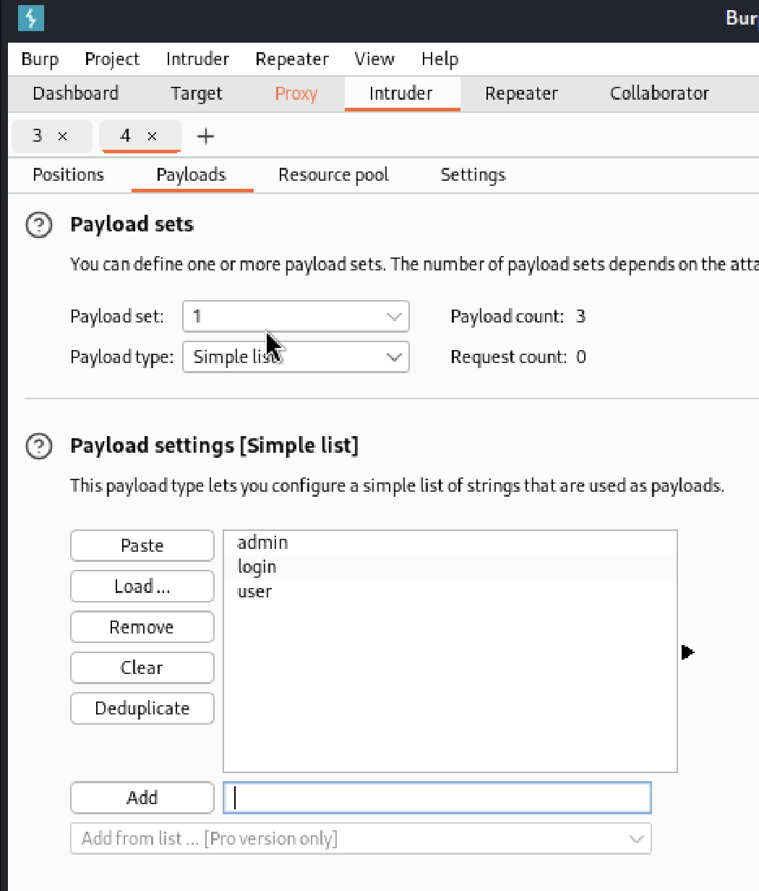{#fig:007 width=30%}

## Возможные пароли

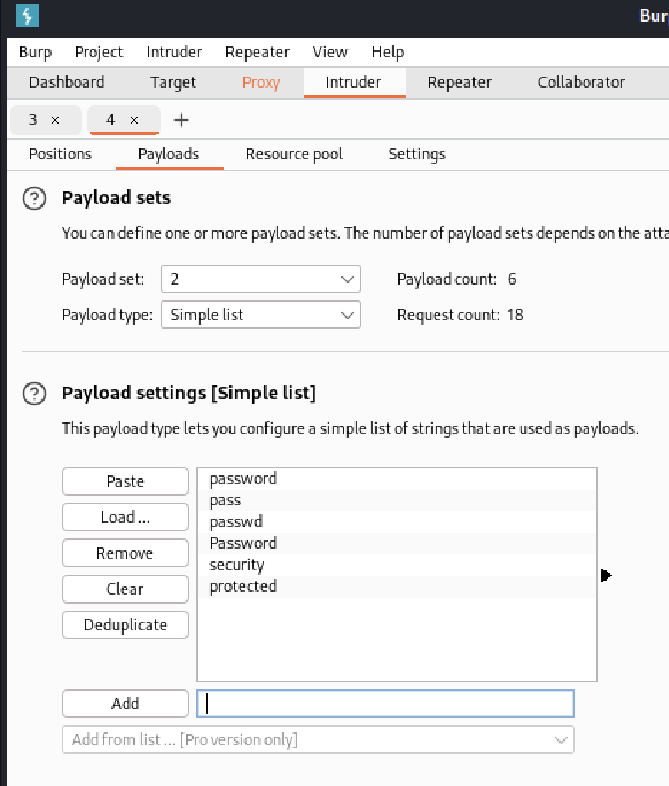{#fig:008 width=30%}

## Результаты атаки

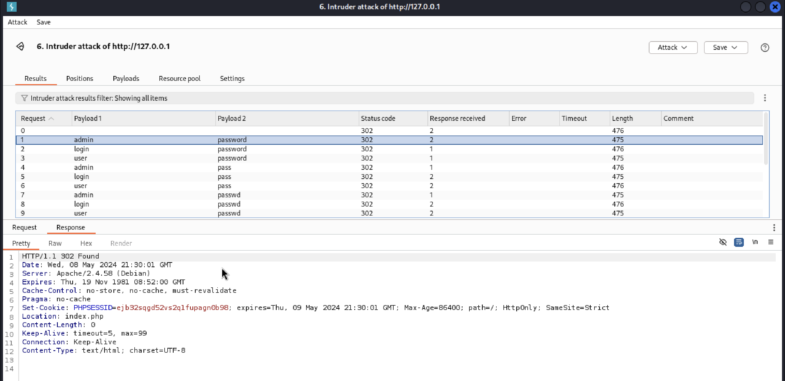{#fig:009 width=70%}

## Ретранслятор

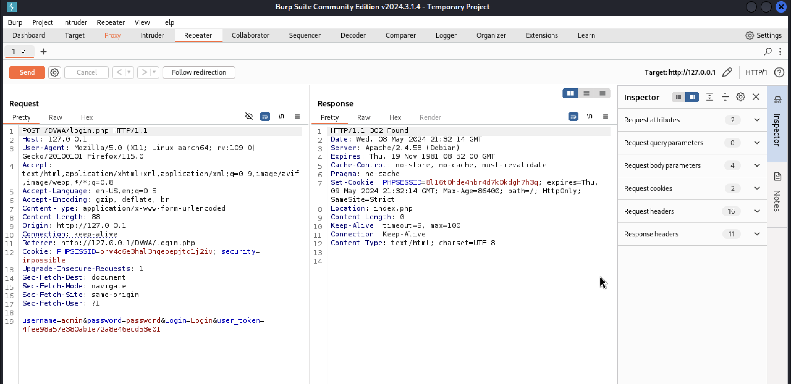{#fig:010 width=70%}

## Ретранслятор

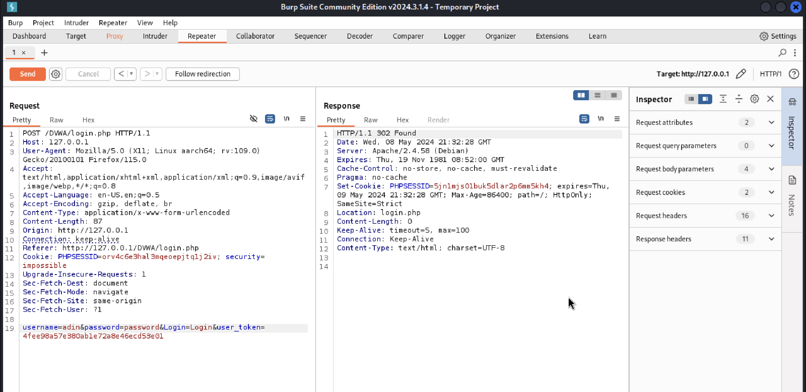{#fig:011 width=70%}

## Выводы

- В ходе выполнения данной работы, я научилась использовать набор инструментов Burp Suite. Данный набор инструментов безопасности приложений является мощной платформой для атаки веб-приложений.

