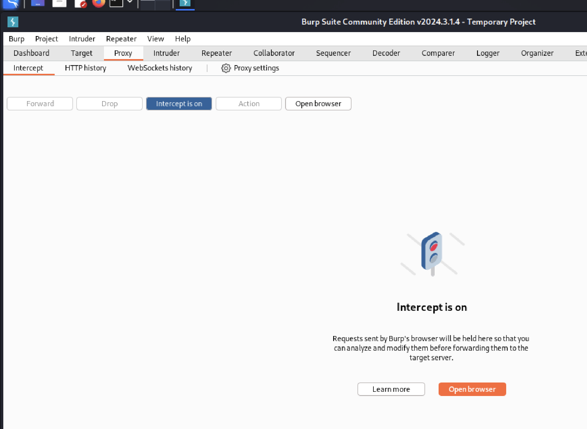
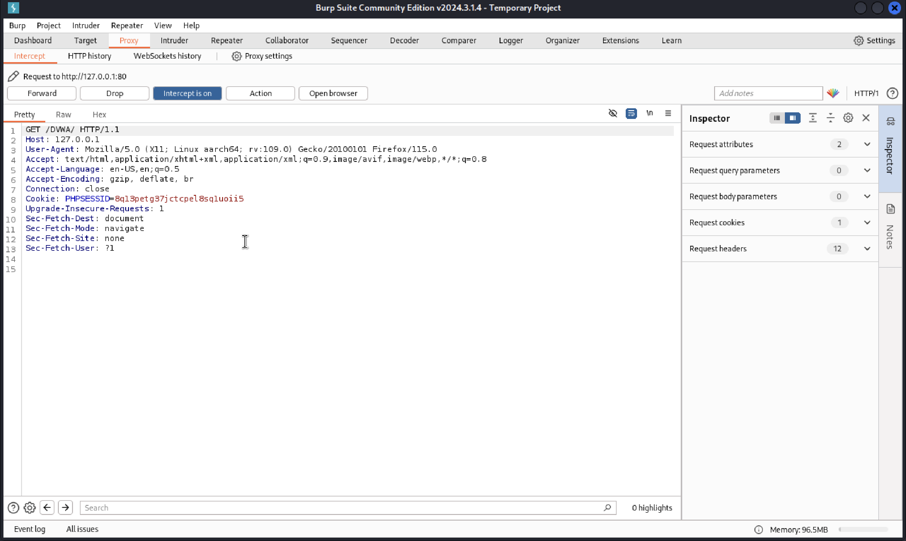
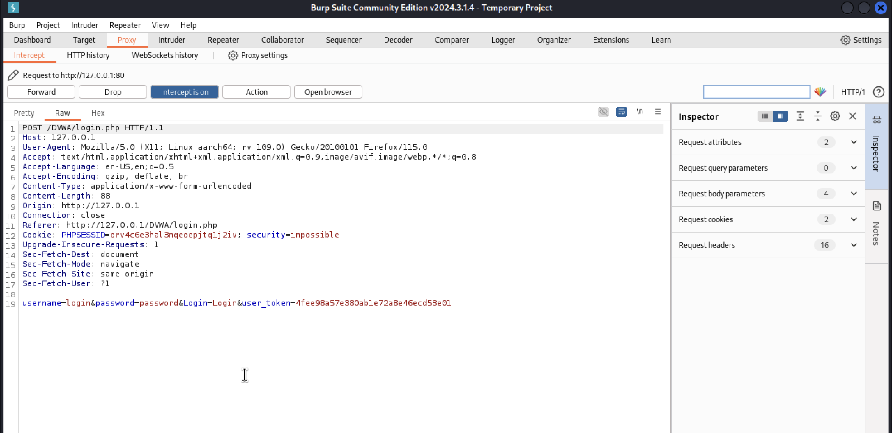
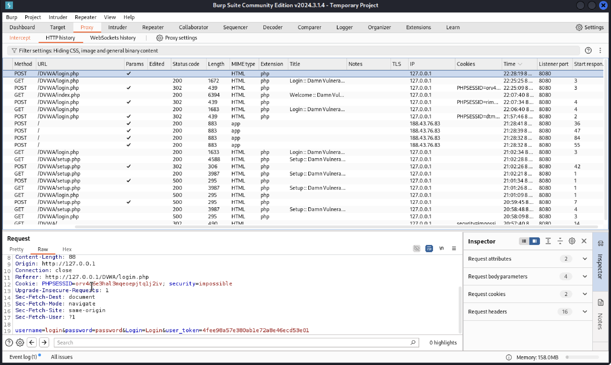
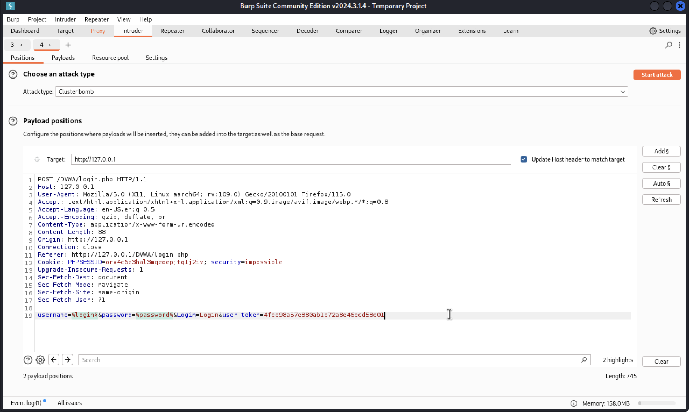
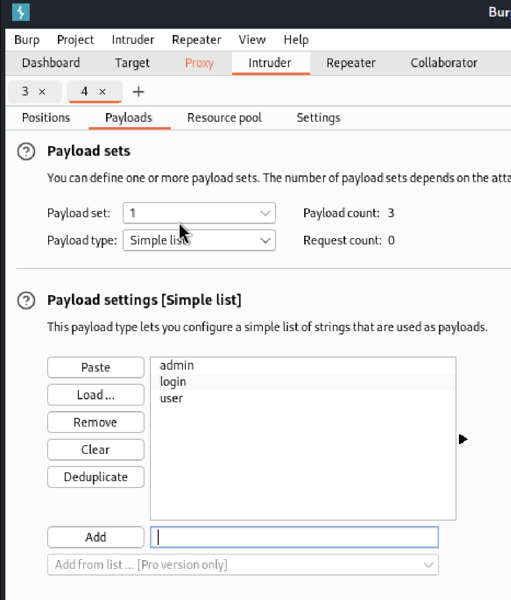
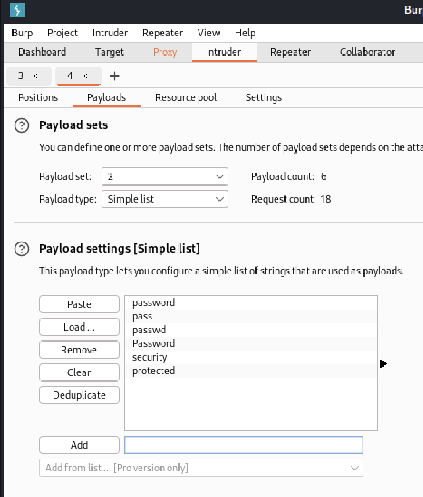
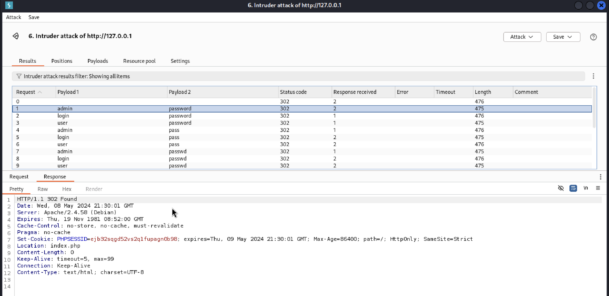
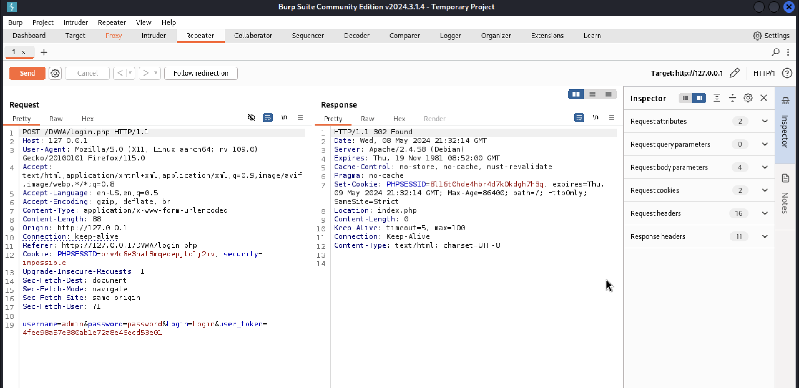
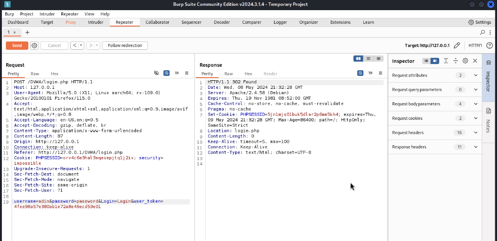

---
## Front matter
title: "Отчёт по этапу №5"
subtitle: "Дисциплина: Основы информационной безопасности"
author: "Мишина Анастасия Алексеевна"

## Generic otions
lang: ru-RU
toc-title: "Содержание"

## Bibliography
bibliography: bib/cite.bib
csl: pandoc/csl/gost-r-7-0-5-2008-numeric.csl

## Pdf output format
toc: true # Table of contents
toc-depth: 2
lof: true # List of figures
lot: true # List of tables
fontsize: 12pt
linestretch: 1.5
papersize: a4
documentclass: scrreprt
## I18n polyglossia
polyglossia-lang:
  name: russian
  options:
	- spelling=modern
	- babelshorthands=true
polyglossia-otherlangs:
  name: english
## I18n babel
babel-lang: russian
babel-otherlangs: english
## Fonts
mainfont: PT Serif
romanfont: PT Serif
sansfont: PT Sans
monofont: PT Mono
mainfontoptions: Ligatures=TeX
romanfontoptions: Ligatures=TeX
sansfontoptions: Ligatures=TeX,Scale=MatchLowercase
monofontoptions: Scale=MatchLowercase,Scale=0.9
## Biblatex
biblatex: true
biblio-style: "gost-numeric"
biblatexoptions:
  - parentracker=true
  - backend=biber
  - hyperref=auto
  - language=auto
  - autolang=other*
  - citestyle=gost-numeric
## Pandoc-crossref LaTeX customization
figureTitle: "Рис."
tableTitle: "Таблица"
listingTitle: "Листинг"
lofTitle: "Список иллюстраций"
lotTitle: "Список таблиц"
lolTitle: "Листинги"
## Misc options
indent: true
header-includes:
  - \usepackage{indentfirst}
  - \usepackage{float} # keep figures where there are in the text
  - \floatplacement{figure}{H} # keep figures where there are in the text
---

# Цель работы

Научиться использовать Burp Suite для демонстрации реальных возможностей злоумышленников.

# Выполнение лабораторной работы

Burp Suite представляет собой набор набор мощных инструментов безопасности веб-приложений. Эти инструменты позволяют сканировать, анализировать и использовать веб-приложения с помощью ручных и автоматических методов [@infosec].

Запускаем Burp Suite. В нашем примере мы будем использовать его для взлома учетных данных, чтобы получить доступ к приложению DVWA. Для этого нам сначала потребуется настроить прокси-сервер и убедиться, что для IP установлено значение localhost IP, а номер порта - 8080. Открываем вкладку Proxy, ставим значение Intercept is on (рис. [-@fig:001]).

{#fig:001 width=70%}

Далее открываем браузер (firefox), заходим в настройки и ищем там network settings. Настраиваем прокси сервер, после этого запускаем и открываем DVWA (рис. [-@fig:002]).

{#fig:002 width=70%}

Переходим в интерфейс Burp Suite, уже видим данные, которые программа смогла получить (рис. [-@fig:003]).

{#fig:003 width=70%}

В браузере вводим любые логин и пароль для входа, в моем случае - login и password. Во вкладке Intercept видим перехваченный запрос, где на последней строке видны наши введенные логин и пароль (рис. [-@fig:004]).

{#fig:004 width=70%}

Во вкладке HTTP history так же можно увидеть попытку входа. Нажимаем на нее правой кнопкой мыши и выбираем send to Intruder (рис. [-@fig:005]).

{#fig:005 width=70%}

В разделе Intruder выбираем вкладку Positions и выделяем поля со введенными логином и паролем на последней строке, нажимаем Add (рис. [-@fig:006]).

{#fig:006 width=70%}

Указываем тип атаки Cluster bomb и переходим на вкладку Payloads. В Payload set выбираем 1 и заполняем Payload settings - вводим возможные логины для подбора (рис. [-@fig:007]).

{#fig:007 width=70%}

В Payload set выбираем 2 и заполняем Payload settings - вводим возможные пароли (рис. [-@fig:008]).

{#fig:008 width=70%}

Нажимаем Start attack и ждем результаты. Все попытки получили статус (код ответа HTTP) 302 - Перенаправление. Нажимаем правой кнопкой мыши на результат и во вкладке Response видим, куда перенаправляется запрос - в основом login.php. Находим комбинацию, когда запрос переправляется на index.php. Это и будет верная комбинация логина-пароля: admin password (рис. [-@fig:009]).

{#fig:009 width=70%}

Нажав на запрос и выбрав Send to Repeater, можно проверить эти результаты в Burp Suite (рис. [-@fig:010]). Ретранслятор предназначен для ручного изменения HTTP-запросов и данных, отправляемых в этих запросах. Во вкладке Repeater можно изменять данные в запросе, нажать Send и получить ответ [@kali-linux] (рис. [-@fig:011]).

{#fig:010 width=70%}

{#fig:011 width=70%}

# Выводы

В ходе выполнения данной работы, я научилась использовать набор инструментов Burp Suite. Данный набор инструментов безопасности приложений является мощной платформой для атаки веб-приложений.

# Список литературы{.unnumbered}

::: {#refs}
:::